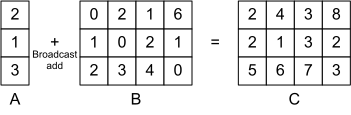

# Broadcast Add
:label:`ch_bcast_add`

A broadcast operator process two tensors in different shapes. Normally, one of the operands has a particular dimension to be 1, which will be broadcast along the corresponding dimension of the other operator to perform the given calculation. Common scalar calculations can all be broadcast, such as elementary arithmetic and logical operations. :numref:`fig_bcast_add` illustrates one broadcast add case between two 2-dimensional tensors. Broadcast operators are commonly seen in deep learning workloads, e.g. [batch normalization](http://d2l.ai/chapter_convolutional-modern/batch-norm.html).


:label:`fig_bcast_add`

In this section we will demonstrate how to perform a broadcast add between two 2-dimensional tensors. The following code defines the computation.

```{.python .input  n=1}
import numpy as np
import tvm

# Save to the d2ltvm package.
def broadcast_add(shape1, shape2):
    """Broadcast add between two 2-dimensional tensors

    shape1, shape2 : the shapes of the input tensors
    """
    assert len(shape1) == 2 and len(shape2) == 2, \
        "broadcast tensors should both be 2-dimension"
    for i in range(len(shape1)):
        assert shape1[i] == shape2[i] or shape1[i] == 1 or shape2[i] == 1, \
            "tensor shapes do not fit for broadcasting"
    A = tvm.placeholder(shape1, name='A')
    B = tvm.placeholder(shape2, name='B')
    m = shape1[0] if shape2[0] == 1 else shape2[0]
    n = shape1[1] if shape2[1] == 1 else shape2[1]
    f = lambda x, y: A[0 if shape1[0]==1 else x, 0 if shape1[1]==1 else y] + \
        B[0 if shape2[0]==1 else x, 0 if shape2[1]==1 else y]
    C = tvm.compute((m, n), f, name='C')
    return A, B, C
```

Then we use it to perform the broadcast add illustrated in :numref:`fig_bcast_add`.

```{.python .input  n=2}
m = 3
n = 4
shape1 = (m, 1)
shape2 = (m, n)
A, B, C = broadcast_add(shape1, shape2)
s = tvm.create_schedule(C.op)
print(tvm.lower(s, [A, B], simple_mode=True))
mod = tvm.build(s, [A, B, C])
```

The printed pseudocode clearly depicts the process of a broadcast add. We verify the results as follows.

```{.python .input  n=3}
# Save to the d2ltvm package.
def get_bcast_data(shape1, shape2, constructor=None):
    """Return random tensors a, b 
    and empty tensor c to store broadcast results between a and b

    shape1, shape2: shapes of input tensors
    constructor : user-defined tensor constructor
    """
    np.random.seed(0)
    a = np.random.normal(size=shape1).astype("float32")
    b = np.random.normal(size=shape2).astype("float32")
    out_shape = (shape1[0] if shape2[0] == 1 else shape2[0], 
                 shape1[1] if shape2[1] == 1 else shape2[1])
    c = np.empty(out_shape, dtype='float32')
    if constructor:
        a, b, c = [constructor(x) for x in (a, b, c)]
    return a, b, c
a, b, c = get_bcast_data(shape1, shape2, tvm.nd.array)
mod(a, b, c)
np.testing.assert_allclose(np.add(a.asnumpy(), b.asnumpy()), c.asnumpy(), atol=1e-5)
```

Note that broadcast is allowed to perform along multiple dimensions.

```{.python .input  n=4}
shape1 = (m, 1)
shape2 = (1, n)
A, B, C = broadcast_add(shape1, shape2)
s = tvm.create_schedule(C.op)
mod = tvm.build(s, [A, B, C])
a, b, c = get_bcast_data(shape1, shape2, tvm.nd.array)
mod(a, b, c)
np.testing.assert_allclose(np.add(a.asnumpy(), b.asnumpy()), c.asnumpy(), atol=1e-5)
print(a.shape, b.shape, c.shape)
```

Lastly, it is easy to note that when the shapes of two input tensors are indentical, the broadcast add reduces to an element-wise add.

## Summary
- We can define a broadcast operator in TVM.
- Broadcast be can performed along multiple dimensions.
