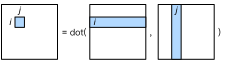

# Matrix Multiplication

Matrix Multiplication is one of the most widely operators in scientific computing and deep learning,which is typically referred to as *GEMM* (GEneral Matrix Multiply). Let's implement its computation in this section.

Given $A\in\mathbb R^{n\times l}$, and $B \in\mathbb R^{l\times m}$, if $C=AB$ then $C \in\mathbb R^{n\times m}$ and

$$C_{i,j} = \sum_{k=1}^l A_{i,k} B_{k,j}.$$

The elements accessed to compute $C_{i,j}$ are illustrated in :numref:`fig_matmul_default`.


:label:`fig_matmul_default`

The following method returns the computing expression of matrix multiplication.

```{.python .input  n=1}
import d2ltvm
import numpy as np
import tvm

# Save to the d2ltvm package
def matmul(n, m, l):
    """Return the computing expression of matrix multiplication
    A : n x l matrix
    B : l x m matrix
    C : n x m matrix with C = A B
    """
    k = tvm.reduce_axis((0, l), name='k')
    A = tvm.placeholder((n, l), name='A')
    B = tvm.placeholder((l, m), name='B')
    C = tvm.compute((n, m),
                    lambda x, y: tvm.sum(A[x, k] * B[k, y], axis=k),
                    name='C')
    return A, B, C
```

Let's compile a module for a square matrix multiplication.

```{.python .input  n=2}
n = 100
A, B, C = matmul(n, n, n)
s = tvm.create_schedule(C.op)
print(tvm.lower(s, [A, B], simple_mode=True))
mod = tvm.build(s, [A, B, C])
```

The pseudo code is simply a naive 3-level nested for loop to calculate the matrix multiplication.

And then we verify the results. Note that NumPy may use multi-threading to accelerate its computing, which may result in slightly different results due to the numerical error. There we use `assert_allclose` with a relative large tolerant error to test the correctness.

```{.python .input  n=3}
a, b, c = d2ltvm.get_abc((100, 100), tvm.nd.array)
mod(a, b, c)
np.testing.assert_allclose(np.dot(a.asnumpy(), b.asnumpy()),
                           c.asnumpy(), atol=1e-5)
```

## Summary

- We can express the compututation of matrix multiplication in TVM in one line of code.
- The naive matrix multiplication is a 3-level nested for loop.
