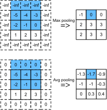

# Pooling
:label:`ch_pooling`

This section talks about how to use TVM to do pooling. Pooling is a common operator in CNN, please refer to chapter [6.5](https://d2l.ai/chapter_convolutional-neural-networks/pooling.html) in D2L if you are not familiar with this operator. Here we will skip the why, only focus on how.

There are two types of pooling, `max pooling` which returns the maximal value of a pool, and `avg pooling` which returns the average value of a pool. For simplicity, we work on 2D pooling in this section. Like conv2d, the pooling operator moves the pooling kernel across the feature map with some stride. Sometimes padding is needed to match the required output size. Pooling has significantly less computation than conv2d as it only needs to get the maximal or average value. It is a memory-bound operator.

:numref:`fig_pooling` illustrate how 2D `max pooling` and `avg pooling` work, with the following setting: kernel size `[3, 3]`, stride `[1, 1]`, and padding `[1, 1]`.


:label:`fig_pooling`

```{.python .input}
import tvm
from tvm import te
import d2ltvm
```

## Compute definition

The computation manner of `pooling` is similar to `conv`, so you will find the pooling definition code below takes similar arguments as `conv` defined in :numref:`ch_conv`. The output size of pooling can be calculated by reusing the `conv_out_size` method, too.

We include two types of `pooling` in the same method using different `te.compute`. In the `pool_type` is specified otherwise, the method will throw an error. 
We use `te.max` to perform `max pooling` and `te.sum` and element-wise division to perform `avg pooling`. In addition, please also note that the padding values of `max pooling` is the `te.min_value` while `avg pooling` being 0.

```{.python .input}
# Save to the d2ltvm package.
def pool(pool_type, c, nh, nw, kh, kw, ph=0, pw=0, sh=1, sw=1):
    """2D pooling
    
    pool_type: pooling type, 'max' or 'avg'
    c : channels
    nh, nw : input width and height
    kh, kw : kernel width and height
    ph, pw : height and width padding sizes, default 0
    sh, sw : height and width strides, default 1
    """
    # reduction axes
    rkh = te.reduce_axis((0, kh), name='rkh')
    rkw = te.reduce_axis((0, kw), name='rkw')
    # output height and weights
    oh = d2ltvm.conv_out_size(nh, kh, ph, sh)
    ow = d2ltvm.conv_out_size(nw, kw, pw, sw)
    # pad X and then compute Y
    X = te.placeholder((c, nh, nw), name='X')
    
    
    if pool_type == 'max':
        PaddedX = d2ltvm.padding(X, ph, pw, val=te.min_value(X.dtype)) \
            if ph * pw != 0 else X
        Y = te.compute((c, oh, ow), \
                            lambda c, h, w: \
                            te.max(PaddedX[c, h*sh+rkh, w*sw+rkw], \
                                axis=[rkh, rkw]), \
                            tag="pool_max")
    elif pool_type == 'avg':
        PaddedX = d2ltvm.padding(X, ph, pw) if ph * pw != 0 else X
        tsum = te.compute((c, oh, ow), \
                            lambda c, h, w: \
                            te.sum(PaddedX[c, h*sh+rkh, w*sw+rkw], \
                                axis=[rkh, rkw]), \
                            tag="pool_avg1")
        Y = te.compute((c, oh, ow), \
                            lambda c, h, w: \
                            tsum[c, h, w] / (kh*kw), \
                            tag='pool_avg2')
    else:
        raise ValueError("Pool type should be 'avg' or 'max'.")
    return X, Y, PaddedX
```

We then compile the `max pooling` using some toy data sizes. The compute logic is simple as shown in the IR. Again, the `get_conv_data` method in :numref:`ch_conv` can be reused to initialize the data. Note that we don't need weights in this case.

```{.python .input}
c, n, k, p, s = 4, 12, 3, 1, 1
X, Y, PaddedX = pool('max', c, n, n, k, k, p, p, s, s)
sch = te.create_schedule(Y.op)
mod = tvm.build(sch, [X, Y])
print(tvm.lower(sch, [X, Y], simple_mode=True))
data, _, out_max = d2ltvm.get_conv_data(c, c, n, k, p, s, tvm.nd.array)
mod(data, out_max)
```

Next, we compile the `avg pooling` using the same toy data sizes. The compute logic is also simple. Check out the computation as well as the padding value difference from the `max pooling`.

```{.python .input}
X, Y, PaddedX = pool('avg', c, n, n, k, k, p, p, s, s)
sch = te.create_schedule(Y.op)
mod = tvm.build(sch, [X, Y])
print(tvm.lower(sch, [X, Y], simple_mode=True))
data, _, out_avg = d2ltvm.get_conv_data(c, c, n, k, p, s, tvm.nd.array)
mod(data, out_avg)
```

## MXNet Baseline

We use the pooling functions of MXNet as the baseline to check the correctness of our compiled functions. MXNet computes pooling similarly as what we have done. The only difference is that its input data is in 4D, including batch as the outmost dimension.

```{.python .input}
import mxnet as mx

def get_pool_data_mxnet(c, n, k, p, s, ctx='cpu'):
    ctx = getattr(mx, ctx)()
    data, _, out = d2ltvm.get_conv_data(c, c, n, k, p, s,
                                      lambda x: mx.nd.array(x, ctx=ctx))
    data, out = data.expand_dims(axis=0), out.expand_dims(axis=0)
    return data, out

# Save to the d2ltvm package.
def pool_mxnet(pool_type, data, out, k, p, s):
    mx.nd.Pooling(data, kernel=(k,k), stride=(s,s),
                      pad=(p,p), pool_type=pool_type, out=out)

data, out_max_mx = get_pool_data_mxnet(c, n, k, p, s)
pool_mxnet('max', data, out_max_mx, k, p, s)
data, out_avg_mx = get_pool_data_mxnet(c, n, k, p, s)
pool_mxnet('avg', data, out_avg_mx, k, p, s)
```

Finally, we check if our results are close enough to the results produced by MXNet.

```{.python .input}
import numpy as np

np.testing.assert_allclose(out_max_mx[0].asnumpy(), out_max.asnumpy(), atol=1e-5)
np.testing.assert_allclose(out_avg_mx[0].asnumpy(), out_avg.asnumpy(), atol=1e-5)
```

## Summary

- 2D pooling handles the data in the similar way as 2D convolution, but the computation itself is much lighter.
- We can define `max pooling` and `avg pooling` easily using TVM expressions.
