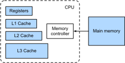
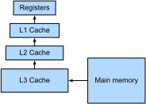
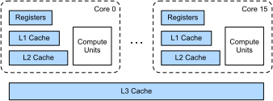

# CPU Architecture

In this section, we will do a very brief introduction of CPU components that are important for the performance of scientific computing workloads. For a more comprehensive survey, we recommend [this classic textbook](https://www.amazon.com/Computer-Architecture-Quantitative-John-Hennessy/dp/012383872X).

## Floating-point Computations

In deep learning, we are mostly interested in floating-point computations. CPU often have specialized floating point units (FPU) to do the computation. Depends on hardware, the speeds of various floating-point types may vary. Let's check the performance of a matrix product under different floating-points.

```{.python .input  n=12}
import numpy as np

def benchmark(dtype):
    x = np.random.normal(size=(1000, 1000)).astype(dtype)
    %timeit np.dot(x, x)

benchmark('float32')
benchmark('float64')
```

As can be seen, 32-bit floating-point is 2x faster than 64-bit floating-point. You may try other data types such as 32-bit integer and 16-bit floating point. You may find they are slower, which might due to both NumPy is not well optimized or the CPU we are using doesn't provide efficient calculation of these data types. 

The matrix product mainly uses the multiply-accumulate operation, i.e. `res += a * b`. Since it is so commonly used in scientific computing, CPU often has specialized unit, called [multiplier–accumulator or MAC](https://en.wikipedia.org/wiki/Multiply–accumulate_operation), to provide efficient support with good numerical accuracy. 

Other operators, however, could be significantly slower than multiply-accumulation. For example, CPU may need hundreds of circles to computing `exp`. You can see that even 1000 times less operators is needed for `np.exp(x)` than `np.dot(x, x)`. The former takes longer time. 

```{.python .input}
x = np.random.normal(size=(1000, 1000)).astype('float32')
%timeit np.exp(x)
```

## Memory Subsystem

The memory subsystem consists of main memory, caches and registers. Let's check the size of each components. 

```{.python .input}
!lscpu | grep cache
```

As can be seen, there are three level caches, L1, L2 and L3. The L1 cache has 32KB for instructions and 32KB for data. The L2 cache 4x larger, while the L3 cache is way more larger. The L1 cache has the smallest access latency, which is roughly 1 ns. The L2 cache access latency is around 3 ns, it's slower because its hardware characteristics (e.g. larger in size) and it's farther away from the computation units than the L1 cache. The L3 cache is bigger and slower (around 20 ns access latency). 

The main memory, on the other hands, is significantly bigger. 

```{.python .input}
!cat /proc/meminfo | grep MemTotal
```

Its size is 240 GB in our system, 5 thousands bigger than the L3 cache. As expected, it has a larger latency, around 10 ns, and also a smaller bandwidth. Main memory is quite different than caches. Main memory is often built on [dynamic random-access memory, or DRAM](https://en.wikipedia.org/wiki/Dynamic_random-access_memory) and plugged in on the motherboard, and connected to CPUs through memory controller.  While caches are often [static random-access memory, or SRAM](https://en.wikipedia.org/wiki/Static_random-access_memory), they are more expensive and are placed on the CPU chip. A brief layout is illustrated in :numref:`fig_cache-mem-layout`.


:label:`fig_cache-mem-layout`

To compute with data in main memory, we first need to copy it to the L3 cache, then the L2 cache, the L1 cache and registers, as shown in :numref:`fig_access-cache`. We can accelerate this process if we will use the same data shortly. For example, if it is still on registers, we don't need to do any movement. Otherwise, we will check if it is still on the L1 cache, whose chance is higher since the L1 cache can hold more data than the registers. Similarly for the L2 cache and the L3 cache. 


:label:`fig_access-cache`

This data access pattern leads to one of the most code optimization principle: [locality of reference](https://en.wikipedia.org/wiki/Locality_of_reference). There are two types of localities matter to us: temporal locality and spatial locality. In temporal locality, we want to reuse data in the near future so that they may still on cache. In spatial locality, we want to access data in a continuous way because the system often read a batch of data (e.g. several FP32 numbers) each time, and it can pre-fetch other near by data into cache before seeing they are used by the program.  

## Multi-core

Modern CPUs have multi-cores. The machine we are using have a single [Intel Xeon E5-2688 v4](https://en.wikichip.org/wiki/intel/xeon_e5/e5-2686_v4) CPU, or called socket. It has 16 physical cores enabled. Due to [hyper-threading](https://en.wikipedia.org/wiki/Hyper-threading), it appears to have 32 processors. But hyper-threading helps scientific computing little, we should consider we only have 16 cores.

```{.python .input}
!nproc
```

Each core has its own registers, computation units (ALU, FPU, ...), and L1/L2 caches. The L3 caches are shared among all cores. This architecture is illustrated in :numref:`fig_multi-cores`. 



:label:`fig_multi-cores`

When a program is [embarrassingly parallel](https://en.wikipedia.org/wiki/Embarrassingly_parallel), we can execute a thread on each cores, and 16 cores often leads to a 16x speedup compared to a single thread implementation. If there are synchronizations among threads, each different threads need to write to a same location, then it leads to synchronization overhead that decreases the performance. 

## Summary

- CPU have dedicated units to handle computations on various data types.
- The memory subsystem design means that programs with good temporal and spatial locality are more efficient.
- An efficient program should effectively use all available cores. 
