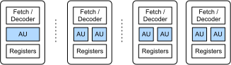
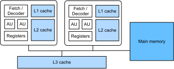

# CPU Architecture

In this section, we will do a brief introduction of CPU components that are important for the performance of scientific computing. For a more comprehensive survey, we recommend [this classic textbook](https://www.amazon.com/Computer-Architecture-Quantitative-John-Hennessy/dp/012383872X).

## Arithmetic Units

CPU have hardware units to perform arithmetics on integers (called [ALU](https://en.wikipedia.org/wiki/Arithmetic_logic_unit)) and floating-points (called [FPU](https://en.wikipedia.org/wiki/Floating-point_arithmetic)). The performance of various data types depends on the hardware. Let's first check the CPU model we are using.

```{.python .input  n=13}
!cat /proc/cpuinfo | grep "model name" | head -n1
```

Now check the performance of a matrix product under different data types.

```{.python .input  n=6}
import numpy as np

def benchmark(dtype):
    x = np.random.normal(size=(1000, 1000)).astype(dtype)
    %timeit np.dot(x, x)

benchmark('float32')
benchmark('float64')
benchmark('int32')
benchmark('int64')
```

As can be seen, 32-bit floating-point (float32) is 2x faster than 64-bit floating-point (float64). The integer performance is way more slower. We will get back to the understand more about these numbers later. 

Other operators, however, could be significantly slower than the multiplication and addition `a += b * c` used in matrix product. For example, CPU may need hundreds of circles to computing `exp`. You can see that even 1000 times less operators is needed for `np.exp(x)` than `np.dot(x, x)`. The former takes longer time.

```{.python .input  n=14}
x = np.random.normal(size=(1000, 1000)).astype('float32')
%timeit np.exp(x)
```

## Parallel Execution

The CPU frequency increased rapidly until the beginning of the 21st century. On 2003, Intel released a [Pentium 4](https://en.wikipedia.org/wiki/Pentium_4) CPU with a 3.0 GHz clock rate. Check our CPU clock rate,

```{.python .input}
!lscpu | grep MHz
```

we can see that it also has a max 3 GHz clock rate, but it might be 100x faster than the Pentium 4 CPU. One secure source is that new models do much better on parallel execution. Next we briefly discuss two typical parallelizations.


:label:`fig_cpu_parallel_arch`

### SIMD

Single instruction, multiple data ([SIMD](https://en.wikipedia.org/wiki/SIMD)), refers to process multiple elements with a single instruction simultaneously. :numref:`fig_cpu_parallel_arch` illustrates this architecture. In a normal CPU core, there is an instruction fetching and decoding unit. It runs an instruction on the arithmetic unit (AU), e.g. ALU or FPU, to process one element, e.g. float32, each time. With SIMD, we have multiple AUs instead of one. In each time, the fetch-and-decode unit runs an instruction on every AU simultaneously. If there are $n$ AUs, then we can process $n$ element each time. 

Popular SIMD instruction sets include Intel's [SSE](https://en.wikipedia.org/wiki/Streaming_SIMD_Extensions) and [AVX](https://en.wikipedia.org/wiki/Advanced_Vector_Extensions), ARM's [Neon](https://en.wikipedia.org/wiki/ARM_architecture#Advanced_SIMD_(NEON)) and AMD's [3DNow!](https://en.wikipedia.org/wiki/3DNow!). Let's check which sets our CPU supports.


```{.python .input}
!cat /proc/cpuinfo | grep "flags" | head -n1
```

As can be seen, the most powerful SIMD instruction set supported is AVX2, which extends AVX to 256-bit, e.g. it is able to perform 8 float32 operations or 4 float64 operators per time. 

### Multi-cores

SIMD improves the performance of a single core, another way is adding multiple cores on a single CPU socket. numref:`fig_cpu_parallel_arch` shows two CPUs cores, each core has 2 AUs. The CPU we are using has 32 cores. 

```{.python .input}
!cat /proc/cpuinfo | grep "model name" | wc -l 
```

But note that Intel's [hyper-threading](https://en.wikipedia.org/wiki/Hyper-threading) runs 2 hardware threads per core. These two threads share the AUs and caches on the same core, which is useful to hide latency but may not improve the throughput, which matters to scientific computing most. By hyper-threading, each core is presented as 2 logic cores to the operation system. So even the system shows there are 32 cores, physically our CPU only has 16 cores. 

### Performance 

We often use floating point operations per second ([FLOP](https://en.wikipedia.org/wiki/FLOPS)) to measure the peak hardware performance. In general, we can compute this number by

`clock_rate * #physical_cores * #instructions_per_clock * #operators_per_instruction`

For the CPU we are using, the max clock rate is $3\times 10^9$, it has 16 physical cores, the AVX2 computes 8 float32 instructions per second, the [FMA](https://en.wikipedia.org/wiki/FMA_instruction_set) instruction set in AVX2 compute `a += b * c` each time, which contains 2 operations. Therefore, the GFLOPS (gigaFLOPS) for single precision (float32) is 

```{.python .input}
3 * 16 * 8 * 2 
```

You can modify the above code based on your system information to calculate your CPU peak performance.  

Matrix product is a good benchmark workload for the peak performance. As can be seen, the measure GFLOPS is very close to the peak performance. 

```{.python .input}
x = np.random.normal(size=(1000, 1000)).astype('float32')
res = %timeit -o -q np.dot(x, x)
2 * 1000**3 / res.average / 1e9
```

## Memory Subsystem

Another component significantly impacts the performance is the memory subsystem. The memory size is one of the key specification of a system. The machine we are using has 240 GB memory. 

```{.python .input}
!cat /proc/meminfo | grep MemTotal
```

The memory bandwidth, on the other hand, is less well-known. We can use the [mbw](http://manpages.ubuntu.com/manpages/xenial/man1/mbw.1.html) tool to test the bandwidth. In average, we can copy 4.6 GB data by `memcpy` per second.

```{.python .input}
!mbw 256 | grep AVG | grep MEMCPY
```

Note that our CPU can process $759\times 10^9$ float32 numbers per second, it requires the bandwidth should be $759\times 4=3036$ MB/s. CPU use caches to fill in this big bandwidth gap. Let's check the caches our CPU has. 

```{.python .input}
!lscpu | grep cache
```

As can be seen, there are three levels of caches: L1, L2 and L3. The L1 cache has 32KB for instructions and 32KB for data. The L2 cache is 4x larger. The L3 cache is way more larger, but it is still thousands times smaller than the main memory. The benefits of caches are significantly improved access latency and bandwidth. Typically, 
the L1 cache has a 1 ns latency, the L2 cache's latency is around 3 ns, and the L3 cache is slower, with a latency about 20 ns, while still faster than the main memory's 100 ns latency.



:label:`fig_cpu_memory`

A brief memory subsystem layout is illustrated in :numref:`fig_cpu_memory`.
To compute with data on main memory, we first need to copy it to the L3 cache, then the L2 cache, the L1 cache and the registers. We can accelerate this process if we will use the same data shortly. For example, if it is still on registers, we don't need to do any movement. Otherwise, we will check if it is still on the L1 cache, whose chance is higher since the L1 cache can hold more data than the registers. Similarly for the L2 cache and the L3 cache. 

This data access pattern leads to one of the most code optimization principle: [locality of reference](https://en.wikipedia.org/wiki/Locality_of_reference). There are two types of localities matter to us: temporal locality and spatial locality. In temporal locality, we want to reuse data in the near future so that they may still on cache. In spatial locality, we want to access data in a continuous way because the system often read a batch of data (e.g. several float32 numbers) each time, and it can pre-fetch other near by data into cache before seeing they are used by the program.

## Summary

- CPUs have dedicated units to handle computations on various data types. Its peak performance is determined by the clock rate, the number of cores, the SIMD width and instruction sets. 
- CPUs use multi-level caches to bridge the gap between CPU computational power and main memory bandwidth. 
- An efficient program should be effectively parallelized and access data with good temporal and spatial localities.
