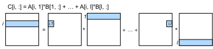

# Matrix Multiplication

We mentioned in :numref:`ch_cpu_arch` that matrix multiplication is a widely used performance benchmark workload, and the NumPy `dot` operator nearly reaches the peak performance of the Xeon E5-2686 v4 CPU. In this chapter, we will investigate multiple scheduling strategies for this operator. 

```{.python .input  n=1}
%matplotlib inline
import tvm
import numpy as np
import d2ltvm as d2l
```

We first define benchmark functions to measure the GFLOPS. To simplify the measurement, we only consider square matrices. Extending to non-square cases is straightforward. Then let's reproduce the matrix multiplication result in :numref:`ch_cpu_arch`.

```{.python .input  n=2}
# Save to the d2ltvm package.
def benchmark_square_matmul(func, n, constructor=None):
    x = np.random.normal(size=(n, n)).astype(np.float32)
    y = np.random.normal(size=(n, n)).astype(np.float32)
    z = np.empty_like(x)
    if constructor:
        x, y, z = constructor(x), constructor(y), constructor(z)
    res = %timeit -o -q -r3 func(x, y, z)
    return 2 * n ** 3 / res.average / 1e9

def np_dot(x, y, z):
    np.dot(x, y, out=z)
    
benchmark_square_matmul(np_dot, 1000)    
```

```{.json .output n=2}
[
 {
  "data": {
   "text/plain": "738.1096192866785"
  },
  "execution_count": 2,
  "metadata": {},
  "output_type": "execute_result"
 }
]
```

Now we benchmark the performance on various input sizes as our baseline.

```{.python .input  n=3}
def benchmark(func, constructor=None):
    gflops, sizes = [], 2**np.arange(5, 12, 1)
    np.random.seed(0)
    for n in sizes:
        gflops.append(benchmark_square_matmul(func, n, constructor))
    return sizes, gflops

sizes, np_gflops = benchmark(np_dot)
```

## Default Scheduling

Given $A, B \in\mathbb R^{n\times n}$, if $C=AB$ then 

$$C_{i,j} = \sum_{k=1}^n A_{i,k} B_{k,j}.$$

The elements assessed to compute $C_{i,j}$ are illustrated in :numref:`fig_matmul_default`. 


:label:`fig_matmul_default`

The following function returns the computing expression of matrix multiplication.

```{.python .input  n=4}
# Save to the d2ltvm package.
def matrix_product(n):
    k = tvm.reduce_axis((0, n), name='k')
    A = tvm.placeholder((n, n), name='A')
    B = tvm.placeholder((n, n), name='B')
    C = tvm.compute(
        (n, n), lambda x, y: tvm.sum(A[x, k] * B[k, y], axis=k), name='C')
    return (A, B, C)
```

Print the default scheduling and benchmark the performance.

```{.python .input  n=5}
A, B, C = matrix_product(tvm.var('n'))
s = tvm.create_schedule(C.op)

def benchmark_tvm(s):
    prog = tvm.lower(s, [A, B, C], simple_mode=True)
    # Only print if the program is relatively simple
    if len(prog.__str__().split('\n')) < 20: print(prog)
    mod = tvm.build(s, [A, B, C])
    return benchmark(mod, tvm.nd.array)[1]

default_gflops = benchmark_tvm(s)
```

```{.json .output n=5}
[
 {
  "name": "stdout",
  "output_type": "stream",
  "text": "produce C {\n  for (x, 0, n) {\n    for (y, 0, n) {\n      C[((x*n) + y)] = 0f\n      for (k, 0, n) {\n        C[((x*n) + y)] = (C[((x*n) + y)] + (A[((x*n) + k)]*B[((k*n) + y)]))\n      }\n    }\n  }\n}\n\n"
 }
]
```

It's not surprised to see that the default scheduling doesn't perform well, especially on large matrices that cannot fit into the cache.

```{.python .input  n=6}
def plot(gflops, legend):
    d2l.plot(sizes, gflops, xlabel='Matrix width/height', ylabel='GFLOPS', 
             xscale='log', yscale='log', 
             legend=legend, fmts=['--']*(len(gflops)-1)+['-'])
    
plot([np_gflops, default_gflops], ['numpy', 'default'])
```

```{.json .output n=6}
[
 {
  "data": {
   "image/svg+xml": "<?xml version=\"1.0\" encoding=\"utf-8\" standalone=\"no\"?>\n<!DOCTYPE svg PUBLIC \"-//W3C//DTD SVG 1.1//EN\"\n  \"http://www.w3.org/Graphics/SVG/1.1/DTD/svg11.dtd\">\n<!-- Created with matplotlib (https://matplotlib.org/) -->\n<svg height=\"265.69625pt\" version=\"1.1\" viewBox=\"0 0 390.978125 265.69625\" width=\"390.978125pt\" xmlns=\"http://www.w3.org/2000/svg\" xmlns:xlink=\"http://www.w3.org/1999/xlink\">\n <defs>\n  <style type=\"text/css\">\n*{stroke-linecap:butt;stroke-linejoin:round;}\n  </style>\n </defs>\n <g id=\"figure_1\">\n  <g id=\"patch_1\">\n   <path d=\"M 0 265.69625 \nL 390.978125 265.69625 \nL 390.978125 0 \nL 0 0 \nz\n\" style=\"fill:none;\"/>\n  </g>\n  <g id=\"axes_1\">\n   <g id=\"patch_2\">\n    <path d=\"M 45.478125 228.14 \nL 380.278125 228.14 \nL 380.278125 10.7 \nL 45.478125 10.7 \nz\n\" style=\"fill:#ffffff;\"/>\n   </g>\n   <g id=\"matplotlib.axis_1\">\n    <g id=\"xtick_1\">\n     <g id=\"line2d_1\">\n      <path clip-path=\"url(#p4bf2725508)\" d=\"M 144.084648 228.14 \nL 144.084648 10.7 \n\" style=\"fill:none;stroke:#b0b0b0;stroke-linecap:square;stroke-width:0.8;\"/>\n     </g>\n     <g id=\"line2d_2\">\n      <defs>\n       <path d=\"M 0 0 \nL 0 3.5 \n\" id=\"m5d0fbc25c4\" style=\"stroke:#000000;stroke-width:0.8;\"/>\n      </defs>\n      <g>\n       <use style=\"stroke:#000000;stroke-width:0.8;\" x=\"144.084648\" xlink:href=\"#m5d0fbc25c4\" y=\"228.14\"/>\n      </g>\n     </g>\n     <g id=\"text_1\">\n      <!-- $\\mathdefault{10^{2}}$ -->\n      <defs>\n       <path d=\"M 12.40625 8.296875 \nL 28.515625 8.296875 \nL 28.515625 63.921875 \nL 10.984375 60.40625 \nL 10.984375 69.390625 \nL 28.421875 72.90625 \nL 38.28125 72.90625 \nL 38.28125 8.296875 \nL 54.390625 8.296875 \nL 54.390625 0 \nL 12.40625 0 \nz\n\" id=\"DejaVuSans-49\"/>\n       <path d=\"M 31.78125 66.40625 \nQ 24.171875 66.40625 20.328125 58.90625 \nQ 16.5 51.421875 16.5 36.375 \nQ 16.5 21.390625 20.328125 13.890625 \nQ 24.171875 6.390625 31.78125 6.390625 \nQ 39.453125 6.390625 43.28125 13.890625 \nQ 47.125 21.390625 47.125 36.375 \nQ 47.125 51.421875 43.28125 58.90625 \nQ 39.453125 66.40625 31.78125 66.40625 \nz\nM 31.78125 74.21875 \nQ 44.046875 74.21875 50.515625 64.515625 \nQ 56.984375 54.828125 56.984375 36.375 \nQ 56.984375 17.96875 50.515625 8.265625 \nQ 44.046875 -1.421875 31.78125 -1.421875 \nQ 19.53125 -1.421875 13.0625 8.265625 \nQ 6.59375 17.96875 6.59375 36.375 \nQ 6.59375 54.828125 13.0625 64.515625 \nQ 19.53125 74.21875 31.78125 74.21875 \nz\n\" id=\"DejaVuSans-48\"/>\n       <path d=\"M 19.1875 8.296875 \nL 53.609375 8.296875 \nL 53.609375 0 \nL 7.328125 0 \nL 7.328125 8.296875 \nQ 12.9375 14.109375 22.625 23.890625 \nQ 32.328125 33.6875 34.8125 36.53125 \nQ 39.546875 41.84375 41.421875 45.53125 \nQ 43.3125 49.21875 43.3125 52.78125 \nQ 43.3125 58.59375 39.234375 62.25 \nQ 35.15625 65.921875 28.609375 65.921875 \nQ 23.96875 65.921875 18.8125 64.3125 \nQ 13.671875 62.703125 7.8125 59.421875 \nL 7.8125 69.390625 \nQ 13.765625 71.78125 18.9375 73 \nQ 24.125 74.21875 28.421875 74.21875 \nQ 39.75 74.21875 46.484375 68.546875 \nQ 53.21875 62.890625 53.21875 53.421875 \nQ 53.21875 48.921875 51.53125 44.890625 \nQ 49.859375 40.875 45.40625 35.40625 \nQ 44.1875 33.984375 37.640625 27.21875 \nQ 31.109375 20.453125 19.1875 8.296875 \nz\n\" id=\"DejaVuSans-50\"/>\n      </defs>\n      <g transform=\"translate(135.284648 242.738437)scale(0.1 -0.1)\">\n       <use transform=\"translate(0 0.765625)\" xlink:href=\"#DejaVuSans-49\"/>\n       <use transform=\"translate(63.623047 0.765625)\" xlink:href=\"#DejaVuSans-48\"/>\n       <use transform=\"translate(128.203125 39.046875)scale(0.7)\" xlink:href=\"#DejaVuSans-50\"/>\n      </g>\n     </g>\n    </g>\n    <g id=\"xtick_2\">\n     <g id=\"line2d_3\">\n      <path clip-path=\"url(#p4bf2725508)\" d=\"M 312.597001 228.14 \nL 312.597001 10.7 \n\" style=\"fill:none;stroke:#b0b0b0;stroke-linecap:square;stroke-width:0.8;\"/>\n     </g>\n     <g id=\"line2d_4\">\n      <g>\n       <use style=\"stroke:#000000;stroke-width:0.8;\" x=\"312.597001\" xlink:href=\"#m5d0fbc25c4\" y=\"228.14\"/>\n      </g>\n     </g>\n     <g id=\"text_2\">\n      <!-- $\\mathdefault{10^{3}}$ -->\n      <defs>\n       <path d=\"M 40.578125 39.3125 \nQ 47.65625 37.796875 51.625 33 \nQ 55.609375 28.21875 55.609375 21.1875 \nQ 55.609375 10.40625 48.1875 4.484375 \nQ 40.765625 -1.421875 27.09375 -1.421875 \nQ 22.515625 -1.421875 17.65625 -0.515625 \nQ 12.796875 0.390625 7.625 2.203125 \nL 7.625 11.71875 \nQ 11.71875 9.328125 16.59375 8.109375 \nQ 21.484375 6.890625 26.8125 6.890625 \nQ 36.078125 6.890625 40.9375 10.546875 \nQ 45.796875 14.203125 45.796875 21.1875 \nQ 45.796875 27.640625 41.28125 31.265625 \nQ 36.765625 34.90625 28.71875 34.90625 \nL 20.21875 34.90625 \nL 20.21875 43.015625 \nL 29.109375 43.015625 \nQ 36.375 43.015625 40.234375 45.921875 \nQ 44.09375 48.828125 44.09375 54.296875 \nQ 44.09375 59.90625 40.109375 62.90625 \nQ 36.140625 65.921875 28.71875 65.921875 \nQ 24.65625 65.921875 20.015625 65.03125 \nQ 15.375 64.15625 9.8125 62.3125 \nL 9.8125 71.09375 \nQ 15.4375 72.65625 20.34375 73.4375 \nQ 25.25 74.21875 29.59375 74.21875 \nQ 40.828125 74.21875 47.359375 69.109375 \nQ 53.90625 64.015625 53.90625 55.328125 \nQ 53.90625 49.265625 50.4375 45.09375 \nQ 46.96875 40.921875 40.578125 39.3125 \nz\n\" id=\"DejaVuSans-51\"/>\n      </defs>\n      <g transform=\"translate(303.797001 242.738437)scale(0.1 -0.1)\">\n       <use transform=\"translate(0 0.765625)\" xlink:href=\"#DejaVuSans-49\"/>\n       <use transform=\"translate(63.623047 0.765625)\" xlink:href=\"#DejaVuSans-48\"/>\n       <use transform=\"translate(128.203125 39.046875)scale(0.7)\" xlink:href=\"#DejaVuSans-51\"/>\n      </g>\n     </g>\n    </g>\n    <g id=\"xtick_3\">\n     <g id=\"line2d_5\">\n      <defs>\n       <path d=\"M 0 0 \nL 0 2 \n\" id=\"m6d5781dc8e\" style=\"stroke:#000000;stroke-width:0.6;\"/>\n      </defs>\n      <g>\n       <use style=\"stroke:#000000;stroke-width:0.6;\" x=\"55.973121\" xlink:href=\"#m6d5781dc8e\" y=\"228.14\"/>\n      </g>\n     </g>\n    </g>\n    <g id=\"xtick_4\">\n     <g id=\"line2d_6\">\n      <g>\n       <use style=\"stroke:#000000;stroke-width:0.6;\" x=\"77.026841\" xlink:href=\"#m6d5781dc8e\" y=\"228.14\"/>\n      </g>\n     </g>\n    </g>\n    <g id=\"xtick_5\">\n     <g id=\"line2d_7\">\n      <g>\n       <use style=\"stroke:#000000;stroke-width:0.6;\" x=\"93.357375\" xlink:href=\"#m6d5781dc8e\" y=\"228.14\"/>\n      </g>\n     </g>\n    </g>\n    <g id=\"xtick_6\">\n     <g id=\"line2d_8\">\n      <g>\n       <use style=\"stroke:#000000;stroke-width:0.6;\" x=\"106.700393\" xlink:href=\"#m6d5781dc8e\" y=\"228.14\"/>\n      </g>\n     </g>\n    </g>\n    <g id=\"xtick_7\">\n     <g id=\"line2d_9\">\n      <g>\n       <use style=\"stroke:#000000;stroke-width:0.6;\" x=\"117.981754\" xlink:href=\"#m6d5781dc8e\" y=\"228.14\"/>\n      </g>\n     </g>\n    </g>\n    <g id=\"xtick_8\">\n     <g id=\"line2d_10\">\n      <g>\n       <use style=\"stroke:#000000;stroke-width:0.6;\" x=\"127.754114\" xlink:href=\"#m6d5781dc8e\" y=\"228.14\"/>\n      </g>\n     </g>\n    </g>\n    <g id=\"xtick_9\">\n     <g id=\"line2d_11\">\n      <g>\n       <use style=\"stroke:#000000;stroke-width:0.6;\" x=\"136.373946\" xlink:href=\"#m6d5781dc8e\" y=\"228.14\"/>\n      </g>\n     </g>\n    </g>\n    <g id=\"xtick_10\">\n     <g id=\"line2d_12\">\n      <g>\n       <use style=\"stroke:#000000;stroke-width:0.6;\" x=\"194.811921\" xlink:href=\"#m6d5781dc8e\" y=\"228.14\"/>\n      </g>\n     </g>\n    </g>\n    <g id=\"xtick_11\">\n     <g id=\"line2d_13\">\n      <g>\n       <use style=\"stroke:#000000;stroke-width:0.6;\" x=\"224.485473\" xlink:href=\"#m6d5781dc8e\" y=\"228.14\"/>\n      </g>\n     </g>\n    </g>\n    <g id=\"xtick_12\">\n     <g id=\"line2d_14\">\n      <g>\n       <use style=\"stroke:#000000;stroke-width:0.6;\" x=\"245.539194\" xlink:href=\"#m6d5781dc8e\" y=\"228.14\"/>\n      </g>\n     </g>\n    </g>\n    <g id=\"xtick_13\">\n     <g id=\"line2d_15\">\n      <g>\n       <use style=\"stroke:#000000;stroke-width:0.6;\" x=\"261.869728\" xlink:href=\"#m6d5781dc8e\" y=\"228.14\"/>\n      </g>\n     </g>\n    </g>\n    <g id=\"xtick_14\">\n     <g id=\"line2d_16\">\n      <g>\n       <use style=\"stroke:#000000;stroke-width:0.6;\" x=\"275.212746\" xlink:href=\"#m6d5781dc8e\" y=\"228.14\"/>\n      </g>\n     </g>\n    </g>\n    <g id=\"xtick_15\">\n     <g id=\"line2d_17\">\n      <g>\n       <use style=\"stroke:#000000;stroke-width:0.6;\" x=\"286.494107\" xlink:href=\"#m6d5781dc8e\" y=\"228.14\"/>\n      </g>\n     </g>\n    </g>\n    <g id=\"xtick_16\">\n     <g id=\"line2d_18\">\n      <g>\n       <use style=\"stroke:#000000;stroke-width:0.6;\" x=\"296.266466\" xlink:href=\"#m6d5781dc8e\" y=\"228.14\"/>\n      </g>\n     </g>\n    </g>\n    <g id=\"xtick_17\">\n     <g id=\"line2d_19\">\n      <g>\n       <use style=\"stroke:#000000;stroke-width:0.6;\" x=\"304.886298\" xlink:href=\"#m6d5781dc8e\" y=\"228.14\"/>\n      </g>\n     </g>\n    </g>\n    <g id=\"xtick_18\">\n     <g id=\"line2d_20\">\n      <g>\n       <use style=\"stroke:#000000;stroke-width:0.6;\" x=\"363.324273\" xlink:href=\"#m6d5781dc8e\" y=\"228.14\"/>\n      </g>\n     </g>\n    </g>\n    <g id=\"text_3\">\n     <!-- Matrix width/height -->\n     <defs>\n      <path d=\"M 9.8125 72.90625 \nL 24.515625 72.90625 \nL 43.109375 23.296875 \nL 61.8125 72.90625 \nL 76.515625 72.90625 \nL 76.515625 0 \nL 66.890625 0 \nL 66.890625 64.015625 \nL 48.09375 14.015625 \nL 38.1875 14.015625 \nL 19.390625 64.015625 \nL 19.390625 0 \nL 9.8125 0 \nz\n\" id=\"DejaVuSans-77\"/>\n      <path d=\"M 34.28125 27.484375 \nQ 23.390625 27.484375 19.1875 25 \nQ 14.984375 22.515625 14.984375 16.5 \nQ 14.984375 11.71875 18.140625 8.90625 \nQ 21.296875 6.109375 26.703125 6.109375 \nQ 34.1875 6.109375 38.703125 11.40625 \nQ 43.21875 16.703125 43.21875 25.484375 \nL 43.21875 27.484375 \nz\nM 52.203125 31.203125 \nL 52.203125 0 \nL 43.21875 0 \nL 43.21875 8.296875 \nQ 40.140625 3.328125 35.546875 0.953125 \nQ 30.953125 -1.421875 24.3125 -1.421875 \nQ 15.921875 -1.421875 10.953125 3.296875 \nQ 6 8.015625 6 15.921875 \nQ 6 25.140625 12.171875 29.828125 \nQ 18.359375 34.515625 30.609375 34.515625 \nL 43.21875 34.515625 \nL 43.21875 35.40625 \nQ 43.21875 41.609375 39.140625 45 \nQ 35.0625 48.390625 27.6875 48.390625 \nQ 23 48.390625 18.546875 47.265625 \nQ 14.109375 46.140625 10.015625 43.890625 \nL 10.015625 52.203125 \nQ 14.9375 54.109375 19.578125 55.046875 \nQ 24.21875 56 28.609375 56 \nQ 40.484375 56 46.34375 49.84375 \nQ 52.203125 43.703125 52.203125 31.203125 \nz\n\" id=\"DejaVuSans-97\"/>\n      <path d=\"M 18.3125 70.21875 \nL 18.3125 54.6875 \nL 36.8125 54.6875 \nL 36.8125 47.703125 \nL 18.3125 47.703125 \nL 18.3125 18.015625 \nQ 18.3125 11.328125 20.140625 9.421875 \nQ 21.96875 7.515625 27.59375 7.515625 \nL 36.8125 7.515625 \nL 36.8125 0 \nL 27.59375 0 \nQ 17.1875 0 13.234375 3.875 \nQ 9.28125 7.765625 9.28125 18.015625 \nL 9.28125 47.703125 \nL 2.6875 47.703125 \nL 2.6875 54.6875 \nL 9.28125 54.6875 \nL 9.28125 70.21875 \nz\n\" id=\"DejaVuSans-116\"/>\n      <path d=\"M 41.109375 46.296875 \nQ 39.59375 47.171875 37.8125 47.578125 \nQ 36.03125 48 33.890625 48 \nQ 26.265625 48 22.1875 43.046875 \nQ 18.109375 38.09375 18.109375 28.8125 \nL 18.109375 0 \nL 9.078125 0 \nL 9.078125 54.6875 \nL 18.109375 54.6875 \nL 18.109375 46.1875 \nQ 20.953125 51.171875 25.484375 53.578125 \nQ 30.03125 56 36.53125 56 \nQ 37.453125 56 38.578125 55.875 \nQ 39.703125 55.765625 41.0625 55.515625 \nz\n\" id=\"DejaVuSans-114\"/>\n      <path d=\"M 9.421875 54.6875 \nL 18.40625 54.6875 \nL 18.40625 0 \nL 9.421875 0 \nz\nM 9.421875 75.984375 \nL 18.40625 75.984375 \nL 18.40625 64.59375 \nL 9.421875 64.59375 \nz\n\" id=\"DejaVuSans-105\"/>\n      <path d=\"M 54.890625 54.6875 \nL 35.109375 28.078125 \nL 55.90625 0 \nL 45.3125 0 \nL 29.390625 21.484375 \nL 13.484375 0 \nL 2.875 0 \nL 24.125 28.609375 \nL 4.6875 54.6875 \nL 15.28125 54.6875 \nL 29.78125 35.203125 \nL 44.28125 54.6875 \nz\n\" id=\"DejaVuSans-120\"/>\n      <path id=\"DejaVuSans-32\"/>\n      <path d=\"M 4.203125 54.6875 \nL 13.1875 54.6875 \nL 24.421875 12.015625 \nL 35.59375 54.6875 \nL 46.1875 54.6875 \nL 57.421875 12.015625 \nL 68.609375 54.6875 \nL 77.59375 54.6875 \nL 63.28125 0 \nL 52.6875 0 \nL 40.921875 44.828125 \nL 29.109375 0 \nL 18.5 0 \nz\n\" id=\"DejaVuSans-119\"/>\n      <path d=\"M 45.40625 46.390625 \nL 45.40625 75.984375 \nL 54.390625 75.984375 \nL 54.390625 0 \nL 45.40625 0 \nL 45.40625 8.203125 \nQ 42.578125 3.328125 38.25 0.953125 \nQ 33.9375 -1.421875 27.875 -1.421875 \nQ 17.96875 -1.421875 11.734375 6.484375 \nQ 5.515625 14.40625 5.515625 27.296875 \nQ 5.515625 40.1875 11.734375 48.09375 \nQ 17.96875 56 27.875 56 \nQ 33.9375 56 38.25 53.625 \nQ 42.578125 51.265625 45.40625 46.390625 \nz\nM 14.796875 27.296875 \nQ 14.796875 17.390625 18.875 11.75 \nQ 22.953125 6.109375 30.078125 6.109375 \nQ 37.203125 6.109375 41.296875 11.75 \nQ 45.40625 17.390625 45.40625 27.296875 \nQ 45.40625 37.203125 41.296875 42.84375 \nQ 37.203125 48.484375 30.078125 48.484375 \nQ 22.953125 48.484375 18.875 42.84375 \nQ 14.796875 37.203125 14.796875 27.296875 \nz\n\" id=\"DejaVuSans-100\"/>\n      <path d=\"M 54.890625 33.015625 \nL 54.890625 0 \nL 45.90625 0 \nL 45.90625 32.71875 \nQ 45.90625 40.484375 42.875 44.328125 \nQ 39.84375 48.1875 33.796875 48.1875 \nQ 26.515625 48.1875 22.3125 43.546875 \nQ 18.109375 38.921875 18.109375 30.90625 \nL 18.109375 0 \nL 9.078125 0 \nL 9.078125 75.984375 \nL 18.109375 75.984375 \nL 18.109375 46.1875 \nQ 21.34375 51.125 25.703125 53.5625 \nQ 30.078125 56 35.796875 56 \nQ 45.21875 56 50.046875 50.171875 \nQ 54.890625 44.34375 54.890625 33.015625 \nz\n\" id=\"DejaVuSans-104\"/>\n      <path d=\"M 25.390625 72.90625 \nL 33.6875 72.90625 \nL 8.296875 -9.28125 \nL 0 -9.28125 \nz\n\" id=\"DejaVuSans-47\"/>\n      <path d=\"M 56.203125 29.59375 \nL 56.203125 25.203125 \nL 14.890625 25.203125 \nQ 15.484375 15.921875 20.484375 11.0625 \nQ 25.484375 6.203125 34.421875 6.203125 \nQ 39.59375 6.203125 44.453125 7.46875 \nQ 49.3125 8.734375 54.109375 11.28125 \nL 54.109375 2.78125 \nQ 49.265625 0.734375 44.1875 -0.34375 \nQ 39.109375 -1.421875 33.890625 -1.421875 \nQ 20.796875 -1.421875 13.15625 6.1875 \nQ 5.515625 13.8125 5.515625 26.8125 \nQ 5.515625 40.234375 12.765625 48.109375 \nQ 20.015625 56 32.328125 56 \nQ 43.359375 56 49.78125 48.890625 \nQ 56.203125 41.796875 56.203125 29.59375 \nz\nM 47.21875 32.234375 \nQ 47.125 39.59375 43.09375 43.984375 \nQ 39.0625 48.390625 32.421875 48.390625 \nQ 24.90625 48.390625 20.390625 44.140625 \nQ 15.875 39.890625 15.1875 32.171875 \nz\n\" id=\"DejaVuSans-101\"/>\n      <path d=\"M 45.40625 27.984375 \nQ 45.40625 37.75 41.375 43.109375 \nQ 37.359375 48.484375 30.078125 48.484375 \nQ 22.859375 48.484375 18.828125 43.109375 \nQ 14.796875 37.75 14.796875 27.984375 \nQ 14.796875 18.265625 18.828125 12.890625 \nQ 22.859375 7.515625 30.078125 7.515625 \nQ 37.359375 7.515625 41.375 12.890625 \nQ 45.40625 18.265625 45.40625 27.984375 \nz\nM 54.390625 6.78125 \nQ 54.390625 -7.171875 48.1875 -13.984375 \nQ 42 -20.796875 29.203125 -20.796875 \nQ 24.46875 -20.796875 20.265625 -20.09375 \nQ 16.0625 -19.390625 12.109375 -17.921875 \nL 12.109375 -9.1875 \nQ 16.0625 -11.328125 19.921875 -12.34375 \nQ 23.78125 -13.375 27.78125 -13.375 \nQ 36.625 -13.375 41.015625 -8.765625 \nQ 45.40625 -4.15625 45.40625 5.171875 \nL 45.40625 9.625 \nQ 42.625 4.78125 38.28125 2.390625 \nQ 33.9375 0 27.875 0 \nQ 17.828125 0 11.671875 7.65625 \nQ 5.515625 15.328125 5.515625 27.984375 \nQ 5.515625 40.671875 11.671875 48.328125 \nQ 17.828125 56 27.875 56 \nQ 33.9375 56 38.28125 53.609375 \nQ 42.625 51.21875 45.40625 46.390625 \nL 45.40625 54.6875 \nL 54.390625 54.6875 \nz\n\" id=\"DejaVuSans-103\"/>\n     </defs>\n     <g transform=\"translate(164.14375 256.416562)scale(0.1 -0.1)\">\n      <use xlink:href=\"#DejaVuSans-77\"/>\n      <use x=\"86.279297\" xlink:href=\"#DejaVuSans-97\"/>\n      <use x=\"147.558594\" xlink:href=\"#DejaVuSans-116\"/>\n      <use x=\"186.767578\" xlink:href=\"#DejaVuSans-114\"/>\n      <use x=\"227.880859\" xlink:href=\"#DejaVuSans-105\"/>\n      <use x=\"255.664062\" xlink:href=\"#DejaVuSans-120\"/>\n      <use x=\"314.84375\" xlink:href=\"#DejaVuSans-32\"/>\n      <use x=\"346.630859\" xlink:href=\"#DejaVuSans-119\"/>\n      <use x=\"428.417969\" xlink:href=\"#DejaVuSans-105\"/>\n      <use x=\"456.201172\" xlink:href=\"#DejaVuSans-100\"/>\n      <use x=\"519.677734\" xlink:href=\"#DejaVuSans-116\"/>\n      <use x=\"558.886719\" xlink:href=\"#DejaVuSans-104\"/>\n      <use x=\"622.265625\" xlink:href=\"#DejaVuSans-47\"/>\n      <use x=\"655.957031\" xlink:href=\"#DejaVuSans-104\"/>\n      <use x=\"719.335938\" xlink:href=\"#DejaVuSans-101\"/>\n      <use x=\"780.859375\" xlink:href=\"#DejaVuSans-105\"/>\n      <use x=\"808.642578\" xlink:href=\"#DejaVuSans-103\"/>\n      <use x=\"872.119141\" xlink:href=\"#DejaVuSans-104\"/>\n      <use x=\"935.498047\" xlink:href=\"#DejaVuSans-116\"/>\n     </g>\n    </g>\n   </g>\n   <g id=\"matplotlib.axis_2\">\n    <g id=\"ytick_1\">\n     <g id=\"line2d_21\">\n      <path clip-path=\"url(#p4bf2725508)\" d=\"M 45.478125 212.896964 \nL 380.278125 212.896964 \n\" style=\"fill:none;stroke:#b0b0b0;stroke-linecap:square;stroke-width:0.8;\"/>\n     </g>\n     <g id=\"line2d_22\">\n      <defs>\n       <path d=\"M 0 0 \nL -3.5 0 \n\" id=\"m64129cbbec\" style=\"stroke:#000000;stroke-width:0.8;\"/>\n      </defs>\n      <g>\n       <use style=\"stroke:#000000;stroke-width:0.8;\" x=\"45.478125\" xlink:href=\"#m64129cbbec\" y=\"212.896964\"/>\n      </g>\n     </g>\n     <g id=\"text_4\">\n      <!-- $\\mathdefault{10^{0}}$ -->\n      <g transform=\"translate(20.878125 216.696183)scale(0.1 -0.1)\">\n       <use transform=\"translate(0 0.765625)\" xlink:href=\"#DejaVuSans-49\"/>\n       <use transform=\"translate(63.623047 0.765625)\" xlink:href=\"#DejaVuSans-48\"/>\n       <use transform=\"translate(128.203125 39.046875)scale(0.7)\" xlink:href=\"#DejaVuSans-48\"/>\n      </g>\n     </g>\n    </g>\n    <g id=\"ytick_2\">\n     <g id=\"line2d_23\">\n      <path clip-path=\"url(#p4bf2725508)\" d=\"M 45.478125 147.177806 \nL 380.278125 147.177806 \n\" style=\"fill:none;stroke:#b0b0b0;stroke-linecap:square;stroke-width:0.8;\"/>\n     </g>\n     <g id=\"line2d_24\">\n      <g>\n       <use style=\"stroke:#000000;stroke-width:0.8;\" x=\"45.478125\" xlink:href=\"#m64129cbbec\" y=\"147.177806\"/>\n      </g>\n     </g>\n     <g id=\"text_5\">\n      <!-- $\\mathdefault{10^{1}}$ -->\n      <g transform=\"translate(20.878125 150.977025)scale(0.1 -0.1)\">\n       <use transform=\"translate(0 0.684375)\" xlink:href=\"#DejaVuSans-49\"/>\n       <use transform=\"translate(63.623047 0.684375)\" xlink:href=\"#DejaVuSans-48\"/>\n       <use transform=\"translate(128.203125 38.965625)scale(0.7)\" xlink:href=\"#DejaVuSans-49\"/>\n      </g>\n     </g>\n    </g>\n    <g id=\"ytick_3\">\n     <g id=\"line2d_25\">\n      <path clip-path=\"url(#p4bf2725508)\" d=\"M 45.478125 81.458649 \nL 380.278125 81.458649 \n\" style=\"fill:none;stroke:#b0b0b0;stroke-linecap:square;stroke-width:0.8;\"/>\n     </g>\n     <g id=\"line2d_26\">\n      <g>\n       <use style=\"stroke:#000000;stroke-width:0.8;\" x=\"45.478125\" xlink:href=\"#m64129cbbec\" y=\"81.458649\"/>\n      </g>\n     </g>\n     <g id=\"text_6\">\n      <!-- $\\mathdefault{10^{2}}$ -->\n      <g transform=\"translate(20.878125 85.257868)scale(0.1 -0.1)\">\n       <use transform=\"translate(0 0.765625)\" xlink:href=\"#DejaVuSans-49\"/>\n       <use transform=\"translate(63.623047 0.765625)\" xlink:href=\"#DejaVuSans-48\"/>\n       <use transform=\"translate(128.203125 39.046875)scale(0.7)\" xlink:href=\"#DejaVuSans-50\"/>\n      </g>\n     </g>\n    </g>\n    <g id=\"ytick_4\">\n     <g id=\"line2d_27\">\n      <path clip-path=\"url(#p4bf2725508)\" d=\"M 45.478125 15.739491 \nL 380.278125 15.739491 \n\" style=\"fill:none;stroke:#b0b0b0;stroke-linecap:square;stroke-width:0.8;\"/>\n     </g>\n     <g id=\"line2d_28\">\n      <g>\n       <use style=\"stroke:#000000;stroke-width:0.8;\" x=\"45.478125\" xlink:href=\"#m64129cbbec\" y=\"15.739491\"/>\n      </g>\n     </g>\n     <g id=\"text_7\">\n      <!-- $\\mathdefault{10^{3}}$ -->\n      <g transform=\"translate(20.878125 19.53871)scale(0.1 -0.1)\">\n       <use transform=\"translate(0 0.765625)\" xlink:href=\"#DejaVuSans-49\"/>\n       <use transform=\"translate(63.623047 0.765625)\" xlink:href=\"#DejaVuSans-48\"/>\n       <use transform=\"translate(128.203125 39.046875)scale(0.7)\" xlink:href=\"#DejaVuSans-51\"/>\n      </g>\n     </g>\n    </g>\n    <g id=\"ytick_5\">\n     <g id=\"line2d_29\">\n      <defs>\n       <path d=\"M 0 0 \nL -2 0 \n\" id=\"mdf9fee5fb6\" style=\"stroke:#000000;stroke-width:0.6;\"/>\n      </defs>\n      <g>\n       <use style=\"stroke:#000000;stroke-width:0.6;\" x=\"45.478125\" xlink:href=\"#mdf9fee5fb6\" y=\"227.476677\"/>\n      </g>\n     </g>\n    </g>\n    <g id=\"ytick_6\">\n     <g id=\"line2d_30\">\n      <g>\n       <use style=\"stroke:#000000;stroke-width:0.6;\" x=\"45.478125\" xlink:href=\"#mdf9fee5fb6\" y=\"223.07699\"/>\n      </g>\n     </g>\n    </g>\n    <g id=\"ytick_7\">\n     <g id=\"line2d_31\">\n      <g>\n       <use style=\"stroke:#000000;stroke-width:0.6;\" x=\"45.478125\" xlink:href=\"#mdf9fee5fb6\" y=\"219.265808\"/>\n      </g>\n     </g>\n    </g>\n    <g id=\"ytick_8\">\n     <g id=\"line2d_32\">\n      <g>\n       <use style=\"stroke:#000000;stroke-width:0.6;\" x=\"45.478125\" xlink:href=\"#mdf9fee5fb6\" y=\"215.904108\"/>\n      </g>\n     </g>\n    </g>\n    <g id=\"ytick_9\">\n     <g id=\"line2d_33\">\n      <g>\n       <use style=\"stroke:#000000;stroke-width:0.6;\" x=\"45.478125\" xlink:href=\"#mdf9fee5fb6\" y=\"193.113526\"/>\n      </g>\n     </g>\n    </g>\n    <g id=\"ytick_10\">\n     <g id=\"line2d_34\">\n      <g>\n       <use style=\"stroke:#000000;stroke-width:0.6;\" x=\"45.478125\" xlink:href=\"#mdf9fee5fb6\" y=\"181.540957\"/>\n      </g>\n     </g>\n    </g>\n    <g id=\"ytick_11\">\n     <g id=\"line2d_35\">\n      <g>\n       <use style=\"stroke:#000000;stroke-width:0.6;\" x=\"45.478125\" xlink:href=\"#mdf9fee5fb6\" y=\"173.330088\"/>\n      </g>\n     </g>\n    </g>\n    <g id=\"ytick_12\">\n     <g id=\"line2d_36\">\n      <g>\n       <use style=\"stroke:#000000;stroke-width:0.6;\" x=\"45.478125\" xlink:href=\"#mdf9fee5fb6\" y=\"166.961244\"/>\n      </g>\n     </g>\n    </g>\n    <g id=\"ytick_13\">\n     <g id=\"line2d_37\">\n      <g>\n       <use style=\"stroke:#000000;stroke-width:0.6;\" x=\"45.478125\" xlink:href=\"#mdf9fee5fb6\" y=\"161.757519\"/>\n      </g>\n     </g>\n    </g>\n    <g id=\"ytick_14\">\n     <g id=\"line2d_38\">\n      <g>\n       <use style=\"stroke:#000000;stroke-width:0.6;\" x=\"45.478125\" xlink:href=\"#mdf9fee5fb6\" y=\"157.357833\"/>\n      </g>\n     </g>\n    </g>\n    <g id=\"ytick_15\">\n     <g id=\"line2d_39\">\n      <g>\n       <use style=\"stroke:#000000;stroke-width:0.6;\" x=\"45.478125\" xlink:href=\"#mdf9fee5fb6\" y=\"153.546651\"/>\n      </g>\n     </g>\n    </g>\n    <g id=\"ytick_16\">\n     <g id=\"line2d_40\">\n      <g>\n       <use style=\"stroke:#000000;stroke-width:0.6;\" x=\"45.478125\" xlink:href=\"#mdf9fee5fb6\" y=\"150.18495\"/>\n      </g>\n     </g>\n    </g>\n    <g id=\"ytick_17\">\n     <g id=\"line2d_41\">\n      <g>\n       <use style=\"stroke:#000000;stroke-width:0.6;\" x=\"45.478125\" xlink:href=\"#mdf9fee5fb6\" y=\"127.394369\"/>\n      </g>\n     </g>\n    </g>\n    <g id=\"ytick_18\">\n     <g id=\"line2d_42\">\n      <g>\n       <use style=\"stroke:#000000;stroke-width:0.6;\" x=\"45.478125\" xlink:href=\"#mdf9fee5fb6\" y=\"115.821799\"/>\n      </g>\n     </g>\n    </g>\n    <g id=\"ytick_19\">\n     <g id=\"line2d_43\">\n      <g>\n       <use style=\"stroke:#000000;stroke-width:0.6;\" x=\"45.478125\" xlink:href=\"#mdf9fee5fb6\" y=\"107.610931\"/>\n      </g>\n     </g>\n    </g>\n    <g id=\"ytick_20\">\n     <g id=\"line2d_44\">\n      <g>\n       <use style=\"stroke:#000000;stroke-width:0.6;\" x=\"45.478125\" xlink:href=\"#mdf9fee5fb6\" y=\"101.242087\"/>\n      </g>\n     </g>\n    </g>\n    <g id=\"ytick_21\">\n     <g id=\"line2d_45\">\n      <g>\n       <use style=\"stroke:#000000;stroke-width:0.6;\" x=\"45.478125\" xlink:href=\"#mdf9fee5fb6\" y=\"96.038362\"/>\n      </g>\n     </g>\n    </g>\n    <g id=\"ytick_22\">\n     <g id=\"line2d_46\">\n      <g>\n       <use style=\"stroke:#000000;stroke-width:0.6;\" x=\"45.478125\" xlink:href=\"#mdf9fee5fb6\" y=\"91.638675\"/>\n      </g>\n     </g>\n    </g>\n    <g id=\"ytick_23\">\n     <g id=\"line2d_47\">\n      <g>\n       <use style=\"stroke:#000000;stroke-width:0.6;\" x=\"45.478125\" xlink:href=\"#mdf9fee5fb6\" y=\"87.827493\"/>\n      </g>\n     </g>\n    </g>\n    <g id=\"ytick_24\">\n     <g id=\"line2d_48\">\n      <g>\n       <use style=\"stroke:#000000;stroke-width:0.6;\" x=\"45.478125\" xlink:href=\"#mdf9fee5fb6\" y=\"84.465793\"/>\n      </g>\n     </g>\n    </g>\n    <g id=\"ytick_25\">\n     <g id=\"line2d_49\">\n      <g>\n       <use style=\"stroke:#000000;stroke-width:0.6;\" x=\"45.478125\" xlink:href=\"#mdf9fee5fb6\" y=\"61.675211\"/>\n      </g>\n     </g>\n    </g>\n    <g id=\"ytick_26\">\n     <g id=\"line2d_50\">\n      <g>\n       <use style=\"stroke:#000000;stroke-width:0.6;\" x=\"45.478125\" xlink:href=\"#mdf9fee5fb6\" y=\"50.102642\"/>\n      </g>\n     </g>\n    </g>\n    <g id=\"ytick_27\">\n     <g id=\"line2d_51\">\n      <g>\n       <use style=\"stroke:#000000;stroke-width:0.6;\" x=\"45.478125\" xlink:href=\"#mdf9fee5fb6\" y=\"41.891774\"/>\n      </g>\n     </g>\n    </g>\n    <g id=\"ytick_28\">\n     <g id=\"line2d_52\">\n      <g>\n       <use style=\"stroke:#000000;stroke-width:0.6;\" x=\"45.478125\" xlink:href=\"#mdf9fee5fb6\" y=\"35.522929\"/>\n      </g>\n     </g>\n    </g>\n    <g id=\"ytick_29\">\n     <g id=\"line2d_53\">\n      <g>\n       <use style=\"stroke:#000000;stroke-width:0.6;\" x=\"45.478125\" xlink:href=\"#mdf9fee5fb6\" y=\"30.319204\"/>\n      </g>\n     </g>\n    </g>\n    <g id=\"ytick_30\">\n     <g id=\"line2d_54\">\n      <g>\n       <use style=\"stroke:#000000;stroke-width:0.6;\" x=\"45.478125\" xlink:href=\"#mdf9fee5fb6\" y=\"25.919518\"/>\n      </g>\n     </g>\n    </g>\n    <g id=\"ytick_31\">\n     <g id=\"line2d_55\">\n      <g>\n       <use style=\"stroke:#000000;stroke-width:0.6;\" x=\"45.478125\" xlink:href=\"#mdf9fee5fb6\" y=\"22.108336\"/>\n      </g>\n     </g>\n    </g>\n    <g id=\"ytick_32\">\n     <g id=\"line2d_56\">\n      <g>\n       <use style=\"stroke:#000000;stroke-width:0.6;\" x=\"45.478125\" xlink:href=\"#mdf9fee5fb6\" y=\"18.746635\"/>\n      </g>\n     </g>\n    </g>\n    <g id=\"text_8\">\n     <!-- GFLOPS -->\n     <defs>\n      <path d=\"M 59.515625 10.40625 \nL 59.515625 29.984375 \nL 43.40625 29.984375 \nL 43.40625 38.09375 \nL 69.28125 38.09375 \nL 69.28125 6.78125 \nQ 63.578125 2.734375 56.6875 0.65625 \nQ 49.8125 -1.421875 42 -1.421875 \nQ 24.90625 -1.421875 15.25 8.5625 \nQ 5.609375 18.5625 5.609375 36.375 \nQ 5.609375 54.25 15.25 64.234375 \nQ 24.90625 74.21875 42 74.21875 \nQ 49.125 74.21875 55.546875 72.453125 \nQ 61.96875 70.703125 67.390625 67.28125 \nL 67.390625 56.78125 \nQ 61.921875 61.421875 55.765625 63.765625 \nQ 49.609375 66.109375 42.828125 66.109375 \nQ 29.4375 66.109375 22.71875 58.640625 \nQ 16.015625 51.171875 16.015625 36.375 \nQ 16.015625 21.625 22.71875 14.15625 \nQ 29.4375 6.6875 42.828125 6.6875 \nQ 48.046875 6.6875 52.140625 7.59375 \nQ 56.25 8.5 59.515625 10.40625 \nz\n\" id=\"DejaVuSans-71\"/>\n      <path d=\"M 9.8125 72.90625 \nL 51.703125 72.90625 \nL 51.703125 64.59375 \nL 19.671875 64.59375 \nL 19.671875 43.109375 \nL 48.578125 43.109375 \nL 48.578125 34.8125 \nL 19.671875 34.8125 \nL 19.671875 0 \nL 9.8125 0 \nz\n\" id=\"DejaVuSans-70\"/>\n      <path d=\"M 9.8125 72.90625 \nL 19.671875 72.90625 \nL 19.671875 8.296875 \nL 55.171875 8.296875 \nL 55.171875 0 \nL 9.8125 0 \nz\n\" id=\"DejaVuSans-76\"/>\n      <path d=\"M 39.40625 66.21875 \nQ 28.65625 66.21875 22.328125 58.203125 \nQ 16.015625 50.203125 16.015625 36.375 \nQ 16.015625 22.609375 22.328125 14.59375 \nQ 28.65625 6.59375 39.40625 6.59375 \nQ 50.140625 6.59375 56.421875 14.59375 \nQ 62.703125 22.609375 62.703125 36.375 \nQ 62.703125 50.203125 56.421875 58.203125 \nQ 50.140625 66.21875 39.40625 66.21875 \nz\nM 39.40625 74.21875 \nQ 54.734375 74.21875 63.90625 63.9375 \nQ 73.09375 53.65625 73.09375 36.375 \nQ 73.09375 19.140625 63.90625 8.859375 \nQ 54.734375 -1.421875 39.40625 -1.421875 \nQ 24.03125 -1.421875 14.8125 8.828125 \nQ 5.609375 19.09375 5.609375 36.375 \nQ 5.609375 53.65625 14.8125 63.9375 \nQ 24.03125 74.21875 39.40625 74.21875 \nz\n\" id=\"DejaVuSans-79\"/>\n      <path d=\"M 19.671875 64.796875 \nL 19.671875 37.40625 \nL 32.078125 37.40625 \nQ 38.96875 37.40625 42.71875 40.96875 \nQ 46.484375 44.53125 46.484375 51.125 \nQ 46.484375 57.671875 42.71875 61.234375 \nQ 38.96875 64.796875 32.078125 64.796875 \nz\nM 9.8125 72.90625 \nL 32.078125 72.90625 \nQ 44.34375 72.90625 50.609375 67.359375 \nQ 56.890625 61.8125 56.890625 51.125 \nQ 56.890625 40.328125 50.609375 34.8125 \nQ 44.34375 29.296875 32.078125 29.296875 \nL 19.671875 29.296875 \nL 19.671875 0 \nL 9.8125 0 \nz\n\" id=\"DejaVuSans-80\"/>\n      <path d=\"M 53.515625 70.515625 \nL 53.515625 60.890625 \nQ 47.90625 63.578125 42.921875 64.890625 \nQ 37.9375 66.21875 33.296875 66.21875 \nQ 25.25 66.21875 20.875 63.09375 \nQ 16.5 59.96875 16.5 54.203125 \nQ 16.5 49.359375 19.40625 46.890625 \nQ 22.3125 44.4375 30.421875 42.921875 \nL 36.375 41.703125 \nQ 47.40625 39.59375 52.65625 34.296875 \nQ 57.90625 29 57.90625 20.125 \nQ 57.90625 9.515625 50.796875 4.046875 \nQ 43.703125 -1.421875 29.984375 -1.421875 \nQ 24.8125 -1.421875 18.96875 -0.25 \nQ 13.140625 0.921875 6.890625 3.21875 \nL 6.890625 13.375 \nQ 12.890625 10.015625 18.65625 8.296875 \nQ 24.421875 6.59375 29.984375 6.59375 \nQ 38.421875 6.59375 43.015625 9.90625 \nQ 47.609375 13.234375 47.609375 19.390625 \nQ 47.609375 24.75 44.3125 27.78125 \nQ 41.015625 30.8125 33.5 32.328125 \nL 27.484375 33.5 \nQ 16.453125 35.6875 11.515625 40.375 \nQ 6.59375 45.0625 6.59375 53.421875 \nQ 6.59375 63.09375 13.40625 68.65625 \nQ 20.21875 74.21875 32.171875 74.21875 \nQ 37.3125 74.21875 42.625 73.28125 \nQ 47.953125 72.359375 53.515625 70.515625 \nz\n\" id=\"DejaVuSans-83\"/>\n     </defs>\n     <g transform=\"translate(14.798438 139.078594)rotate(-90)scale(0.1 -0.1)\">\n      <use xlink:href=\"#DejaVuSans-71\"/>\n      <use x=\"77.490234\" xlink:href=\"#DejaVuSans-70\"/>\n      <use x=\"135.009766\" xlink:href=\"#DejaVuSans-76\"/>\n      <use x=\"190.675781\" xlink:href=\"#DejaVuSans-79\"/>\n      <use x=\"269.386719\" xlink:href=\"#DejaVuSans-80\"/>\n      <use x=\"329.689453\" xlink:href=\"#DejaVuSans-83\"/>\n     </g>\n    </g>\n   </g>\n   <g id=\"line2d_57\">\n    <path clip-path=\"url(#p4bf2725508)\" d=\"M 60.696307 134.742245 \nL 111.42358 111.51926 \nL 162.150852 83.083732 \nL 212.878125 55.693415 \nL 263.605398 45.06404 \nL 314.33267 24.815295 \nL 365.059943 20.583636 \n\" style=\"fill:none;stroke:#1f77b4;stroke-dasharray:5.55,2.4;stroke-dashoffset:0;stroke-width:1.5;\"/>\n   </g>\n   <g id=\"line2d_58\">\n    <path clip-path=\"url(#p4bf2725508)\" d=\"M 60.696307 187.750987 \nL 111.42358 189.543789 \nL 162.150852 193.985748 \nL 212.878125 208.026449 \nL 263.605398 217.949955 \nL 314.33267 218.256364 \nL 365.059943 218.234323 \n\" style=\"fill:none;stroke:#ff7f0e;stroke-linecap:square;stroke-width:1.5;\"/>\n   </g>\n   <g id=\"patch_3\">\n    <path d=\"M 45.478125 228.14 \nL 45.478125 10.7 \n\" style=\"fill:none;stroke:#000000;stroke-linecap:square;stroke-linejoin:miter;stroke-width:0.8;\"/>\n   </g>\n   <g id=\"patch_4\">\n    <path d=\"M 380.278125 228.14 \nL 380.278125 10.7 \n\" style=\"fill:none;stroke:#000000;stroke-linecap:square;stroke-linejoin:miter;stroke-width:0.8;\"/>\n   </g>\n   <g id=\"patch_5\">\n    <path d=\"M 45.478125 228.14 \nL 380.278125 228.14 \n\" style=\"fill:none;stroke:#000000;stroke-linecap:square;stroke-linejoin:miter;stroke-width:0.8;\"/>\n   </g>\n   <g id=\"patch_6\">\n    <path d=\"M 45.478125 10.7 \nL 380.278125 10.7 \n\" style=\"fill:none;stroke:#000000;stroke-linecap:square;stroke-linejoin:miter;stroke-width:0.8;\"/>\n   </g>\n   <g id=\"legend_1\">\n    <g id=\"patch_7\">\n     <path d=\"M 52.478125 48.05625 \nL 119.664062 48.05625 \nQ 121.664062 48.05625 121.664062 46.05625 \nL 121.664062 17.7 \nQ 121.664062 15.7 119.664062 15.7 \nL 52.478125 15.7 \nQ 50.478125 15.7 50.478125 17.7 \nL 50.478125 46.05625 \nQ 50.478125 48.05625 52.478125 48.05625 \nz\n\" style=\"fill:#ffffff;opacity:0.8;stroke:#cccccc;stroke-linejoin:miter;\"/>\n    </g>\n    <g id=\"line2d_59\">\n     <path d=\"M 54.478125 23.798437 \nL 74.478125 23.798437 \n\" style=\"fill:none;stroke:#1f77b4;stroke-dasharray:5.55,2.4;stroke-dashoffset:0;stroke-width:1.5;\"/>\n    </g>\n    <g id=\"line2d_60\"/>\n    <g id=\"text_9\">\n     <!-- numpy -->\n     <defs>\n      <path d=\"M 54.890625 33.015625 \nL 54.890625 0 \nL 45.90625 0 \nL 45.90625 32.71875 \nQ 45.90625 40.484375 42.875 44.328125 \nQ 39.84375 48.1875 33.796875 48.1875 \nQ 26.515625 48.1875 22.3125 43.546875 \nQ 18.109375 38.921875 18.109375 30.90625 \nL 18.109375 0 \nL 9.078125 0 \nL 9.078125 54.6875 \nL 18.109375 54.6875 \nL 18.109375 46.1875 \nQ 21.34375 51.125 25.703125 53.5625 \nQ 30.078125 56 35.796875 56 \nQ 45.21875 56 50.046875 50.171875 \nQ 54.890625 44.34375 54.890625 33.015625 \nz\n\" id=\"DejaVuSans-110\"/>\n      <path d=\"M 8.5 21.578125 \nL 8.5 54.6875 \nL 17.484375 54.6875 \nL 17.484375 21.921875 \nQ 17.484375 14.15625 20.5 10.265625 \nQ 23.53125 6.390625 29.59375 6.390625 \nQ 36.859375 6.390625 41.078125 11.03125 \nQ 45.3125 15.671875 45.3125 23.6875 \nL 45.3125 54.6875 \nL 54.296875 54.6875 \nL 54.296875 0 \nL 45.3125 0 \nL 45.3125 8.40625 \nQ 42.046875 3.421875 37.71875 1 \nQ 33.40625 -1.421875 27.6875 -1.421875 \nQ 18.265625 -1.421875 13.375 4.4375 \nQ 8.5 10.296875 8.5 21.578125 \nz\nM 31.109375 56 \nz\n\" id=\"DejaVuSans-117\"/>\n      <path d=\"M 52 44.1875 \nQ 55.375 50.25 60.0625 53.125 \nQ 64.75 56 71.09375 56 \nQ 79.640625 56 84.28125 50.015625 \nQ 88.921875 44.046875 88.921875 33.015625 \nL 88.921875 0 \nL 79.890625 0 \nL 79.890625 32.71875 \nQ 79.890625 40.578125 77.09375 44.375 \nQ 74.3125 48.1875 68.609375 48.1875 \nQ 61.625 48.1875 57.5625 43.546875 \nQ 53.515625 38.921875 53.515625 30.90625 \nL 53.515625 0 \nL 44.484375 0 \nL 44.484375 32.71875 \nQ 44.484375 40.625 41.703125 44.40625 \nQ 38.921875 48.1875 33.109375 48.1875 \nQ 26.21875 48.1875 22.15625 43.53125 \nQ 18.109375 38.875 18.109375 30.90625 \nL 18.109375 0 \nL 9.078125 0 \nL 9.078125 54.6875 \nL 18.109375 54.6875 \nL 18.109375 46.1875 \nQ 21.1875 51.21875 25.484375 53.609375 \nQ 29.78125 56 35.6875 56 \nQ 41.65625 56 45.828125 52.96875 \nQ 50 49.953125 52 44.1875 \nz\n\" id=\"DejaVuSans-109\"/>\n      <path d=\"M 18.109375 8.203125 \nL 18.109375 -20.796875 \nL 9.078125 -20.796875 \nL 9.078125 54.6875 \nL 18.109375 54.6875 \nL 18.109375 46.390625 \nQ 20.953125 51.265625 25.265625 53.625 \nQ 29.59375 56 35.59375 56 \nQ 45.5625 56 51.78125 48.09375 \nQ 58.015625 40.1875 58.015625 27.296875 \nQ 58.015625 14.40625 51.78125 6.484375 \nQ 45.5625 -1.421875 35.59375 -1.421875 \nQ 29.59375 -1.421875 25.265625 0.953125 \nQ 20.953125 3.328125 18.109375 8.203125 \nz\nM 48.6875 27.296875 \nQ 48.6875 37.203125 44.609375 42.84375 \nQ 40.53125 48.484375 33.40625 48.484375 \nQ 26.265625 48.484375 22.1875 42.84375 \nQ 18.109375 37.203125 18.109375 27.296875 \nQ 18.109375 17.390625 22.1875 11.75 \nQ 26.265625 6.109375 33.40625 6.109375 \nQ 40.53125 6.109375 44.609375 11.75 \nQ 48.6875 17.390625 48.6875 27.296875 \nz\n\" id=\"DejaVuSans-112\"/>\n      <path d=\"M 32.171875 -5.078125 \nQ 28.375 -14.84375 24.75 -17.8125 \nQ 21.140625 -20.796875 15.09375 -20.796875 \nL 7.90625 -20.796875 \nL 7.90625 -13.28125 \nL 13.1875 -13.28125 \nQ 16.890625 -13.28125 18.9375 -11.515625 \nQ 21 -9.765625 23.484375 -3.21875 \nL 25.09375 0.875 \nL 2.984375 54.6875 \nL 12.5 54.6875 \nL 29.59375 11.921875 \nL 46.6875 54.6875 \nL 56.203125 54.6875 \nz\n\" id=\"DejaVuSans-121\"/>\n     </defs>\n     <g transform=\"translate(82.478125 27.298437)scale(0.1 -0.1)\">\n      <use xlink:href=\"#DejaVuSans-110\"/>\n      <use x=\"63.378906\" xlink:href=\"#DejaVuSans-117\"/>\n      <use x=\"126.757812\" xlink:href=\"#DejaVuSans-109\"/>\n      <use x=\"224.169922\" xlink:href=\"#DejaVuSans-112\"/>\n      <use x=\"287.646484\" xlink:href=\"#DejaVuSans-121\"/>\n     </g>\n    </g>\n    <g id=\"line2d_61\">\n     <path d=\"M 54.478125 38.476562 \nL 74.478125 38.476562 \n\" style=\"fill:none;stroke:#ff7f0e;stroke-linecap:square;stroke-width:1.5;\"/>\n    </g>\n    <g id=\"line2d_62\"/>\n    <g id=\"text_10\">\n     <!-- default -->\n     <defs>\n      <path d=\"M 37.109375 75.984375 \nL 37.109375 68.5 \nL 28.515625 68.5 \nQ 23.6875 68.5 21.796875 66.546875 \nQ 19.921875 64.59375 19.921875 59.515625 \nL 19.921875 54.6875 \nL 34.71875 54.6875 \nL 34.71875 47.703125 \nL 19.921875 47.703125 \nL 19.921875 0 \nL 10.890625 0 \nL 10.890625 47.703125 \nL 2.296875 47.703125 \nL 2.296875 54.6875 \nL 10.890625 54.6875 \nL 10.890625 58.5 \nQ 10.890625 67.625 15.140625 71.796875 \nQ 19.390625 75.984375 28.609375 75.984375 \nz\n\" id=\"DejaVuSans-102\"/>\n      <path d=\"M 9.421875 75.984375 \nL 18.40625 75.984375 \nL 18.40625 0 \nL 9.421875 0 \nz\n\" id=\"DejaVuSans-108\"/>\n     </defs>\n     <g transform=\"translate(82.478125 41.976562)scale(0.1 -0.1)\">\n      <use xlink:href=\"#DejaVuSans-100\"/>\n      <use x=\"63.476562\" xlink:href=\"#DejaVuSans-101\"/>\n      <use x=\"125\" xlink:href=\"#DejaVuSans-102\"/>\n      <use x=\"160.205078\" xlink:href=\"#DejaVuSans-97\"/>\n      <use x=\"221.484375\" xlink:href=\"#DejaVuSans-117\"/>\n      <use x=\"284.863281\" xlink:href=\"#DejaVuSans-108\"/>\n      <use x=\"312.646484\" xlink:href=\"#DejaVuSans-116\"/>\n     </g>\n    </g>\n   </g>\n  </g>\n </g>\n <defs>\n  <clipPath id=\"p4bf2725508\">\n   <rect height=\"217.44\" width=\"334.8\" x=\"45.478125\" y=\"10.7\"/>\n  </clipPath>\n </defs>\n</svg>\n",
   "text/plain": "<Figure size 432x288 with 1 Axes>"
  },
  "metadata": {
   "needs_background": "light"
  },
  "output_type": "display_data"
 }
]
```

## Reordering Axes

The first problem we can see from :numref:`fig_matmul_default` is that $B$ is accessed by columns while its elements are stored by rows. The reason is because we iterate axis `y` before axis `k`. Simply switch these two axes will make all element read and write sequential. :numref:`fig_matmul_reorder` illustrates the changed the data access pattern. 


:label:`fig_matmul_reorder`

To implement it, we change the axes order from (`x`, `y`, `k`) to (`x`, `k`, `y`) by the `reorder` method.

```{.python .input  n=7}
s = tvm.create_schedule(C.op)
(x, y), (k,) = C.op.axis, C.op.reduce_axis
s[C].reorder(x, k, y)
reorder_gflops = benchmark_tvm(s)
```

```{.json .output n=7}
[
 {
  "name": "stdout",
  "output_type": "stream",
  "text": "produce C {\n  for (x, 0, n) {\n    for (y.init, 0, n) {\n      C[((x*n) + y.init)] = 0f\n    }\n    for (k, 0, n) {\n      for (y, 0, n) {\n        C[((x*n) + y)] = (C[((x*n) + y)] + (A[((x*n) + k)]*B[((k*n) + y)]))\n      }\n    }\n  }\n}\n\n"
 }
]
```

We can see that the reordering significantly improves the performance compared to the default scheduling.

```{.python .input  n=8}
plot([np_gflops, default_gflops, reorder_gflops], 
     ['numpy', 'default', 'reorder'])
```

```{.json .output n=8}
[
 {
  "data": {
   "image/svg+xml": "<?xml version=\"1.0\" encoding=\"utf-8\" standalone=\"no\"?>\n<!DOCTYPE svg PUBLIC \"-//W3C//DTD SVG 1.1//EN\"\n  \"http://www.w3.org/Graphics/SVG/1.1/DTD/svg11.dtd\">\n<!-- Created with matplotlib (https://matplotlib.org/) -->\n<svg height=\"265.69625pt\" version=\"1.1\" viewBox=\"0 0 390.978125 265.69625\" width=\"390.978125pt\" xmlns=\"http://www.w3.org/2000/svg\" xmlns:xlink=\"http://www.w3.org/1999/xlink\">\n <defs>\n  <style type=\"text/css\">\n*{stroke-linecap:butt;stroke-linejoin:round;}\n  </style>\n </defs>\n <g id=\"figure_1\">\n  <g id=\"patch_1\">\n   <path d=\"M 0 265.69625 \nL 390.978125 265.69625 \nL 390.978125 0 \nL 0 0 \nz\n\" style=\"fill:none;\"/>\n  </g>\n  <g id=\"axes_1\">\n   <g id=\"patch_2\">\n    <path d=\"M 45.478125 228.14 \nL 380.278125 228.14 \nL 380.278125 10.7 \nL 45.478125 10.7 \nz\n\" style=\"fill:#ffffff;\"/>\n   </g>\n   <g id=\"matplotlib.axis_1\">\n    <g id=\"xtick_1\">\n     <g id=\"line2d_1\">\n      <path clip-path=\"url(#p64d0dfa6df)\" d=\"M 144.084648 228.14 \nL 144.084648 10.7 \n\" style=\"fill:none;stroke:#b0b0b0;stroke-linecap:square;stroke-width:0.8;\"/>\n     </g>\n     <g id=\"line2d_2\">\n      <defs>\n       <path d=\"M 0 0 \nL 0 3.5 \n\" id=\"mb643e2921d\" style=\"stroke:#000000;stroke-width:0.8;\"/>\n      </defs>\n      <g>\n       <use style=\"stroke:#000000;stroke-width:0.8;\" x=\"144.084648\" xlink:href=\"#mb643e2921d\" y=\"228.14\"/>\n      </g>\n     </g>\n     <g id=\"text_1\">\n      <!-- $\\mathdefault{10^{2}}$ -->\n      <defs>\n       <path d=\"M 12.40625 8.296875 \nL 28.515625 8.296875 \nL 28.515625 63.921875 \nL 10.984375 60.40625 \nL 10.984375 69.390625 \nL 28.421875 72.90625 \nL 38.28125 72.90625 \nL 38.28125 8.296875 \nL 54.390625 8.296875 \nL 54.390625 0 \nL 12.40625 0 \nz\n\" id=\"DejaVuSans-49\"/>\n       <path d=\"M 31.78125 66.40625 \nQ 24.171875 66.40625 20.328125 58.90625 \nQ 16.5 51.421875 16.5 36.375 \nQ 16.5 21.390625 20.328125 13.890625 \nQ 24.171875 6.390625 31.78125 6.390625 \nQ 39.453125 6.390625 43.28125 13.890625 \nQ 47.125 21.390625 47.125 36.375 \nQ 47.125 51.421875 43.28125 58.90625 \nQ 39.453125 66.40625 31.78125 66.40625 \nz\nM 31.78125 74.21875 \nQ 44.046875 74.21875 50.515625 64.515625 \nQ 56.984375 54.828125 56.984375 36.375 \nQ 56.984375 17.96875 50.515625 8.265625 \nQ 44.046875 -1.421875 31.78125 -1.421875 \nQ 19.53125 -1.421875 13.0625 8.265625 \nQ 6.59375 17.96875 6.59375 36.375 \nQ 6.59375 54.828125 13.0625 64.515625 \nQ 19.53125 74.21875 31.78125 74.21875 \nz\n\" id=\"DejaVuSans-48\"/>\n       <path d=\"M 19.1875 8.296875 \nL 53.609375 8.296875 \nL 53.609375 0 \nL 7.328125 0 \nL 7.328125 8.296875 \nQ 12.9375 14.109375 22.625 23.890625 \nQ 32.328125 33.6875 34.8125 36.53125 \nQ 39.546875 41.84375 41.421875 45.53125 \nQ 43.3125 49.21875 43.3125 52.78125 \nQ 43.3125 58.59375 39.234375 62.25 \nQ 35.15625 65.921875 28.609375 65.921875 \nQ 23.96875 65.921875 18.8125 64.3125 \nQ 13.671875 62.703125 7.8125 59.421875 \nL 7.8125 69.390625 \nQ 13.765625 71.78125 18.9375 73 \nQ 24.125 74.21875 28.421875 74.21875 \nQ 39.75 74.21875 46.484375 68.546875 \nQ 53.21875 62.890625 53.21875 53.421875 \nQ 53.21875 48.921875 51.53125 44.890625 \nQ 49.859375 40.875 45.40625 35.40625 \nQ 44.1875 33.984375 37.640625 27.21875 \nQ 31.109375 20.453125 19.1875 8.296875 \nz\n\" id=\"DejaVuSans-50\"/>\n      </defs>\n      <g transform=\"translate(135.284648 242.738437)scale(0.1 -0.1)\">\n       <use transform=\"translate(0 0.765625)\" xlink:href=\"#DejaVuSans-49\"/>\n       <use transform=\"translate(63.623047 0.765625)\" xlink:href=\"#DejaVuSans-48\"/>\n       <use transform=\"translate(128.203125 39.046875)scale(0.7)\" xlink:href=\"#DejaVuSans-50\"/>\n      </g>\n     </g>\n    </g>\n    <g id=\"xtick_2\">\n     <g id=\"line2d_3\">\n      <path clip-path=\"url(#p64d0dfa6df)\" d=\"M 312.597001 228.14 \nL 312.597001 10.7 \n\" style=\"fill:none;stroke:#b0b0b0;stroke-linecap:square;stroke-width:0.8;\"/>\n     </g>\n     <g id=\"line2d_4\">\n      <g>\n       <use style=\"stroke:#000000;stroke-width:0.8;\" x=\"312.597001\" xlink:href=\"#mb643e2921d\" y=\"228.14\"/>\n      </g>\n     </g>\n     <g id=\"text_2\">\n      <!-- $\\mathdefault{10^{3}}$ -->\n      <defs>\n       <path d=\"M 40.578125 39.3125 \nQ 47.65625 37.796875 51.625 33 \nQ 55.609375 28.21875 55.609375 21.1875 \nQ 55.609375 10.40625 48.1875 4.484375 \nQ 40.765625 -1.421875 27.09375 -1.421875 \nQ 22.515625 -1.421875 17.65625 -0.515625 \nQ 12.796875 0.390625 7.625 2.203125 \nL 7.625 11.71875 \nQ 11.71875 9.328125 16.59375 8.109375 \nQ 21.484375 6.890625 26.8125 6.890625 \nQ 36.078125 6.890625 40.9375 10.546875 \nQ 45.796875 14.203125 45.796875 21.1875 \nQ 45.796875 27.640625 41.28125 31.265625 \nQ 36.765625 34.90625 28.71875 34.90625 \nL 20.21875 34.90625 \nL 20.21875 43.015625 \nL 29.109375 43.015625 \nQ 36.375 43.015625 40.234375 45.921875 \nQ 44.09375 48.828125 44.09375 54.296875 \nQ 44.09375 59.90625 40.109375 62.90625 \nQ 36.140625 65.921875 28.71875 65.921875 \nQ 24.65625 65.921875 20.015625 65.03125 \nQ 15.375 64.15625 9.8125 62.3125 \nL 9.8125 71.09375 \nQ 15.4375 72.65625 20.34375 73.4375 \nQ 25.25 74.21875 29.59375 74.21875 \nQ 40.828125 74.21875 47.359375 69.109375 \nQ 53.90625 64.015625 53.90625 55.328125 \nQ 53.90625 49.265625 50.4375 45.09375 \nQ 46.96875 40.921875 40.578125 39.3125 \nz\n\" id=\"DejaVuSans-51\"/>\n      </defs>\n      <g transform=\"translate(303.797001 242.738437)scale(0.1 -0.1)\">\n       <use transform=\"translate(0 0.765625)\" xlink:href=\"#DejaVuSans-49\"/>\n       <use transform=\"translate(63.623047 0.765625)\" xlink:href=\"#DejaVuSans-48\"/>\n       <use transform=\"translate(128.203125 39.046875)scale(0.7)\" xlink:href=\"#DejaVuSans-51\"/>\n      </g>\n     </g>\n    </g>\n    <g id=\"xtick_3\">\n     <g id=\"line2d_5\">\n      <defs>\n       <path d=\"M 0 0 \nL 0 2 \n\" id=\"me7990f153d\" style=\"stroke:#000000;stroke-width:0.6;\"/>\n      </defs>\n      <g>\n       <use style=\"stroke:#000000;stroke-width:0.6;\" x=\"55.973121\" xlink:href=\"#me7990f153d\" y=\"228.14\"/>\n      </g>\n     </g>\n    </g>\n    <g id=\"xtick_4\">\n     <g id=\"line2d_6\">\n      <g>\n       <use style=\"stroke:#000000;stroke-width:0.6;\" x=\"77.026841\" xlink:href=\"#me7990f153d\" y=\"228.14\"/>\n      </g>\n     </g>\n    </g>\n    <g id=\"xtick_5\">\n     <g id=\"line2d_7\">\n      <g>\n       <use style=\"stroke:#000000;stroke-width:0.6;\" x=\"93.357375\" xlink:href=\"#me7990f153d\" y=\"228.14\"/>\n      </g>\n     </g>\n    </g>\n    <g id=\"xtick_6\">\n     <g id=\"line2d_8\">\n      <g>\n       <use style=\"stroke:#000000;stroke-width:0.6;\" x=\"106.700393\" xlink:href=\"#me7990f153d\" y=\"228.14\"/>\n      </g>\n     </g>\n    </g>\n    <g id=\"xtick_7\">\n     <g id=\"line2d_9\">\n      <g>\n       <use style=\"stroke:#000000;stroke-width:0.6;\" x=\"117.981754\" xlink:href=\"#me7990f153d\" y=\"228.14\"/>\n      </g>\n     </g>\n    </g>\n    <g id=\"xtick_8\">\n     <g id=\"line2d_10\">\n      <g>\n       <use style=\"stroke:#000000;stroke-width:0.6;\" x=\"127.754114\" xlink:href=\"#me7990f153d\" y=\"228.14\"/>\n      </g>\n     </g>\n    </g>\n    <g id=\"xtick_9\">\n     <g id=\"line2d_11\">\n      <g>\n       <use style=\"stroke:#000000;stroke-width:0.6;\" x=\"136.373946\" xlink:href=\"#me7990f153d\" y=\"228.14\"/>\n      </g>\n     </g>\n    </g>\n    <g id=\"xtick_10\">\n     <g id=\"line2d_12\">\n      <g>\n       <use style=\"stroke:#000000;stroke-width:0.6;\" x=\"194.811921\" xlink:href=\"#me7990f153d\" y=\"228.14\"/>\n      </g>\n     </g>\n    </g>\n    <g id=\"xtick_11\">\n     <g id=\"line2d_13\">\n      <g>\n       <use style=\"stroke:#000000;stroke-width:0.6;\" x=\"224.485473\" xlink:href=\"#me7990f153d\" y=\"228.14\"/>\n      </g>\n     </g>\n    </g>\n    <g id=\"xtick_12\">\n     <g id=\"line2d_14\">\n      <g>\n       <use style=\"stroke:#000000;stroke-width:0.6;\" x=\"245.539194\" xlink:href=\"#me7990f153d\" y=\"228.14\"/>\n      </g>\n     </g>\n    </g>\n    <g id=\"xtick_13\">\n     <g id=\"line2d_15\">\n      <g>\n       <use style=\"stroke:#000000;stroke-width:0.6;\" x=\"261.869728\" xlink:href=\"#me7990f153d\" y=\"228.14\"/>\n      </g>\n     </g>\n    </g>\n    <g id=\"xtick_14\">\n     <g id=\"line2d_16\">\n      <g>\n       <use style=\"stroke:#000000;stroke-width:0.6;\" x=\"275.212746\" xlink:href=\"#me7990f153d\" y=\"228.14\"/>\n      </g>\n     </g>\n    </g>\n    <g id=\"xtick_15\">\n     <g id=\"line2d_17\">\n      <g>\n       <use style=\"stroke:#000000;stroke-width:0.6;\" x=\"286.494107\" xlink:href=\"#me7990f153d\" y=\"228.14\"/>\n      </g>\n     </g>\n    </g>\n    <g id=\"xtick_16\">\n     <g id=\"line2d_18\">\n      <g>\n       <use style=\"stroke:#000000;stroke-width:0.6;\" x=\"296.266466\" xlink:href=\"#me7990f153d\" y=\"228.14\"/>\n      </g>\n     </g>\n    </g>\n    <g id=\"xtick_17\">\n     <g id=\"line2d_19\">\n      <g>\n       <use style=\"stroke:#000000;stroke-width:0.6;\" x=\"304.886298\" xlink:href=\"#me7990f153d\" y=\"228.14\"/>\n      </g>\n     </g>\n    </g>\n    <g id=\"xtick_18\">\n     <g id=\"line2d_20\">\n      <g>\n       <use style=\"stroke:#000000;stroke-width:0.6;\" x=\"363.324273\" xlink:href=\"#me7990f153d\" y=\"228.14\"/>\n      </g>\n     </g>\n    </g>\n    <g id=\"text_3\">\n     <!-- Matrix width/height -->\n     <defs>\n      <path d=\"M 9.8125 72.90625 \nL 24.515625 72.90625 \nL 43.109375 23.296875 \nL 61.8125 72.90625 \nL 76.515625 72.90625 \nL 76.515625 0 \nL 66.890625 0 \nL 66.890625 64.015625 \nL 48.09375 14.015625 \nL 38.1875 14.015625 \nL 19.390625 64.015625 \nL 19.390625 0 \nL 9.8125 0 \nz\n\" id=\"DejaVuSans-77\"/>\n      <path d=\"M 34.28125 27.484375 \nQ 23.390625 27.484375 19.1875 25 \nQ 14.984375 22.515625 14.984375 16.5 \nQ 14.984375 11.71875 18.140625 8.90625 \nQ 21.296875 6.109375 26.703125 6.109375 \nQ 34.1875 6.109375 38.703125 11.40625 \nQ 43.21875 16.703125 43.21875 25.484375 \nL 43.21875 27.484375 \nz\nM 52.203125 31.203125 \nL 52.203125 0 \nL 43.21875 0 \nL 43.21875 8.296875 \nQ 40.140625 3.328125 35.546875 0.953125 \nQ 30.953125 -1.421875 24.3125 -1.421875 \nQ 15.921875 -1.421875 10.953125 3.296875 \nQ 6 8.015625 6 15.921875 \nQ 6 25.140625 12.171875 29.828125 \nQ 18.359375 34.515625 30.609375 34.515625 \nL 43.21875 34.515625 \nL 43.21875 35.40625 \nQ 43.21875 41.609375 39.140625 45 \nQ 35.0625 48.390625 27.6875 48.390625 \nQ 23 48.390625 18.546875 47.265625 \nQ 14.109375 46.140625 10.015625 43.890625 \nL 10.015625 52.203125 \nQ 14.9375 54.109375 19.578125 55.046875 \nQ 24.21875 56 28.609375 56 \nQ 40.484375 56 46.34375 49.84375 \nQ 52.203125 43.703125 52.203125 31.203125 \nz\n\" id=\"DejaVuSans-97\"/>\n      <path d=\"M 18.3125 70.21875 \nL 18.3125 54.6875 \nL 36.8125 54.6875 \nL 36.8125 47.703125 \nL 18.3125 47.703125 \nL 18.3125 18.015625 \nQ 18.3125 11.328125 20.140625 9.421875 \nQ 21.96875 7.515625 27.59375 7.515625 \nL 36.8125 7.515625 \nL 36.8125 0 \nL 27.59375 0 \nQ 17.1875 0 13.234375 3.875 \nQ 9.28125 7.765625 9.28125 18.015625 \nL 9.28125 47.703125 \nL 2.6875 47.703125 \nL 2.6875 54.6875 \nL 9.28125 54.6875 \nL 9.28125 70.21875 \nz\n\" id=\"DejaVuSans-116\"/>\n      <path d=\"M 41.109375 46.296875 \nQ 39.59375 47.171875 37.8125 47.578125 \nQ 36.03125 48 33.890625 48 \nQ 26.265625 48 22.1875 43.046875 \nQ 18.109375 38.09375 18.109375 28.8125 \nL 18.109375 0 \nL 9.078125 0 \nL 9.078125 54.6875 \nL 18.109375 54.6875 \nL 18.109375 46.1875 \nQ 20.953125 51.171875 25.484375 53.578125 \nQ 30.03125 56 36.53125 56 \nQ 37.453125 56 38.578125 55.875 \nQ 39.703125 55.765625 41.0625 55.515625 \nz\n\" id=\"DejaVuSans-114\"/>\n      <path d=\"M 9.421875 54.6875 \nL 18.40625 54.6875 \nL 18.40625 0 \nL 9.421875 0 \nz\nM 9.421875 75.984375 \nL 18.40625 75.984375 \nL 18.40625 64.59375 \nL 9.421875 64.59375 \nz\n\" id=\"DejaVuSans-105\"/>\n      <path d=\"M 54.890625 54.6875 \nL 35.109375 28.078125 \nL 55.90625 0 \nL 45.3125 0 \nL 29.390625 21.484375 \nL 13.484375 0 \nL 2.875 0 \nL 24.125 28.609375 \nL 4.6875 54.6875 \nL 15.28125 54.6875 \nL 29.78125 35.203125 \nL 44.28125 54.6875 \nz\n\" id=\"DejaVuSans-120\"/>\n      <path id=\"DejaVuSans-32\"/>\n      <path d=\"M 4.203125 54.6875 \nL 13.1875 54.6875 \nL 24.421875 12.015625 \nL 35.59375 54.6875 \nL 46.1875 54.6875 \nL 57.421875 12.015625 \nL 68.609375 54.6875 \nL 77.59375 54.6875 \nL 63.28125 0 \nL 52.6875 0 \nL 40.921875 44.828125 \nL 29.109375 0 \nL 18.5 0 \nz\n\" id=\"DejaVuSans-119\"/>\n      <path d=\"M 45.40625 46.390625 \nL 45.40625 75.984375 \nL 54.390625 75.984375 \nL 54.390625 0 \nL 45.40625 0 \nL 45.40625 8.203125 \nQ 42.578125 3.328125 38.25 0.953125 \nQ 33.9375 -1.421875 27.875 -1.421875 \nQ 17.96875 -1.421875 11.734375 6.484375 \nQ 5.515625 14.40625 5.515625 27.296875 \nQ 5.515625 40.1875 11.734375 48.09375 \nQ 17.96875 56 27.875 56 \nQ 33.9375 56 38.25 53.625 \nQ 42.578125 51.265625 45.40625 46.390625 \nz\nM 14.796875 27.296875 \nQ 14.796875 17.390625 18.875 11.75 \nQ 22.953125 6.109375 30.078125 6.109375 \nQ 37.203125 6.109375 41.296875 11.75 \nQ 45.40625 17.390625 45.40625 27.296875 \nQ 45.40625 37.203125 41.296875 42.84375 \nQ 37.203125 48.484375 30.078125 48.484375 \nQ 22.953125 48.484375 18.875 42.84375 \nQ 14.796875 37.203125 14.796875 27.296875 \nz\n\" id=\"DejaVuSans-100\"/>\n      <path d=\"M 54.890625 33.015625 \nL 54.890625 0 \nL 45.90625 0 \nL 45.90625 32.71875 \nQ 45.90625 40.484375 42.875 44.328125 \nQ 39.84375 48.1875 33.796875 48.1875 \nQ 26.515625 48.1875 22.3125 43.546875 \nQ 18.109375 38.921875 18.109375 30.90625 \nL 18.109375 0 \nL 9.078125 0 \nL 9.078125 75.984375 \nL 18.109375 75.984375 \nL 18.109375 46.1875 \nQ 21.34375 51.125 25.703125 53.5625 \nQ 30.078125 56 35.796875 56 \nQ 45.21875 56 50.046875 50.171875 \nQ 54.890625 44.34375 54.890625 33.015625 \nz\n\" id=\"DejaVuSans-104\"/>\n      <path d=\"M 25.390625 72.90625 \nL 33.6875 72.90625 \nL 8.296875 -9.28125 \nL 0 -9.28125 \nz\n\" id=\"DejaVuSans-47\"/>\n      <path d=\"M 56.203125 29.59375 \nL 56.203125 25.203125 \nL 14.890625 25.203125 \nQ 15.484375 15.921875 20.484375 11.0625 \nQ 25.484375 6.203125 34.421875 6.203125 \nQ 39.59375 6.203125 44.453125 7.46875 \nQ 49.3125 8.734375 54.109375 11.28125 \nL 54.109375 2.78125 \nQ 49.265625 0.734375 44.1875 -0.34375 \nQ 39.109375 -1.421875 33.890625 -1.421875 \nQ 20.796875 -1.421875 13.15625 6.1875 \nQ 5.515625 13.8125 5.515625 26.8125 \nQ 5.515625 40.234375 12.765625 48.109375 \nQ 20.015625 56 32.328125 56 \nQ 43.359375 56 49.78125 48.890625 \nQ 56.203125 41.796875 56.203125 29.59375 \nz\nM 47.21875 32.234375 \nQ 47.125 39.59375 43.09375 43.984375 \nQ 39.0625 48.390625 32.421875 48.390625 \nQ 24.90625 48.390625 20.390625 44.140625 \nQ 15.875 39.890625 15.1875 32.171875 \nz\n\" id=\"DejaVuSans-101\"/>\n      <path d=\"M 45.40625 27.984375 \nQ 45.40625 37.75 41.375 43.109375 \nQ 37.359375 48.484375 30.078125 48.484375 \nQ 22.859375 48.484375 18.828125 43.109375 \nQ 14.796875 37.75 14.796875 27.984375 \nQ 14.796875 18.265625 18.828125 12.890625 \nQ 22.859375 7.515625 30.078125 7.515625 \nQ 37.359375 7.515625 41.375 12.890625 \nQ 45.40625 18.265625 45.40625 27.984375 \nz\nM 54.390625 6.78125 \nQ 54.390625 -7.171875 48.1875 -13.984375 \nQ 42 -20.796875 29.203125 -20.796875 \nQ 24.46875 -20.796875 20.265625 -20.09375 \nQ 16.0625 -19.390625 12.109375 -17.921875 \nL 12.109375 -9.1875 \nQ 16.0625 -11.328125 19.921875 -12.34375 \nQ 23.78125 -13.375 27.78125 -13.375 \nQ 36.625 -13.375 41.015625 -8.765625 \nQ 45.40625 -4.15625 45.40625 5.171875 \nL 45.40625 9.625 \nQ 42.625 4.78125 38.28125 2.390625 \nQ 33.9375 0 27.875 0 \nQ 17.828125 0 11.671875 7.65625 \nQ 5.515625 15.328125 5.515625 27.984375 \nQ 5.515625 40.671875 11.671875 48.328125 \nQ 17.828125 56 27.875 56 \nQ 33.9375 56 38.28125 53.609375 \nQ 42.625 51.21875 45.40625 46.390625 \nL 45.40625 54.6875 \nL 54.390625 54.6875 \nz\n\" id=\"DejaVuSans-103\"/>\n     </defs>\n     <g transform=\"translate(164.14375 256.416562)scale(0.1 -0.1)\">\n      <use xlink:href=\"#DejaVuSans-77\"/>\n      <use x=\"86.279297\" xlink:href=\"#DejaVuSans-97\"/>\n      <use x=\"147.558594\" xlink:href=\"#DejaVuSans-116\"/>\n      <use x=\"186.767578\" xlink:href=\"#DejaVuSans-114\"/>\n      <use x=\"227.880859\" xlink:href=\"#DejaVuSans-105\"/>\n      <use x=\"255.664062\" xlink:href=\"#DejaVuSans-120\"/>\n      <use x=\"314.84375\" xlink:href=\"#DejaVuSans-32\"/>\n      <use x=\"346.630859\" xlink:href=\"#DejaVuSans-119\"/>\n      <use x=\"428.417969\" xlink:href=\"#DejaVuSans-105\"/>\n      <use x=\"456.201172\" xlink:href=\"#DejaVuSans-100\"/>\n      <use x=\"519.677734\" xlink:href=\"#DejaVuSans-116\"/>\n      <use x=\"558.886719\" xlink:href=\"#DejaVuSans-104\"/>\n      <use x=\"622.265625\" xlink:href=\"#DejaVuSans-47\"/>\n      <use x=\"655.957031\" xlink:href=\"#DejaVuSans-104\"/>\n      <use x=\"719.335938\" xlink:href=\"#DejaVuSans-101\"/>\n      <use x=\"780.859375\" xlink:href=\"#DejaVuSans-105\"/>\n      <use x=\"808.642578\" xlink:href=\"#DejaVuSans-103\"/>\n      <use x=\"872.119141\" xlink:href=\"#DejaVuSans-104\"/>\n      <use x=\"935.498047\" xlink:href=\"#DejaVuSans-116\"/>\n     </g>\n    </g>\n   </g>\n   <g id=\"matplotlib.axis_2\">\n    <g id=\"ytick_1\">\n     <g id=\"line2d_21\">\n      <path clip-path=\"url(#p64d0dfa6df)\" d=\"M 45.478125 212.896964 \nL 380.278125 212.896964 \n\" style=\"fill:none;stroke:#b0b0b0;stroke-linecap:square;stroke-width:0.8;\"/>\n     </g>\n     <g id=\"line2d_22\">\n      <defs>\n       <path d=\"M 0 0 \nL -3.5 0 \n\" id=\"mf3ab3769a1\" style=\"stroke:#000000;stroke-width:0.8;\"/>\n      </defs>\n      <g>\n       <use style=\"stroke:#000000;stroke-width:0.8;\" x=\"45.478125\" xlink:href=\"#mf3ab3769a1\" y=\"212.896964\"/>\n      </g>\n     </g>\n     <g id=\"text_4\">\n      <!-- $\\mathdefault{10^{0}}$ -->\n      <g transform=\"translate(20.878125 216.696183)scale(0.1 -0.1)\">\n       <use transform=\"translate(0 0.765625)\" xlink:href=\"#DejaVuSans-49\"/>\n       <use transform=\"translate(63.623047 0.765625)\" xlink:href=\"#DejaVuSans-48\"/>\n       <use transform=\"translate(128.203125 39.046875)scale(0.7)\" xlink:href=\"#DejaVuSans-48\"/>\n      </g>\n     </g>\n    </g>\n    <g id=\"ytick_2\">\n     <g id=\"line2d_23\">\n      <path clip-path=\"url(#p64d0dfa6df)\" d=\"M 45.478125 147.177806 \nL 380.278125 147.177806 \n\" style=\"fill:none;stroke:#b0b0b0;stroke-linecap:square;stroke-width:0.8;\"/>\n     </g>\n     <g id=\"line2d_24\">\n      <g>\n       <use style=\"stroke:#000000;stroke-width:0.8;\" x=\"45.478125\" xlink:href=\"#mf3ab3769a1\" y=\"147.177806\"/>\n      </g>\n     </g>\n     <g id=\"text_5\">\n      <!-- $\\mathdefault{10^{1}}$ -->\n      <g transform=\"translate(20.878125 150.977025)scale(0.1 -0.1)\">\n       <use transform=\"translate(0 0.684375)\" xlink:href=\"#DejaVuSans-49\"/>\n       <use transform=\"translate(63.623047 0.684375)\" xlink:href=\"#DejaVuSans-48\"/>\n       <use transform=\"translate(128.203125 38.965625)scale(0.7)\" xlink:href=\"#DejaVuSans-49\"/>\n      </g>\n     </g>\n    </g>\n    <g id=\"ytick_3\">\n     <g id=\"line2d_25\">\n      <path clip-path=\"url(#p64d0dfa6df)\" d=\"M 45.478125 81.458649 \nL 380.278125 81.458649 \n\" style=\"fill:none;stroke:#b0b0b0;stroke-linecap:square;stroke-width:0.8;\"/>\n     </g>\n     <g id=\"line2d_26\">\n      <g>\n       <use style=\"stroke:#000000;stroke-width:0.8;\" x=\"45.478125\" xlink:href=\"#mf3ab3769a1\" y=\"81.458649\"/>\n      </g>\n     </g>\n     <g id=\"text_6\">\n      <!-- $\\mathdefault{10^{2}}$ -->\n      <g transform=\"translate(20.878125 85.257868)scale(0.1 -0.1)\">\n       <use transform=\"translate(0 0.765625)\" xlink:href=\"#DejaVuSans-49\"/>\n       <use transform=\"translate(63.623047 0.765625)\" xlink:href=\"#DejaVuSans-48\"/>\n       <use transform=\"translate(128.203125 39.046875)scale(0.7)\" xlink:href=\"#DejaVuSans-50\"/>\n      </g>\n     </g>\n    </g>\n    <g id=\"ytick_4\">\n     <g id=\"line2d_27\">\n      <path clip-path=\"url(#p64d0dfa6df)\" d=\"M 45.478125 15.739491 \nL 380.278125 15.739491 \n\" style=\"fill:none;stroke:#b0b0b0;stroke-linecap:square;stroke-width:0.8;\"/>\n     </g>\n     <g id=\"line2d_28\">\n      <g>\n       <use style=\"stroke:#000000;stroke-width:0.8;\" x=\"45.478125\" xlink:href=\"#mf3ab3769a1\" y=\"15.739491\"/>\n      </g>\n     </g>\n     <g id=\"text_7\">\n      <!-- $\\mathdefault{10^{3}}$ -->\n      <g transform=\"translate(20.878125 19.53871)scale(0.1 -0.1)\">\n       <use transform=\"translate(0 0.765625)\" xlink:href=\"#DejaVuSans-49\"/>\n       <use transform=\"translate(63.623047 0.765625)\" xlink:href=\"#DejaVuSans-48\"/>\n       <use transform=\"translate(128.203125 39.046875)scale(0.7)\" xlink:href=\"#DejaVuSans-51\"/>\n      </g>\n     </g>\n    </g>\n    <g id=\"ytick_5\">\n     <g id=\"line2d_29\">\n      <defs>\n       <path d=\"M 0 0 \nL -2 0 \n\" id=\"m94e17154b2\" style=\"stroke:#000000;stroke-width:0.6;\"/>\n      </defs>\n      <g>\n       <use style=\"stroke:#000000;stroke-width:0.6;\" x=\"45.478125\" xlink:href=\"#m94e17154b2\" y=\"227.476677\"/>\n      </g>\n     </g>\n    </g>\n    <g id=\"ytick_6\">\n     <g id=\"line2d_30\">\n      <g>\n       <use style=\"stroke:#000000;stroke-width:0.6;\" x=\"45.478125\" xlink:href=\"#m94e17154b2\" y=\"223.07699\"/>\n      </g>\n     </g>\n    </g>\n    <g id=\"ytick_7\">\n     <g id=\"line2d_31\">\n      <g>\n       <use style=\"stroke:#000000;stroke-width:0.6;\" x=\"45.478125\" xlink:href=\"#m94e17154b2\" y=\"219.265808\"/>\n      </g>\n     </g>\n    </g>\n    <g id=\"ytick_8\">\n     <g id=\"line2d_32\">\n      <g>\n       <use style=\"stroke:#000000;stroke-width:0.6;\" x=\"45.478125\" xlink:href=\"#m94e17154b2\" y=\"215.904108\"/>\n      </g>\n     </g>\n    </g>\n    <g id=\"ytick_9\">\n     <g id=\"line2d_33\">\n      <g>\n       <use style=\"stroke:#000000;stroke-width:0.6;\" x=\"45.478125\" xlink:href=\"#m94e17154b2\" y=\"193.113526\"/>\n      </g>\n     </g>\n    </g>\n    <g id=\"ytick_10\">\n     <g id=\"line2d_34\">\n      <g>\n       <use style=\"stroke:#000000;stroke-width:0.6;\" x=\"45.478125\" xlink:href=\"#m94e17154b2\" y=\"181.540957\"/>\n      </g>\n     </g>\n    </g>\n    <g id=\"ytick_11\">\n     <g id=\"line2d_35\">\n      <g>\n       <use style=\"stroke:#000000;stroke-width:0.6;\" x=\"45.478125\" xlink:href=\"#m94e17154b2\" y=\"173.330088\"/>\n      </g>\n     </g>\n    </g>\n    <g id=\"ytick_12\">\n     <g id=\"line2d_36\">\n      <g>\n       <use style=\"stroke:#000000;stroke-width:0.6;\" x=\"45.478125\" xlink:href=\"#m94e17154b2\" y=\"166.961244\"/>\n      </g>\n     </g>\n    </g>\n    <g id=\"ytick_13\">\n     <g id=\"line2d_37\">\n      <g>\n       <use style=\"stroke:#000000;stroke-width:0.6;\" x=\"45.478125\" xlink:href=\"#m94e17154b2\" y=\"161.757519\"/>\n      </g>\n     </g>\n    </g>\n    <g id=\"ytick_14\">\n     <g id=\"line2d_38\">\n      <g>\n       <use style=\"stroke:#000000;stroke-width:0.6;\" x=\"45.478125\" xlink:href=\"#m94e17154b2\" y=\"157.357833\"/>\n      </g>\n     </g>\n    </g>\n    <g id=\"ytick_15\">\n     <g id=\"line2d_39\">\n      <g>\n       <use style=\"stroke:#000000;stroke-width:0.6;\" x=\"45.478125\" xlink:href=\"#m94e17154b2\" y=\"153.546651\"/>\n      </g>\n     </g>\n    </g>\n    <g id=\"ytick_16\">\n     <g id=\"line2d_40\">\n      <g>\n       <use style=\"stroke:#000000;stroke-width:0.6;\" x=\"45.478125\" xlink:href=\"#m94e17154b2\" y=\"150.18495\"/>\n      </g>\n     </g>\n    </g>\n    <g id=\"ytick_17\">\n     <g id=\"line2d_41\">\n      <g>\n       <use style=\"stroke:#000000;stroke-width:0.6;\" x=\"45.478125\" xlink:href=\"#m94e17154b2\" y=\"127.394369\"/>\n      </g>\n     </g>\n    </g>\n    <g id=\"ytick_18\">\n     <g id=\"line2d_42\">\n      <g>\n       <use style=\"stroke:#000000;stroke-width:0.6;\" x=\"45.478125\" xlink:href=\"#m94e17154b2\" y=\"115.821799\"/>\n      </g>\n     </g>\n    </g>\n    <g id=\"ytick_19\">\n     <g id=\"line2d_43\">\n      <g>\n       <use style=\"stroke:#000000;stroke-width:0.6;\" x=\"45.478125\" xlink:href=\"#m94e17154b2\" y=\"107.610931\"/>\n      </g>\n     </g>\n    </g>\n    <g id=\"ytick_20\">\n     <g id=\"line2d_44\">\n      <g>\n       <use style=\"stroke:#000000;stroke-width:0.6;\" x=\"45.478125\" xlink:href=\"#m94e17154b2\" y=\"101.242087\"/>\n      </g>\n     </g>\n    </g>\n    <g id=\"ytick_21\">\n     <g id=\"line2d_45\">\n      <g>\n       <use style=\"stroke:#000000;stroke-width:0.6;\" x=\"45.478125\" xlink:href=\"#m94e17154b2\" y=\"96.038362\"/>\n      </g>\n     </g>\n    </g>\n    <g id=\"ytick_22\">\n     <g id=\"line2d_46\">\n      <g>\n       <use style=\"stroke:#000000;stroke-width:0.6;\" x=\"45.478125\" xlink:href=\"#m94e17154b2\" y=\"91.638675\"/>\n      </g>\n     </g>\n    </g>\n    <g id=\"ytick_23\">\n     <g id=\"line2d_47\">\n      <g>\n       <use style=\"stroke:#000000;stroke-width:0.6;\" x=\"45.478125\" xlink:href=\"#m94e17154b2\" y=\"87.827493\"/>\n      </g>\n     </g>\n    </g>\n    <g id=\"ytick_24\">\n     <g id=\"line2d_48\">\n      <g>\n       <use style=\"stroke:#000000;stroke-width:0.6;\" x=\"45.478125\" xlink:href=\"#m94e17154b2\" y=\"84.465793\"/>\n      </g>\n     </g>\n    </g>\n    <g id=\"ytick_25\">\n     <g id=\"line2d_49\">\n      <g>\n       <use style=\"stroke:#000000;stroke-width:0.6;\" x=\"45.478125\" xlink:href=\"#m94e17154b2\" y=\"61.675211\"/>\n      </g>\n     </g>\n    </g>\n    <g id=\"ytick_26\">\n     <g id=\"line2d_50\">\n      <g>\n       <use style=\"stroke:#000000;stroke-width:0.6;\" x=\"45.478125\" xlink:href=\"#m94e17154b2\" y=\"50.102642\"/>\n      </g>\n     </g>\n    </g>\n    <g id=\"ytick_27\">\n     <g id=\"line2d_51\">\n      <g>\n       <use style=\"stroke:#000000;stroke-width:0.6;\" x=\"45.478125\" xlink:href=\"#m94e17154b2\" y=\"41.891774\"/>\n      </g>\n     </g>\n    </g>\n    <g id=\"ytick_28\">\n     <g id=\"line2d_52\">\n      <g>\n       <use style=\"stroke:#000000;stroke-width:0.6;\" x=\"45.478125\" xlink:href=\"#m94e17154b2\" y=\"35.522929\"/>\n      </g>\n     </g>\n    </g>\n    <g id=\"ytick_29\">\n     <g id=\"line2d_53\">\n      <g>\n       <use style=\"stroke:#000000;stroke-width:0.6;\" x=\"45.478125\" xlink:href=\"#m94e17154b2\" y=\"30.319204\"/>\n      </g>\n     </g>\n    </g>\n    <g id=\"ytick_30\">\n     <g id=\"line2d_54\">\n      <g>\n       <use style=\"stroke:#000000;stroke-width:0.6;\" x=\"45.478125\" xlink:href=\"#m94e17154b2\" y=\"25.919518\"/>\n      </g>\n     </g>\n    </g>\n    <g id=\"ytick_31\">\n     <g id=\"line2d_55\">\n      <g>\n       <use style=\"stroke:#000000;stroke-width:0.6;\" x=\"45.478125\" xlink:href=\"#m94e17154b2\" y=\"22.108336\"/>\n      </g>\n     </g>\n    </g>\n    <g id=\"ytick_32\">\n     <g id=\"line2d_56\">\n      <g>\n       <use style=\"stroke:#000000;stroke-width:0.6;\" x=\"45.478125\" xlink:href=\"#m94e17154b2\" y=\"18.746635\"/>\n      </g>\n     </g>\n    </g>\n    <g id=\"text_8\">\n     <!-- GFLOPS -->\n     <defs>\n      <path d=\"M 59.515625 10.40625 \nL 59.515625 29.984375 \nL 43.40625 29.984375 \nL 43.40625 38.09375 \nL 69.28125 38.09375 \nL 69.28125 6.78125 \nQ 63.578125 2.734375 56.6875 0.65625 \nQ 49.8125 -1.421875 42 -1.421875 \nQ 24.90625 -1.421875 15.25 8.5625 \nQ 5.609375 18.5625 5.609375 36.375 \nQ 5.609375 54.25 15.25 64.234375 \nQ 24.90625 74.21875 42 74.21875 \nQ 49.125 74.21875 55.546875 72.453125 \nQ 61.96875 70.703125 67.390625 67.28125 \nL 67.390625 56.78125 \nQ 61.921875 61.421875 55.765625 63.765625 \nQ 49.609375 66.109375 42.828125 66.109375 \nQ 29.4375 66.109375 22.71875 58.640625 \nQ 16.015625 51.171875 16.015625 36.375 \nQ 16.015625 21.625 22.71875 14.15625 \nQ 29.4375 6.6875 42.828125 6.6875 \nQ 48.046875 6.6875 52.140625 7.59375 \nQ 56.25 8.5 59.515625 10.40625 \nz\n\" id=\"DejaVuSans-71\"/>\n      <path d=\"M 9.8125 72.90625 \nL 51.703125 72.90625 \nL 51.703125 64.59375 \nL 19.671875 64.59375 \nL 19.671875 43.109375 \nL 48.578125 43.109375 \nL 48.578125 34.8125 \nL 19.671875 34.8125 \nL 19.671875 0 \nL 9.8125 0 \nz\n\" id=\"DejaVuSans-70\"/>\n      <path d=\"M 9.8125 72.90625 \nL 19.671875 72.90625 \nL 19.671875 8.296875 \nL 55.171875 8.296875 \nL 55.171875 0 \nL 9.8125 0 \nz\n\" id=\"DejaVuSans-76\"/>\n      <path d=\"M 39.40625 66.21875 \nQ 28.65625 66.21875 22.328125 58.203125 \nQ 16.015625 50.203125 16.015625 36.375 \nQ 16.015625 22.609375 22.328125 14.59375 \nQ 28.65625 6.59375 39.40625 6.59375 \nQ 50.140625 6.59375 56.421875 14.59375 \nQ 62.703125 22.609375 62.703125 36.375 \nQ 62.703125 50.203125 56.421875 58.203125 \nQ 50.140625 66.21875 39.40625 66.21875 \nz\nM 39.40625 74.21875 \nQ 54.734375 74.21875 63.90625 63.9375 \nQ 73.09375 53.65625 73.09375 36.375 \nQ 73.09375 19.140625 63.90625 8.859375 \nQ 54.734375 -1.421875 39.40625 -1.421875 \nQ 24.03125 -1.421875 14.8125 8.828125 \nQ 5.609375 19.09375 5.609375 36.375 \nQ 5.609375 53.65625 14.8125 63.9375 \nQ 24.03125 74.21875 39.40625 74.21875 \nz\n\" id=\"DejaVuSans-79\"/>\n      <path d=\"M 19.671875 64.796875 \nL 19.671875 37.40625 \nL 32.078125 37.40625 \nQ 38.96875 37.40625 42.71875 40.96875 \nQ 46.484375 44.53125 46.484375 51.125 \nQ 46.484375 57.671875 42.71875 61.234375 \nQ 38.96875 64.796875 32.078125 64.796875 \nz\nM 9.8125 72.90625 \nL 32.078125 72.90625 \nQ 44.34375 72.90625 50.609375 67.359375 \nQ 56.890625 61.8125 56.890625 51.125 \nQ 56.890625 40.328125 50.609375 34.8125 \nQ 44.34375 29.296875 32.078125 29.296875 \nL 19.671875 29.296875 \nL 19.671875 0 \nL 9.8125 0 \nz\n\" id=\"DejaVuSans-80\"/>\n      <path d=\"M 53.515625 70.515625 \nL 53.515625 60.890625 \nQ 47.90625 63.578125 42.921875 64.890625 \nQ 37.9375 66.21875 33.296875 66.21875 \nQ 25.25 66.21875 20.875 63.09375 \nQ 16.5 59.96875 16.5 54.203125 \nQ 16.5 49.359375 19.40625 46.890625 \nQ 22.3125 44.4375 30.421875 42.921875 \nL 36.375 41.703125 \nQ 47.40625 39.59375 52.65625 34.296875 \nQ 57.90625 29 57.90625 20.125 \nQ 57.90625 9.515625 50.796875 4.046875 \nQ 43.703125 -1.421875 29.984375 -1.421875 \nQ 24.8125 -1.421875 18.96875 -0.25 \nQ 13.140625 0.921875 6.890625 3.21875 \nL 6.890625 13.375 \nQ 12.890625 10.015625 18.65625 8.296875 \nQ 24.421875 6.59375 29.984375 6.59375 \nQ 38.421875 6.59375 43.015625 9.90625 \nQ 47.609375 13.234375 47.609375 19.390625 \nQ 47.609375 24.75 44.3125 27.78125 \nQ 41.015625 30.8125 33.5 32.328125 \nL 27.484375 33.5 \nQ 16.453125 35.6875 11.515625 40.375 \nQ 6.59375 45.0625 6.59375 53.421875 \nQ 6.59375 63.09375 13.40625 68.65625 \nQ 20.21875 74.21875 32.171875 74.21875 \nQ 37.3125 74.21875 42.625 73.28125 \nQ 47.953125 72.359375 53.515625 70.515625 \nz\n\" id=\"DejaVuSans-83\"/>\n     </defs>\n     <g transform=\"translate(14.798438 139.078594)rotate(-90)scale(0.1 -0.1)\">\n      <use xlink:href=\"#DejaVuSans-71\"/>\n      <use x=\"77.490234\" xlink:href=\"#DejaVuSans-70\"/>\n      <use x=\"135.009766\" xlink:href=\"#DejaVuSans-76\"/>\n      <use x=\"190.675781\" xlink:href=\"#DejaVuSans-79\"/>\n      <use x=\"269.386719\" xlink:href=\"#DejaVuSans-80\"/>\n      <use x=\"329.689453\" xlink:href=\"#DejaVuSans-83\"/>\n     </g>\n    </g>\n   </g>\n   <g id=\"line2d_57\">\n    <path clip-path=\"url(#p64d0dfa6df)\" d=\"M 60.696307 134.742245 \nL 111.42358 111.51926 \nL 162.150852 83.083732 \nL 212.878125 55.693415 \nL 263.605398 45.06404 \nL 314.33267 24.815295 \nL 365.059943 20.583636 \n\" style=\"fill:none;stroke:#1f77b4;stroke-dasharray:5.55,2.4;stroke-dashoffset:0;stroke-width:1.5;\"/>\n   </g>\n   <g id=\"line2d_58\">\n    <path clip-path=\"url(#p64d0dfa6df)\" d=\"M 60.696307 187.750987 \nL 111.42358 189.543789 \nL 162.150852 193.985748 \nL 212.878125 208.026449 \nL 263.605398 217.949955 \nL 314.33267 218.256364 \nL 365.059943 218.234323 \n\" style=\"fill:none;stroke:#ff7f0e;stroke-dasharray:5.55,2.4;stroke-dashoffset:0;stroke-width:1.5;\"/>\n   </g>\n   <g id=\"line2d_59\">\n    <path clip-path=\"url(#p64d0dfa6df)\" d=\"M 60.696307 152.298567 \nL 111.42358 144.562628 \nL 162.150852 143.793062 \nL 212.878125 143.711372 \nL 263.605398 146.137709 \nL 314.33267 145.969645 \nL 365.059943 146.332511 \n\" style=\"fill:none;stroke:#2ca02c;stroke-linecap:square;stroke-width:1.5;\"/>\n   </g>\n   <g id=\"patch_3\">\n    <path d=\"M 45.478125 228.14 \nL 45.478125 10.7 \n\" style=\"fill:none;stroke:#000000;stroke-linecap:square;stroke-linejoin:miter;stroke-width:0.8;\"/>\n   </g>\n   <g id=\"patch_4\">\n    <path d=\"M 380.278125 228.14 \nL 380.278125 10.7 \n\" style=\"fill:none;stroke:#000000;stroke-linecap:square;stroke-linejoin:miter;stroke-width:0.8;\"/>\n   </g>\n   <g id=\"patch_5\">\n    <path d=\"M 45.478125 228.14 \nL 380.278125 228.14 \n\" style=\"fill:none;stroke:#000000;stroke-linecap:square;stroke-linejoin:miter;stroke-width:0.8;\"/>\n   </g>\n   <g id=\"patch_6\">\n    <path d=\"M 45.478125 10.7 \nL 380.278125 10.7 \n\" style=\"fill:none;stroke:#000000;stroke-linecap:square;stroke-linejoin:miter;stroke-width:0.8;\"/>\n   </g>\n   <g id=\"legend_1\">\n    <g id=\"patch_7\">\n     <path d=\"M 52.478125 62.734375 \nL 121.579688 62.734375 \nQ 123.579688 62.734375 123.579688 60.734375 \nL 123.579688 17.7 \nQ 123.579688 15.7 121.579688 15.7 \nL 52.478125 15.7 \nQ 50.478125 15.7 50.478125 17.7 \nL 50.478125 60.734375 \nQ 50.478125 62.734375 52.478125 62.734375 \nz\n\" style=\"fill:#ffffff;opacity:0.8;stroke:#cccccc;stroke-linejoin:miter;\"/>\n    </g>\n    <g id=\"line2d_60\">\n     <path d=\"M 54.478125 23.798437 \nL 74.478125 23.798437 \n\" style=\"fill:none;stroke:#1f77b4;stroke-dasharray:5.55,2.4;stroke-dashoffset:0;stroke-width:1.5;\"/>\n    </g>\n    <g id=\"line2d_61\"/>\n    <g id=\"text_9\">\n     <!-- numpy -->\n     <defs>\n      <path d=\"M 54.890625 33.015625 \nL 54.890625 0 \nL 45.90625 0 \nL 45.90625 32.71875 \nQ 45.90625 40.484375 42.875 44.328125 \nQ 39.84375 48.1875 33.796875 48.1875 \nQ 26.515625 48.1875 22.3125 43.546875 \nQ 18.109375 38.921875 18.109375 30.90625 \nL 18.109375 0 \nL 9.078125 0 \nL 9.078125 54.6875 \nL 18.109375 54.6875 \nL 18.109375 46.1875 \nQ 21.34375 51.125 25.703125 53.5625 \nQ 30.078125 56 35.796875 56 \nQ 45.21875 56 50.046875 50.171875 \nQ 54.890625 44.34375 54.890625 33.015625 \nz\n\" id=\"DejaVuSans-110\"/>\n      <path d=\"M 8.5 21.578125 \nL 8.5 54.6875 \nL 17.484375 54.6875 \nL 17.484375 21.921875 \nQ 17.484375 14.15625 20.5 10.265625 \nQ 23.53125 6.390625 29.59375 6.390625 \nQ 36.859375 6.390625 41.078125 11.03125 \nQ 45.3125 15.671875 45.3125 23.6875 \nL 45.3125 54.6875 \nL 54.296875 54.6875 \nL 54.296875 0 \nL 45.3125 0 \nL 45.3125 8.40625 \nQ 42.046875 3.421875 37.71875 1 \nQ 33.40625 -1.421875 27.6875 -1.421875 \nQ 18.265625 -1.421875 13.375 4.4375 \nQ 8.5 10.296875 8.5 21.578125 \nz\nM 31.109375 56 \nz\n\" id=\"DejaVuSans-117\"/>\n      <path d=\"M 52 44.1875 \nQ 55.375 50.25 60.0625 53.125 \nQ 64.75 56 71.09375 56 \nQ 79.640625 56 84.28125 50.015625 \nQ 88.921875 44.046875 88.921875 33.015625 \nL 88.921875 0 \nL 79.890625 0 \nL 79.890625 32.71875 \nQ 79.890625 40.578125 77.09375 44.375 \nQ 74.3125 48.1875 68.609375 48.1875 \nQ 61.625 48.1875 57.5625 43.546875 \nQ 53.515625 38.921875 53.515625 30.90625 \nL 53.515625 0 \nL 44.484375 0 \nL 44.484375 32.71875 \nQ 44.484375 40.625 41.703125 44.40625 \nQ 38.921875 48.1875 33.109375 48.1875 \nQ 26.21875 48.1875 22.15625 43.53125 \nQ 18.109375 38.875 18.109375 30.90625 \nL 18.109375 0 \nL 9.078125 0 \nL 9.078125 54.6875 \nL 18.109375 54.6875 \nL 18.109375 46.1875 \nQ 21.1875 51.21875 25.484375 53.609375 \nQ 29.78125 56 35.6875 56 \nQ 41.65625 56 45.828125 52.96875 \nQ 50 49.953125 52 44.1875 \nz\n\" id=\"DejaVuSans-109\"/>\n      <path d=\"M 18.109375 8.203125 \nL 18.109375 -20.796875 \nL 9.078125 -20.796875 \nL 9.078125 54.6875 \nL 18.109375 54.6875 \nL 18.109375 46.390625 \nQ 20.953125 51.265625 25.265625 53.625 \nQ 29.59375 56 35.59375 56 \nQ 45.5625 56 51.78125 48.09375 \nQ 58.015625 40.1875 58.015625 27.296875 \nQ 58.015625 14.40625 51.78125 6.484375 \nQ 45.5625 -1.421875 35.59375 -1.421875 \nQ 29.59375 -1.421875 25.265625 0.953125 \nQ 20.953125 3.328125 18.109375 8.203125 \nz\nM 48.6875 27.296875 \nQ 48.6875 37.203125 44.609375 42.84375 \nQ 40.53125 48.484375 33.40625 48.484375 \nQ 26.265625 48.484375 22.1875 42.84375 \nQ 18.109375 37.203125 18.109375 27.296875 \nQ 18.109375 17.390625 22.1875 11.75 \nQ 26.265625 6.109375 33.40625 6.109375 \nQ 40.53125 6.109375 44.609375 11.75 \nQ 48.6875 17.390625 48.6875 27.296875 \nz\n\" id=\"DejaVuSans-112\"/>\n      <path d=\"M 32.171875 -5.078125 \nQ 28.375 -14.84375 24.75 -17.8125 \nQ 21.140625 -20.796875 15.09375 -20.796875 \nL 7.90625 -20.796875 \nL 7.90625 -13.28125 \nL 13.1875 -13.28125 \nQ 16.890625 -13.28125 18.9375 -11.515625 \nQ 21 -9.765625 23.484375 -3.21875 \nL 25.09375 0.875 \nL 2.984375 54.6875 \nL 12.5 54.6875 \nL 29.59375 11.921875 \nL 46.6875 54.6875 \nL 56.203125 54.6875 \nz\n\" id=\"DejaVuSans-121\"/>\n     </defs>\n     <g transform=\"translate(82.478125 27.298437)scale(0.1 -0.1)\">\n      <use xlink:href=\"#DejaVuSans-110\"/>\n      <use x=\"63.378906\" xlink:href=\"#DejaVuSans-117\"/>\n      <use x=\"126.757812\" xlink:href=\"#DejaVuSans-109\"/>\n      <use x=\"224.169922\" xlink:href=\"#DejaVuSans-112\"/>\n      <use x=\"287.646484\" xlink:href=\"#DejaVuSans-121\"/>\n     </g>\n    </g>\n    <g id=\"line2d_62\">\n     <path d=\"M 54.478125 38.476562 \nL 74.478125 38.476562 \n\" style=\"fill:none;stroke:#ff7f0e;stroke-dasharray:5.55,2.4;stroke-dashoffset:0;stroke-width:1.5;\"/>\n    </g>\n    <g id=\"line2d_63\"/>\n    <g id=\"text_10\">\n     <!-- default -->\n     <defs>\n      <path d=\"M 37.109375 75.984375 \nL 37.109375 68.5 \nL 28.515625 68.5 \nQ 23.6875 68.5 21.796875 66.546875 \nQ 19.921875 64.59375 19.921875 59.515625 \nL 19.921875 54.6875 \nL 34.71875 54.6875 \nL 34.71875 47.703125 \nL 19.921875 47.703125 \nL 19.921875 0 \nL 10.890625 0 \nL 10.890625 47.703125 \nL 2.296875 47.703125 \nL 2.296875 54.6875 \nL 10.890625 54.6875 \nL 10.890625 58.5 \nQ 10.890625 67.625 15.140625 71.796875 \nQ 19.390625 75.984375 28.609375 75.984375 \nz\n\" id=\"DejaVuSans-102\"/>\n      <path d=\"M 9.421875 75.984375 \nL 18.40625 75.984375 \nL 18.40625 0 \nL 9.421875 0 \nz\n\" id=\"DejaVuSans-108\"/>\n     </defs>\n     <g transform=\"translate(82.478125 41.976562)scale(0.1 -0.1)\">\n      <use xlink:href=\"#DejaVuSans-100\"/>\n      <use x=\"63.476562\" xlink:href=\"#DejaVuSans-101\"/>\n      <use x=\"125\" xlink:href=\"#DejaVuSans-102\"/>\n      <use x=\"160.205078\" xlink:href=\"#DejaVuSans-97\"/>\n      <use x=\"221.484375\" xlink:href=\"#DejaVuSans-117\"/>\n      <use x=\"284.863281\" xlink:href=\"#DejaVuSans-108\"/>\n      <use x=\"312.646484\" xlink:href=\"#DejaVuSans-116\"/>\n     </g>\n    </g>\n    <g id=\"line2d_64\">\n     <path d=\"M 54.478125 53.154687 \nL 74.478125 53.154687 \n\" style=\"fill:none;stroke:#2ca02c;stroke-linecap:square;stroke-width:1.5;\"/>\n    </g>\n    <g id=\"line2d_65\"/>\n    <g id=\"text_11\">\n     <!-- reorder -->\n     <defs>\n      <path d=\"M 30.609375 48.390625 \nQ 23.390625 48.390625 19.1875 42.75 \nQ 14.984375 37.109375 14.984375 27.296875 \nQ 14.984375 17.484375 19.15625 11.84375 \nQ 23.34375 6.203125 30.609375 6.203125 \nQ 37.796875 6.203125 41.984375 11.859375 \nQ 46.1875 17.53125 46.1875 27.296875 \nQ 46.1875 37.015625 41.984375 42.703125 \nQ 37.796875 48.390625 30.609375 48.390625 \nz\nM 30.609375 56 \nQ 42.328125 56 49.015625 48.375 \nQ 55.71875 40.765625 55.71875 27.296875 \nQ 55.71875 13.875 49.015625 6.21875 \nQ 42.328125 -1.421875 30.609375 -1.421875 \nQ 18.84375 -1.421875 12.171875 6.21875 \nQ 5.515625 13.875 5.515625 27.296875 \nQ 5.515625 40.765625 12.171875 48.375 \nQ 18.84375 56 30.609375 56 \nz\n\" id=\"DejaVuSans-111\"/>\n     </defs>\n     <g transform=\"translate(82.478125 56.654687)scale(0.1 -0.1)\">\n      <use xlink:href=\"#DejaVuSans-114\"/>\n      <use x=\"41.082031\" xlink:href=\"#DejaVuSans-101\"/>\n      <use x=\"102.605469\" xlink:href=\"#DejaVuSans-111\"/>\n      <use x=\"163.787109\" xlink:href=\"#DejaVuSans-114\"/>\n      <use x=\"204.884766\" xlink:href=\"#DejaVuSans-100\"/>\n      <use x=\"268.361328\" xlink:href=\"#DejaVuSans-101\"/>\n      <use x=\"329.884766\" xlink:href=\"#DejaVuSans-114\"/>\n     </g>\n    </g>\n   </g>\n  </g>\n </g>\n <defs>\n  <clipPath id=\"p64d0dfa6df\">\n   <rect height=\"217.44\" width=\"334.8\" x=\"45.478125\" y=\"10.7\"/>\n  </clipPath>\n </defs>\n</svg>\n",
   "text/plain": "<Figure size 432x288 with 1 Axes>"
  },
  "metadata": {
   "needs_background": "light"
  },
  "output_type": "display_data"
 }
]
```

## Parallelization

In the outer for loop, each time we compute the results of a row in $C$. Each rows can be computed in parallel, so we can make the schedule be parallel on axis `x`.

```{.python .input  n=10}
s = tvm.create_schedule(C.op)
(x, y), (k,) = C.op.axis, C.op.reduce_axis
s[C].reorder(x, k, y)
s[C].parallel(x)
parallel_gflops = benchmark_tvm(s)
```

```{.json .output n=None}
[
 {
  "name": "stdout",
  "output_type": "stream",
  "text": "produce C {\n  parallel (x, 0, n) {\n    for (y.init, 0, n) {\n      C[((x*n) + y.init)] = 0f\n    }\n    for (k, 0, n) {\n      for (y, 0, n) {\n        C[((x*n) + y)] = (C[((x*n) + y)] + (A[((x*n) + k)]*B[((k*n) + y)]))\n      }\n    }\n  }\n}\n\n"
 }
]
```

Parallelization improves the performance again. But we can see that there is still gap compared to NumPy on large matrices.

```{.python .input  n=11}
plot([np_gflops, default_gflops, reorder_gflops, parallel_gflops], 
     ['numpy', 'default', 'reorder', '+ parallel'])
```

```{.json .output n=None}
[
 {
  "data": {
   "image/svg+xml": "<?xml version=\"1.0\" encoding=\"utf-8\" standalone=\"no\"?>\n<!DOCTYPE svg PUBLIC \"-//W3C//DTD SVG 1.1//EN\"\n  \"http://www.w3.org/Graphics/SVG/1.1/DTD/svg11.dtd\">\n<!-- Created with matplotlib (https://matplotlib.org/) -->\n<svg height=\"265.69625pt\" version=\"1.1\" viewBox=\"0 0 390.978125 265.69625\" width=\"390.978125pt\" xmlns=\"http://www.w3.org/2000/svg\" xmlns:xlink=\"http://www.w3.org/1999/xlink\">\n <defs>\n  <style type=\"text/css\">\n*{stroke-linecap:butt;stroke-linejoin:round;}\n  </style>\n </defs>\n <g id=\"figure_1\">\n  <g id=\"patch_1\">\n   <path d=\"M 0 265.69625 \nL 390.978125 265.69625 \nL 390.978125 0 \nL 0 0 \nz\n\" style=\"fill:none;\"/>\n  </g>\n  <g id=\"axes_1\">\n   <g id=\"patch_2\">\n    <path d=\"M 45.478125 228.14 \nL 380.278125 228.14 \nL 380.278125 10.7 \nL 45.478125 10.7 \nz\n\" style=\"fill:#ffffff;\"/>\n   </g>\n   <g id=\"matplotlib.axis_1\">\n    <g id=\"xtick_1\">\n     <g id=\"line2d_1\">\n      <path clip-path=\"url(#p49e85d1b68)\" d=\"M 144.084648 228.14 \nL 144.084648 10.7 \n\" style=\"fill:none;stroke:#b0b0b0;stroke-linecap:square;stroke-width:0.8;\"/>\n     </g>\n     <g id=\"line2d_2\">\n      <defs>\n       <path d=\"M 0 0 \nL 0 3.5 \n\" id=\"m26df0b9fc4\" style=\"stroke:#000000;stroke-width:0.8;\"/>\n      </defs>\n      <g>\n       <use style=\"stroke:#000000;stroke-width:0.8;\" x=\"144.084648\" xlink:href=\"#m26df0b9fc4\" y=\"228.14\"/>\n      </g>\n     </g>\n     <g id=\"text_1\">\n      <!-- $\\mathdefault{10^{2}}$ -->\n      <defs>\n       <path d=\"M 12.40625 8.296875 \nL 28.515625 8.296875 \nL 28.515625 63.921875 \nL 10.984375 60.40625 \nL 10.984375 69.390625 \nL 28.421875 72.90625 \nL 38.28125 72.90625 \nL 38.28125 8.296875 \nL 54.390625 8.296875 \nL 54.390625 0 \nL 12.40625 0 \nz\n\" id=\"DejaVuSans-49\"/>\n       <path d=\"M 31.78125 66.40625 \nQ 24.171875 66.40625 20.328125 58.90625 \nQ 16.5 51.421875 16.5 36.375 \nQ 16.5 21.390625 20.328125 13.890625 \nQ 24.171875 6.390625 31.78125 6.390625 \nQ 39.453125 6.390625 43.28125 13.890625 \nQ 47.125 21.390625 47.125 36.375 \nQ 47.125 51.421875 43.28125 58.90625 \nQ 39.453125 66.40625 31.78125 66.40625 \nz\nM 31.78125 74.21875 \nQ 44.046875 74.21875 50.515625 64.515625 \nQ 56.984375 54.828125 56.984375 36.375 \nQ 56.984375 17.96875 50.515625 8.265625 \nQ 44.046875 -1.421875 31.78125 -1.421875 \nQ 19.53125 -1.421875 13.0625 8.265625 \nQ 6.59375 17.96875 6.59375 36.375 \nQ 6.59375 54.828125 13.0625 64.515625 \nQ 19.53125 74.21875 31.78125 74.21875 \nz\n\" id=\"DejaVuSans-48\"/>\n       <path d=\"M 19.1875 8.296875 \nL 53.609375 8.296875 \nL 53.609375 0 \nL 7.328125 0 \nL 7.328125 8.296875 \nQ 12.9375 14.109375 22.625 23.890625 \nQ 32.328125 33.6875 34.8125 36.53125 \nQ 39.546875 41.84375 41.421875 45.53125 \nQ 43.3125 49.21875 43.3125 52.78125 \nQ 43.3125 58.59375 39.234375 62.25 \nQ 35.15625 65.921875 28.609375 65.921875 \nQ 23.96875 65.921875 18.8125 64.3125 \nQ 13.671875 62.703125 7.8125 59.421875 \nL 7.8125 69.390625 \nQ 13.765625 71.78125 18.9375 73 \nQ 24.125 74.21875 28.421875 74.21875 \nQ 39.75 74.21875 46.484375 68.546875 \nQ 53.21875 62.890625 53.21875 53.421875 \nQ 53.21875 48.921875 51.53125 44.890625 \nQ 49.859375 40.875 45.40625 35.40625 \nQ 44.1875 33.984375 37.640625 27.21875 \nQ 31.109375 20.453125 19.1875 8.296875 \nz\n\" id=\"DejaVuSans-50\"/>\n      </defs>\n      <g transform=\"translate(135.284648 242.738437)scale(0.1 -0.1)\">\n       <use transform=\"translate(0 0.765625)\" xlink:href=\"#DejaVuSans-49\"/>\n       <use transform=\"translate(63.623047 0.765625)\" xlink:href=\"#DejaVuSans-48\"/>\n       <use transform=\"translate(128.203125 39.046875)scale(0.7)\" xlink:href=\"#DejaVuSans-50\"/>\n      </g>\n     </g>\n    </g>\n    <g id=\"xtick_2\">\n     <g id=\"line2d_3\">\n      <path clip-path=\"url(#p49e85d1b68)\" d=\"M 312.597001 228.14 \nL 312.597001 10.7 \n\" style=\"fill:none;stroke:#b0b0b0;stroke-linecap:square;stroke-width:0.8;\"/>\n     </g>\n     <g id=\"line2d_4\">\n      <g>\n       <use style=\"stroke:#000000;stroke-width:0.8;\" x=\"312.597001\" xlink:href=\"#m26df0b9fc4\" y=\"228.14\"/>\n      </g>\n     </g>\n     <g id=\"text_2\">\n      <!-- $\\mathdefault{10^{3}}$ -->\n      <defs>\n       <path d=\"M 40.578125 39.3125 \nQ 47.65625 37.796875 51.625 33 \nQ 55.609375 28.21875 55.609375 21.1875 \nQ 55.609375 10.40625 48.1875 4.484375 \nQ 40.765625 -1.421875 27.09375 -1.421875 \nQ 22.515625 -1.421875 17.65625 -0.515625 \nQ 12.796875 0.390625 7.625 2.203125 \nL 7.625 11.71875 \nQ 11.71875 9.328125 16.59375 8.109375 \nQ 21.484375 6.890625 26.8125 6.890625 \nQ 36.078125 6.890625 40.9375 10.546875 \nQ 45.796875 14.203125 45.796875 21.1875 \nQ 45.796875 27.640625 41.28125 31.265625 \nQ 36.765625 34.90625 28.71875 34.90625 \nL 20.21875 34.90625 \nL 20.21875 43.015625 \nL 29.109375 43.015625 \nQ 36.375 43.015625 40.234375 45.921875 \nQ 44.09375 48.828125 44.09375 54.296875 \nQ 44.09375 59.90625 40.109375 62.90625 \nQ 36.140625 65.921875 28.71875 65.921875 \nQ 24.65625 65.921875 20.015625 65.03125 \nQ 15.375 64.15625 9.8125 62.3125 \nL 9.8125 71.09375 \nQ 15.4375 72.65625 20.34375 73.4375 \nQ 25.25 74.21875 29.59375 74.21875 \nQ 40.828125 74.21875 47.359375 69.109375 \nQ 53.90625 64.015625 53.90625 55.328125 \nQ 53.90625 49.265625 50.4375 45.09375 \nQ 46.96875 40.921875 40.578125 39.3125 \nz\n\" id=\"DejaVuSans-51\"/>\n      </defs>\n      <g transform=\"translate(303.797001 242.738437)scale(0.1 -0.1)\">\n       <use transform=\"translate(0 0.765625)\" xlink:href=\"#DejaVuSans-49\"/>\n       <use transform=\"translate(63.623047 0.765625)\" xlink:href=\"#DejaVuSans-48\"/>\n       <use transform=\"translate(128.203125 39.046875)scale(0.7)\" xlink:href=\"#DejaVuSans-51\"/>\n      </g>\n     </g>\n    </g>\n    <g id=\"xtick_3\">\n     <g id=\"line2d_5\">\n      <defs>\n       <path d=\"M 0 0 \nL 0 2 \n\" id=\"medb32f6fa3\" style=\"stroke:#000000;stroke-width:0.6;\"/>\n      </defs>\n      <g>\n       <use style=\"stroke:#000000;stroke-width:0.6;\" x=\"55.973121\" xlink:href=\"#medb32f6fa3\" y=\"228.14\"/>\n      </g>\n     </g>\n    </g>\n    <g id=\"xtick_4\">\n     <g id=\"line2d_6\">\n      <g>\n       <use style=\"stroke:#000000;stroke-width:0.6;\" x=\"77.026841\" xlink:href=\"#medb32f6fa3\" y=\"228.14\"/>\n      </g>\n     </g>\n    </g>\n    <g id=\"xtick_5\">\n     <g id=\"line2d_7\">\n      <g>\n       <use style=\"stroke:#000000;stroke-width:0.6;\" x=\"93.357375\" xlink:href=\"#medb32f6fa3\" y=\"228.14\"/>\n      </g>\n     </g>\n    </g>\n    <g id=\"xtick_6\">\n     <g id=\"line2d_8\">\n      <g>\n       <use style=\"stroke:#000000;stroke-width:0.6;\" x=\"106.700393\" xlink:href=\"#medb32f6fa3\" y=\"228.14\"/>\n      </g>\n     </g>\n    </g>\n    <g id=\"xtick_7\">\n     <g id=\"line2d_9\">\n      <g>\n       <use style=\"stroke:#000000;stroke-width:0.6;\" x=\"117.981754\" xlink:href=\"#medb32f6fa3\" y=\"228.14\"/>\n      </g>\n     </g>\n    </g>\n    <g id=\"xtick_8\">\n     <g id=\"line2d_10\">\n      <g>\n       <use style=\"stroke:#000000;stroke-width:0.6;\" x=\"127.754114\" xlink:href=\"#medb32f6fa3\" y=\"228.14\"/>\n      </g>\n     </g>\n    </g>\n    <g id=\"xtick_9\">\n     <g id=\"line2d_11\">\n      <g>\n       <use style=\"stroke:#000000;stroke-width:0.6;\" x=\"136.373946\" xlink:href=\"#medb32f6fa3\" y=\"228.14\"/>\n      </g>\n     </g>\n    </g>\n    <g id=\"xtick_10\">\n     <g id=\"line2d_12\">\n      <g>\n       <use style=\"stroke:#000000;stroke-width:0.6;\" x=\"194.811921\" xlink:href=\"#medb32f6fa3\" y=\"228.14\"/>\n      </g>\n     </g>\n    </g>\n    <g id=\"xtick_11\">\n     <g id=\"line2d_13\">\n      <g>\n       <use style=\"stroke:#000000;stroke-width:0.6;\" x=\"224.485473\" xlink:href=\"#medb32f6fa3\" y=\"228.14\"/>\n      </g>\n     </g>\n    </g>\n    <g id=\"xtick_12\">\n     <g id=\"line2d_14\">\n      <g>\n       <use style=\"stroke:#000000;stroke-width:0.6;\" x=\"245.539194\" xlink:href=\"#medb32f6fa3\" y=\"228.14\"/>\n      </g>\n     </g>\n    </g>\n    <g id=\"xtick_13\">\n     <g id=\"line2d_15\">\n      <g>\n       <use style=\"stroke:#000000;stroke-width:0.6;\" x=\"261.869728\" xlink:href=\"#medb32f6fa3\" y=\"228.14\"/>\n      </g>\n     </g>\n    </g>\n    <g id=\"xtick_14\">\n     <g id=\"line2d_16\">\n      <g>\n       <use style=\"stroke:#000000;stroke-width:0.6;\" x=\"275.212746\" xlink:href=\"#medb32f6fa3\" y=\"228.14\"/>\n      </g>\n     </g>\n    </g>\n    <g id=\"xtick_15\">\n     <g id=\"line2d_17\">\n      <g>\n       <use style=\"stroke:#000000;stroke-width:0.6;\" x=\"286.494107\" xlink:href=\"#medb32f6fa3\" y=\"228.14\"/>\n      </g>\n     </g>\n    </g>\n    <g id=\"xtick_16\">\n     <g id=\"line2d_18\">\n      <g>\n       <use style=\"stroke:#000000;stroke-width:0.6;\" x=\"296.266466\" xlink:href=\"#medb32f6fa3\" y=\"228.14\"/>\n      </g>\n     </g>\n    </g>\n    <g id=\"xtick_17\">\n     <g id=\"line2d_19\">\n      <g>\n       <use style=\"stroke:#000000;stroke-width:0.6;\" x=\"304.886298\" xlink:href=\"#medb32f6fa3\" y=\"228.14\"/>\n      </g>\n     </g>\n    </g>\n    <g id=\"xtick_18\">\n     <g id=\"line2d_20\">\n      <g>\n       <use style=\"stroke:#000000;stroke-width:0.6;\" x=\"363.324273\" xlink:href=\"#medb32f6fa3\" y=\"228.14\"/>\n      </g>\n     </g>\n    </g>\n    <g id=\"text_3\">\n     <!-- Matrix width/height -->\n     <defs>\n      <path d=\"M 9.8125 72.90625 \nL 24.515625 72.90625 \nL 43.109375 23.296875 \nL 61.8125 72.90625 \nL 76.515625 72.90625 \nL 76.515625 0 \nL 66.890625 0 \nL 66.890625 64.015625 \nL 48.09375 14.015625 \nL 38.1875 14.015625 \nL 19.390625 64.015625 \nL 19.390625 0 \nL 9.8125 0 \nz\n\" id=\"DejaVuSans-77\"/>\n      <path d=\"M 34.28125 27.484375 \nQ 23.390625 27.484375 19.1875 25 \nQ 14.984375 22.515625 14.984375 16.5 \nQ 14.984375 11.71875 18.140625 8.90625 \nQ 21.296875 6.109375 26.703125 6.109375 \nQ 34.1875 6.109375 38.703125 11.40625 \nQ 43.21875 16.703125 43.21875 25.484375 \nL 43.21875 27.484375 \nz\nM 52.203125 31.203125 \nL 52.203125 0 \nL 43.21875 0 \nL 43.21875 8.296875 \nQ 40.140625 3.328125 35.546875 0.953125 \nQ 30.953125 -1.421875 24.3125 -1.421875 \nQ 15.921875 -1.421875 10.953125 3.296875 \nQ 6 8.015625 6 15.921875 \nQ 6 25.140625 12.171875 29.828125 \nQ 18.359375 34.515625 30.609375 34.515625 \nL 43.21875 34.515625 \nL 43.21875 35.40625 \nQ 43.21875 41.609375 39.140625 45 \nQ 35.0625 48.390625 27.6875 48.390625 \nQ 23 48.390625 18.546875 47.265625 \nQ 14.109375 46.140625 10.015625 43.890625 \nL 10.015625 52.203125 \nQ 14.9375 54.109375 19.578125 55.046875 \nQ 24.21875 56 28.609375 56 \nQ 40.484375 56 46.34375 49.84375 \nQ 52.203125 43.703125 52.203125 31.203125 \nz\n\" id=\"DejaVuSans-97\"/>\n      <path d=\"M 18.3125 70.21875 \nL 18.3125 54.6875 \nL 36.8125 54.6875 \nL 36.8125 47.703125 \nL 18.3125 47.703125 \nL 18.3125 18.015625 \nQ 18.3125 11.328125 20.140625 9.421875 \nQ 21.96875 7.515625 27.59375 7.515625 \nL 36.8125 7.515625 \nL 36.8125 0 \nL 27.59375 0 \nQ 17.1875 0 13.234375 3.875 \nQ 9.28125 7.765625 9.28125 18.015625 \nL 9.28125 47.703125 \nL 2.6875 47.703125 \nL 2.6875 54.6875 \nL 9.28125 54.6875 \nL 9.28125 70.21875 \nz\n\" id=\"DejaVuSans-116\"/>\n      <path d=\"M 41.109375 46.296875 \nQ 39.59375 47.171875 37.8125 47.578125 \nQ 36.03125 48 33.890625 48 \nQ 26.265625 48 22.1875 43.046875 \nQ 18.109375 38.09375 18.109375 28.8125 \nL 18.109375 0 \nL 9.078125 0 \nL 9.078125 54.6875 \nL 18.109375 54.6875 \nL 18.109375 46.1875 \nQ 20.953125 51.171875 25.484375 53.578125 \nQ 30.03125 56 36.53125 56 \nQ 37.453125 56 38.578125 55.875 \nQ 39.703125 55.765625 41.0625 55.515625 \nz\n\" id=\"DejaVuSans-114\"/>\n      <path d=\"M 9.421875 54.6875 \nL 18.40625 54.6875 \nL 18.40625 0 \nL 9.421875 0 \nz\nM 9.421875 75.984375 \nL 18.40625 75.984375 \nL 18.40625 64.59375 \nL 9.421875 64.59375 \nz\n\" id=\"DejaVuSans-105\"/>\n      <path d=\"M 54.890625 54.6875 \nL 35.109375 28.078125 \nL 55.90625 0 \nL 45.3125 0 \nL 29.390625 21.484375 \nL 13.484375 0 \nL 2.875 0 \nL 24.125 28.609375 \nL 4.6875 54.6875 \nL 15.28125 54.6875 \nL 29.78125 35.203125 \nL 44.28125 54.6875 \nz\n\" id=\"DejaVuSans-120\"/>\n      <path id=\"DejaVuSans-32\"/>\n      <path d=\"M 4.203125 54.6875 \nL 13.1875 54.6875 \nL 24.421875 12.015625 \nL 35.59375 54.6875 \nL 46.1875 54.6875 \nL 57.421875 12.015625 \nL 68.609375 54.6875 \nL 77.59375 54.6875 \nL 63.28125 0 \nL 52.6875 0 \nL 40.921875 44.828125 \nL 29.109375 0 \nL 18.5 0 \nz\n\" id=\"DejaVuSans-119\"/>\n      <path d=\"M 45.40625 46.390625 \nL 45.40625 75.984375 \nL 54.390625 75.984375 \nL 54.390625 0 \nL 45.40625 0 \nL 45.40625 8.203125 \nQ 42.578125 3.328125 38.25 0.953125 \nQ 33.9375 -1.421875 27.875 -1.421875 \nQ 17.96875 -1.421875 11.734375 6.484375 \nQ 5.515625 14.40625 5.515625 27.296875 \nQ 5.515625 40.1875 11.734375 48.09375 \nQ 17.96875 56 27.875 56 \nQ 33.9375 56 38.25 53.625 \nQ 42.578125 51.265625 45.40625 46.390625 \nz\nM 14.796875 27.296875 \nQ 14.796875 17.390625 18.875 11.75 \nQ 22.953125 6.109375 30.078125 6.109375 \nQ 37.203125 6.109375 41.296875 11.75 \nQ 45.40625 17.390625 45.40625 27.296875 \nQ 45.40625 37.203125 41.296875 42.84375 \nQ 37.203125 48.484375 30.078125 48.484375 \nQ 22.953125 48.484375 18.875 42.84375 \nQ 14.796875 37.203125 14.796875 27.296875 \nz\n\" id=\"DejaVuSans-100\"/>\n      <path d=\"M 54.890625 33.015625 \nL 54.890625 0 \nL 45.90625 0 \nL 45.90625 32.71875 \nQ 45.90625 40.484375 42.875 44.328125 \nQ 39.84375 48.1875 33.796875 48.1875 \nQ 26.515625 48.1875 22.3125 43.546875 \nQ 18.109375 38.921875 18.109375 30.90625 \nL 18.109375 0 \nL 9.078125 0 \nL 9.078125 75.984375 \nL 18.109375 75.984375 \nL 18.109375 46.1875 \nQ 21.34375 51.125 25.703125 53.5625 \nQ 30.078125 56 35.796875 56 \nQ 45.21875 56 50.046875 50.171875 \nQ 54.890625 44.34375 54.890625 33.015625 \nz\n\" id=\"DejaVuSans-104\"/>\n      <path d=\"M 25.390625 72.90625 \nL 33.6875 72.90625 \nL 8.296875 -9.28125 \nL 0 -9.28125 \nz\n\" id=\"DejaVuSans-47\"/>\n      <path d=\"M 56.203125 29.59375 \nL 56.203125 25.203125 \nL 14.890625 25.203125 \nQ 15.484375 15.921875 20.484375 11.0625 \nQ 25.484375 6.203125 34.421875 6.203125 \nQ 39.59375 6.203125 44.453125 7.46875 \nQ 49.3125 8.734375 54.109375 11.28125 \nL 54.109375 2.78125 \nQ 49.265625 0.734375 44.1875 -0.34375 \nQ 39.109375 -1.421875 33.890625 -1.421875 \nQ 20.796875 -1.421875 13.15625 6.1875 \nQ 5.515625 13.8125 5.515625 26.8125 \nQ 5.515625 40.234375 12.765625 48.109375 \nQ 20.015625 56 32.328125 56 \nQ 43.359375 56 49.78125 48.890625 \nQ 56.203125 41.796875 56.203125 29.59375 \nz\nM 47.21875 32.234375 \nQ 47.125 39.59375 43.09375 43.984375 \nQ 39.0625 48.390625 32.421875 48.390625 \nQ 24.90625 48.390625 20.390625 44.140625 \nQ 15.875 39.890625 15.1875 32.171875 \nz\n\" id=\"DejaVuSans-101\"/>\n      <path d=\"M 45.40625 27.984375 \nQ 45.40625 37.75 41.375 43.109375 \nQ 37.359375 48.484375 30.078125 48.484375 \nQ 22.859375 48.484375 18.828125 43.109375 \nQ 14.796875 37.75 14.796875 27.984375 \nQ 14.796875 18.265625 18.828125 12.890625 \nQ 22.859375 7.515625 30.078125 7.515625 \nQ 37.359375 7.515625 41.375 12.890625 \nQ 45.40625 18.265625 45.40625 27.984375 \nz\nM 54.390625 6.78125 \nQ 54.390625 -7.171875 48.1875 -13.984375 \nQ 42 -20.796875 29.203125 -20.796875 \nQ 24.46875 -20.796875 20.265625 -20.09375 \nQ 16.0625 -19.390625 12.109375 -17.921875 \nL 12.109375 -9.1875 \nQ 16.0625 -11.328125 19.921875 -12.34375 \nQ 23.78125 -13.375 27.78125 -13.375 \nQ 36.625 -13.375 41.015625 -8.765625 \nQ 45.40625 -4.15625 45.40625 5.171875 \nL 45.40625 9.625 \nQ 42.625 4.78125 38.28125 2.390625 \nQ 33.9375 0 27.875 0 \nQ 17.828125 0 11.671875 7.65625 \nQ 5.515625 15.328125 5.515625 27.984375 \nQ 5.515625 40.671875 11.671875 48.328125 \nQ 17.828125 56 27.875 56 \nQ 33.9375 56 38.28125 53.609375 \nQ 42.625 51.21875 45.40625 46.390625 \nL 45.40625 54.6875 \nL 54.390625 54.6875 \nz\n\" id=\"DejaVuSans-103\"/>\n     </defs>\n     <g transform=\"translate(164.14375 256.416562)scale(0.1 -0.1)\">\n      <use xlink:href=\"#DejaVuSans-77\"/>\n      <use x=\"86.279297\" xlink:href=\"#DejaVuSans-97\"/>\n      <use x=\"147.558594\" xlink:href=\"#DejaVuSans-116\"/>\n      <use x=\"186.767578\" xlink:href=\"#DejaVuSans-114\"/>\n      <use x=\"227.880859\" xlink:href=\"#DejaVuSans-105\"/>\n      <use x=\"255.664062\" xlink:href=\"#DejaVuSans-120\"/>\n      <use x=\"314.84375\" xlink:href=\"#DejaVuSans-32\"/>\n      <use x=\"346.630859\" xlink:href=\"#DejaVuSans-119\"/>\n      <use x=\"428.417969\" xlink:href=\"#DejaVuSans-105\"/>\n      <use x=\"456.201172\" xlink:href=\"#DejaVuSans-100\"/>\n      <use x=\"519.677734\" xlink:href=\"#DejaVuSans-116\"/>\n      <use x=\"558.886719\" xlink:href=\"#DejaVuSans-104\"/>\n      <use x=\"622.265625\" xlink:href=\"#DejaVuSans-47\"/>\n      <use x=\"655.957031\" xlink:href=\"#DejaVuSans-104\"/>\n      <use x=\"719.335938\" xlink:href=\"#DejaVuSans-101\"/>\n      <use x=\"780.859375\" xlink:href=\"#DejaVuSans-105\"/>\n      <use x=\"808.642578\" xlink:href=\"#DejaVuSans-103\"/>\n      <use x=\"872.119141\" xlink:href=\"#DejaVuSans-104\"/>\n      <use x=\"935.498047\" xlink:href=\"#DejaVuSans-116\"/>\n     </g>\n    </g>\n   </g>\n   <g id=\"matplotlib.axis_2\">\n    <g id=\"ytick_1\">\n     <g id=\"line2d_21\">\n      <path clip-path=\"url(#p49e85d1b68)\" d=\"M 45.478125 212.896964 \nL 380.278125 212.896964 \n\" style=\"fill:none;stroke:#b0b0b0;stroke-linecap:square;stroke-width:0.8;\"/>\n     </g>\n     <g id=\"line2d_22\">\n      <defs>\n       <path d=\"M 0 0 \nL -3.5 0 \n\" id=\"m24ee8e63f1\" style=\"stroke:#000000;stroke-width:0.8;\"/>\n      </defs>\n      <g>\n       <use style=\"stroke:#000000;stroke-width:0.8;\" x=\"45.478125\" xlink:href=\"#m24ee8e63f1\" y=\"212.896964\"/>\n      </g>\n     </g>\n     <g id=\"text_4\">\n      <!-- $\\mathdefault{10^{0}}$ -->\n      <g transform=\"translate(20.878125 216.696183)scale(0.1 -0.1)\">\n       <use transform=\"translate(0 0.765625)\" xlink:href=\"#DejaVuSans-49\"/>\n       <use transform=\"translate(63.623047 0.765625)\" xlink:href=\"#DejaVuSans-48\"/>\n       <use transform=\"translate(128.203125 39.046875)scale(0.7)\" xlink:href=\"#DejaVuSans-48\"/>\n      </g>\n     </g>\n    </g>\n    <g id=\"ytick_2\">\n     <g id=\"line2d_23\">\n      <path clip-path=\"url(#p49e85d1b68)\" d=\"M 45.478125 147.177806 \nL 380.278125 147.177806 \n\" style=\"fill:none;stroke:#b0b0b0;stroke-linecap:square;stroke-width:0.8;\"/>\n     </g>\n     <g id=\"line2d_24\">\n      <g>\n       <use style=\"stroke:#000000;stroke-width:0.8;\" x=\"45.478125\" xlink:href=\"#m24ee8e63f1\" y=\"147.177806\"/>\n      </g>\n     </g>\n     <g id=\"text_5\">\n      <!-- $\\mathdefault{10^{1}}$ -->\n      <g transform=\"translate(20.878125 150.977025)scale(0.1 -0.1)\">\n       <use transform=\"translate(0 0.684375)\" xlink:href=\"#DejaVuSans-49\"/>\n       <use transform=\"translate(63.623047 0.684375)\" xlink:href=\"#DejaVuSans-48\"/>\n       <use transform=\"translate(128.203125 38.965625)scale(0.7)\" xlink:href=\"#DejaVuSans-49\"/>\n      </g>\n     </g>\n    </g>\n    <g id=\"ytick_3\">\n     <g id=\"line2d_25\">\n      <path clip-path=\"url(#p49e85d1b68)\" d=\"M 45.478125 81.458649 \nL 380.278125 81.458649 \n\" style=\"fill:none;stroke:#b0b0b0;stroke-linecap:square;stroke-width:0.8;\"/>\n     </g>\n     <g id=\"line2d_26\">\n      <g>\n       <use style=\"stroke:#000000;stroke-width:0.8;\" x=\"45.478125\" xlink:href=\"#m24ee8e63f1\" y=\"81.458649\"/>\n      </g>\n     </g>\n     <g id=\"text_6\">\n      <!-- $\\mathdefault{10^{2}}$ -->\n      <g transform=\"translate(20.878125 85.257868)scale(0.1 -0.1)\">\n       <use transform=\"translate(0 0.765625)\" xlink:href=\"#DejaVuSans-49\"/>\n       <use transform=\"translate(63.623047 0.765625)\" xlink:href=\"#DejaVuSans-48\"/>\n       <use transform=\"translate(128.203125 39.046875)scale(0.7)\" xlink:href=\"#DejaVuSans-50\"/>\n      </g>\n     </g>\n    </g>\n    <g id=\"ytick_4\">\n     <g id=\"line2d_27\">\n      <path clip-path=\"url(#p49e85d1b68)\" d=\"M 45.478125 15.739491 \nL 380.278125 15.739491 \n\" style=\"fill:none;stroke:#b0b0b0;stroke-linecap:square;stroke-width:0.8;\"/>\n     </g>\n     <g id=\"line2d_28\">\n      <g>\n       <use style=\"stroke:#000000;stroke-width:0.8;\" x=\"45.478125\" xlink:href=\"#m24ee8e63f1\" y=\"15.739491\"/>\n      </g>\n     </g>\n     <g id=\"text_7\">\n      <!-- $\\mathdefault{10^{3}}$ -->\n      <g transform=\"translate(20.878125 19.53871)scale(0.1 -0.1)\">\n       <use transform=\"translate(0 0.765625)\" xlink:href=\"#DejaVuSans-49\"/>\n       <use transform=\"translate(63.623047 0.765625)\" xlink:href=\"#DejaVuSans-48\"/>\n       <use transform=\"translate(128.203125 39.046875)scale(0.7)\" xlink:href=\"#DejaVuSans-51\"/>\n      </g>\n     </g>\n    </g>\n    <g id=\"ytick_5\">\n     <g id=\"line2d_29\">\n      <defs>\n       <path d=\"M 0 0 \nL -2 0 \n\" id=\"m50e8768ad5\" style=\"stroke:#000000;stroke-width:0.6;\"/>\n      </defs>\n      <g>\n       <use style=\"stroke:#000000;stroke-width:0.6;\" x=\"45.478125\" xlink:href=\"#m50e8768ad5\" y=\"227.476677\"/>\n      </g>\n     </g>\n    </g>\n    <g id=\"ytick_6\">\n     <g id=\"line2d_30\">\n      <g>\n       <use style=\"stroke:#000000;stroke-width:0.6;\" x=\"45.478125\" xlink:href=\"#m50e8768ad5\" y=\"223.07699\"/>\n      </g>\n     </g>\n    </g>\n    <g id=\"ytick_7\">\n     <g id=\"line2d_31\">\n      <g>\n       <use style=\"stroke:#000000;stroke-width:0.6;\" x=\"45.478125\" xlink:href=\"#m50e8768ad5\" y=\"219.265808\"/>\n      </g>\n     </g>\n    </g>\n    <g id=\"ytick_8\">\n     <g id=\"line2d_32\">\n      <g>\n       <use style=\"stroke:#000000;stroke-width:0.6;\" x=\"45.478125\" xlink:href=\"#m50e8768ad5\" y=\"215.904108\"/>\n      </g>\n     </g>\n    </g>\n    <g id=\"ytick_9\">\n     <g id=\"line2d_33\">\n      <g>\n       <use style=\"stroke:#000000;stroke-width:0.6;\" x=\"45.478125\" xlink:href=\"#m50e8768ad5\" y=\"193.113526\"/>\n      </g>\n     </g>\n    </g>\n    <g id=\"ytick_10\">\n     <g id=\"line2d_34\">\n      <g>\n       <use style=\"stroke:#000000;stroke-width:0.6;\" x=\"45.478125\" xlink:href=\"#m50e8768ad5\" y=\"181.540957\"/>\n      </g>\n     </g>\n    </g>\n    <g id=\"ytick_11\">\n     <g id=\"line2d_35\">\n      <g>\n       <use style=\"stroke:#000000;stroke-width:0.6;\" x=\"45.478125\" xlink:href=\"#m50e8768ad5\" y=\"173.330088\"/>\n      </g>\n     </g>\n    </g>\n    <g id=\"ytick_12\">\n     <g id=\"line2d_36\">\n      <g>\n       <use style=\"stroke:#000000;stroke-width:0.6;\" x=\"45.478125\" xlink:href=\"#m50e8768ad5\" y=\"166.961244\"/>\n      </g>\n     </g>\n    </g>\n    <g id=\"ytick_13\">\n     <g id=\"line2d_37\">\n      <g>\n       <use style=\"stroke:#000000;stroke-width:0.6;\" x=\"45.478125\" xlink:href=\"#m50e8768ad5\" y=\"161.757519\"/>\n      </g>\n     </g>\n    </g>\n    <g id=\"ytick_14\">\n     <g id=\"line2d_38\">\n      <g>\n       <use style=\"stroke:#000000;stroke-width:0.6;\" x=\"45.478125\" xlink:href=\"#m50e8768ad5\" y=\"157.357833\"/>\n      </g>\n     </g>\n    </g>\n    <g id=\"ytick_15\">\n     <g id=\"line2d_39\">\n      <g>\n       <use style=\"stroke:#000000;stroke-width:0.6;\" x=\"45.478125\" xlink:href=\"#m50e8768ad5\" y=\"153.546651\"/>\n      </g>\n     </g>\n    </g>\n    <g id=\"ytick_16\">\n     <g id=\"line2d_40\">\n      <g>\n       <use style=\"stroke:#000000;stroke-width:0.6;\" x=\"45.478125\" xlink:href=\"#m50e8768ad5\" y=\"150.18495\"/>\n      </g>\n     </g>\n    </g>\n    <g id=\"ytick_17\">\n     <g id=\"line2d_41\">\n      <g>\n       <use style=\"stroke:#000000;stroke-width:0.6;\" x=\"45.478125\" xlink:href=\"#m50e8768ad5\" y=\"127.394369\"/>\n      </g>\n     </g>\n    </g>\n    <g id=\"ytick_18\">\n     <g id=\"line2d_42\">\n      <g>\n       <use style=\"stroke:#000000;stroke-width:0.6;\" x=\"45.478125\" xlink:href=\"#m50e8768ad5\" y=\"115.821799\"/>\n      </g>\n     </g>\n    </g>\n    <g id=\"ytick_19\">\n     <g id=\"line2d_43\">\n      <g>\n       <use style=\"stroke:#000000;stroke-width:0.6;\" x=\"45.478125\" xlink:href=\"#m50e8768ad5\" y=\"107.610931\"/>\n      </g>\n     </g>\n    </g>\n    <g id=\"ytick_20\">\n     <g id=\"line2d_44\">\n      <g>\n       <use style=\"stroke:#000000;stroke-width:0.6;\" x=\"45.478125\" xlink:href=\"#m50e8768ad5\" y=\"101.242087\"/>\n      </g>\n     </g>\n    </g>\n    <g id=\"ytick_21\">\n     <g id=\"line2d_45\">\n      <g>\n       <use style=\"stroke:#000000;stroke-width:0.6;\" x=\"45.478125\" xlink:href=\"#m50e8768ad5\" y=\"96.038362\"/>\n      </g>\n     </g>\n    </g>\n    <g id=\"ytick_22\">\n     <g id=\"line2d_46\">\n      <g>\n       <use style=\"stroke:#000000;stroke-width:0.6;\" x=\"45.478125\" xlink:href=\"#m50e8768ad5\" y=\"91.638675\"/>\n      </g>\n     </g>\n    </g>\n    <g id=\"ytick_23\">\n     <g id=\"line2d_47\">\n      <g>\n       <use style=\"stroke:#000000;stroke-width:0.6;\" x=\"45.478125\" xlink:href=\"#m50e8768ad5\" y=\"87.827493\"/>\n      </g>\n     </g>\n    </g>\n    <g id=\"ytick_24\">\n     <g id=\"line2d_48\">\n      <g>\n       <use style=\"stroke:#000000;stroke-width:0.6;\" x=\"45.478125\" xlink:href=\"#m50e8768ad5\" y=\"84.465793\"/>\n      </g>\n     </g>\n    </g>\n    <g id=\"ytick_25\">\n     <g id=\"line2d_49\">\n      <g>\n       <use style=\"stroke:#000000;stroke-width:0.6;\" x=\"45.478125\" xlink:href=\"#m50e8768ad5\" y=\"61.675211\"/>\n      </g>\n     </g>\n    </g>\n    <g id=\"ytick_26\">\n     <g id=\"line2d_50\">\n      <g>\n       <use style=\"stroke:#000000;stroke-width:0.6;\" x=\"45.478125\" xlink:href=\"#m50e8768ad5\" y=\"50.102642\"/>\n      </g>\n     </g>\n    </g>\n    <g id=\"ytick_27\">\n     <g id=\"line2d_51\">\n      <g>\n       <use style=\"stroke:#000000;stroke-width:0.6;\" x=\"45.478125\" xlink:href=\"#m50e8768ad5\" y=\"41.891774\"/>\n      </g>\n     </g>\n    </g>\n    <g id=\"ytick_28\">\n     <g id=\"line2d_52\">\n      <g>\n       <use style=\"stroke:#000000;stroke-width:0.6;\" x=\"45.478125\" xlink:href=\"#m50e8768ad5\" y=\"35.522929\"/>\n      </g>\n     </g>\n    </g>\n    <g id=\"ytick_29\">\n     <g id=\"line2d_53\">\n      <g>\n       <use style=\"stroke:#000000;stroke-width:0.6;\" x=\"45.478125\" xlink:href=\"#m50e8768ad5\" y=\"30.319204\"/>\n      </g>\n     </g>\n    </g>\n    <g id=\"ytick_30\">\n     <g id=\"line2d_54\">\n      <g>\n       <use style=\"stroke:#000000;stroke-width:0.6;\" x=\"45.478125\" xlink:href=\"#m50e8768ad5\" y=\"25.919518\"/>\n      </g>\n     </g>\n    </g>\n    <g id=\"ytick_31\">\n     <g id=\"line2d_55\">\n      <g>\n       <use style=\"stroke:#000000;stroke-width:0.6;\" x=\"45.478125\" xlink:href=\"#m50e8768ad5\" y=\"22.108336\"/>\n      </g>\n     </g>\n    </g>\n    <g id=\"ytick_32\">\n     <g id=\"line2d_56\">\n      <g>\n       <use style=\"stroke:#000000;stroke-width:0.6;\" x=\"45.478125\" xlink:href=\"#m50e8768ad5\" y=\"18.746635\"/>\n      </g>\n     </g>\n    </g>\n    <g id=\"text_8\">\n     <!-- GFLOPS -->\n     <defs>\n      <path d=\"M 59.515625 10.40625 \nL 59.515625 29.984375 \nL 43.40625 29.984375 \nL 43.40625 38.09375 \nL 69.28125 38.09375 \nL 69.28125 6.78125 \nQ 63.578125 2.734375 56.6875 0.65625 \nQ 49.8125 -1.421875 42 -1.421875 \nQ 24.90625 -1.421875 15.25 8.5625 \nQ 5.609375 18.5625 5.609375 36.375 \nQ 5.609375 54.25 15.25 64.234375 \nQ 24.90625 74.21875 42 74.21875 \nQ 49.125 74.21875 55.546875 72.453125 \nQ 61.96875 70.703125 67.390625 67.28125 \nL 67.390625 56.78125 \nQ 61.921875 61.421875 55.765625 63.765625 \nQ 49.609375 66.109375 42.828125 66.109375 \nQ 29.4375 66.109375 22.71875 58.640625 \nQ 16.015625 51.171875 16.015625 36.375 \nQ 16.015625 21.625 22.71875 14.15625 \nQ 29.4375 6.6875 42.828125 6.6875 \nQ 48.046875 6.6875 52.140625 7.59375 \nQ 56.25 8.5 59.515625 10.40625 \nz\n\" id=\"DejaVuSans-71\"/>\n      <path d=\"M 9.8125 72.90625 \nL 51.703125 72.90625 \nL 51.703125 64.59375 \nL 19.671875 64.59375 \nL 19.671875 43.109375 \nL 48.578125 43.109375 \nL 48.578125 34.8125 \nL 19.671875 34.8125 \nL 19.671875 0 \nL 9.8125 0 \nz\n\" id=\"DejaVuSans-70\"/>\n      <path d=\"M 9.8125 72.90625 \nL 19.671875 72.90625 \nL 19.671875 8.296875 \nL 55.171875 8.296875 \nL 55.171875 0 \nL 9.8125 0 \nz\n\" id=\"DejaVuSans-76\"/>\n      <path d=\"M 39.40625 66.21875 \nQ 28.65625 66.21875 22.328125 58.203125 \nQ 16.015625 50.203125 16.015625 36.375 \nQ 16.015625 22.609375 22.328125 14.59375 \nQ 28.65625 6.59375 39.40625 6.59375 \nQ 50.140625 6.59375 56.421875 14.59375 \nQ 62.703125 22.609375 62.703125 36.375 \nQ 62.703125 50.203125 56.421875 58.203125 \nQ 50.140625 66.21875 39.40625 66.21875 \nz\nM 39.40625 74.21875 \nQ 54.734375 74.21875 63.90625 63.9375 \nQ 73.09375 53.65625 73.09375 36.375 \nQ 73.09375 19.140625 63.90625 8.859375 \nQ 54.734375 -1.421875 39.40625 -1.421875 \nQ 24.03125 -1.421875 14.8125 8.828125 \nQ 5.609375 19.09375 5.609375 36.375 \nQ 5.609375 53.65625 14.8125 63.9375 \nQ 24.03125 74.21875 39.40625 74.21875 \nz\n\" id=\"DejaVuSans-79\"/>\n      <path d=\"M 19.671875 64.796875 \nL 19.671875 37.40625 \nL 32.078125 37.40625 \nQ 38.96875 37.40625 42.71875 40.96875 \nQ 46.484375 44.53125 46.484375 51.125 \nQ 46.484375 57.671875 42.71875 61.234375 \nQ 38.96875 64.796875 32.078125 64.796875 \nz\nM 9.8125 72.90625 \nL 32.078125 72.90625 \nQ 44.34375 72.90625 50.609375 67.359375 \nQ 56.890625 61.8125 56.890625 51.125 \nQ 56.890625 40.328125 50.609375 34.8125 \nQ 44.34375 29.296875 32.078125 29.296875 \nL 19.671875 29.296875 \nL 19.671875 0 \nL 9.8125 0 \nz\n\" id=\"DejaVuSans-80\"/>\n      <path d=\"M 53.515625 70.515625 \nL 53.515625 60.890625 \nQ 47.90625 63.578125 42.921875 64.890625 \nQ 37.9375 66.21875 33.296875 66.21875 \nQ 25.25 66.21875 20.875 63.09375 \nQ 16.5 59.96875 16.5 54.203125 \nQ 16.5 49.359375 19.40625 46.890625 \nQ 22.3125 44.4375 30.421875 42.921875 \nL 36.375 41.703125 \nQ 47.40625 39.59375 52.65625 34.296875 \nQ 57.90625 29 57.90625 20.125 \nQ 57.90625 9.515625 50.796875 4.046875 \nQ 43.703125 -1.421875 29.984375 -1.421875 \nQ 24.8125 -1.421875 18.96875 -0.25 \nQ 13.140625 0.921875 6.890625 3.21875 \nL 6.890625 13.375 \nQ 12.890625 10.015625 18.65625 8.296875 \nQ 24.421875 6.59375 29.984375 6.59375 \nQ 38.421875 6.59375 43.015625 9.90625 \nQ 47.609375 13.234375 47.609375 19.390625 \nQ 47.609375 24.75 44.3125 27.78125 \nQ 41.015625 30.8125 33.5 32.328125 \nL 27.484375 33.5 \nQ 16.453125 35.6875 11.515625 40.375 \nQ 6.59375 45.0625 6.59375 53.421875 \nQ 6.59375 63.09375 13.40625 68.65625 \nQ 20.21875 74.21875 32.171875 74.21875 \nQ 37.3125 74.21875 42.625 73.28125 \nQ 47.953125 72.359375 53.515625 70.515625 \nz\n\" id=\"DejaVuSans-83\"/>\n     </defs>\n     <g transform=\"translate(14.798438 139.078594)rotate(-90)scale(0.1 -0.1)\">\n      <use xlink:href=\"#DejaVuSans-71\"/>\n      <use x=\"77.490234\" xlink:href=\"#DejaVuSans-70\"/>\n      <use x=\"135.009766\" xlink:href=\"#DejaVuSans-76\"/>\n      <use x=\"190.675781\" xlink:href=\"#DejaVuSans-79\"/>\n      <use x=\"269.386719\" xlink:href=\"#DejaVuSans-80\"/>\n      <use x=\"329.689453\" xlink:href=\"#DejaVuSans-83\"/>\n     </g>\n    </g>\n   </g>\n   <g id=\"line2d_57\">\n    <path clip-path=\"url(#p49e85d1b68)\" d=\"M 60.696307 134.742245 \nL 111.42358 111.51926 \nL 162.150852 83.083732 \nL 212.878125 55.693415 \nL 263.605398 45.06404 \nL 314.33267 24.815295 \nL 365.059943 20.583636 \n\" style=\"fill:none;stroke:#1f77b4;stroke-dasharray:5.55,2.4;stroke-dashoffset:0;stroke-width:1.5;\"/>\n   </g>\n   <g id=\"line2d_58\">\n    <path clip-path=\"url(#p49e85d1b68)\" d=\"M 60.696307 187.750987 \nL 111.42358 189.543789 \nL 162.150852 193.985748 \nL 212.878125 208.026449 \nL 263.605398 217.949955 \nL 314.33267 218.256364 \nL 365.059943 218.234323 \n\" style=\"fill:none;stroke:#ff7f0e;stroke-dasharray:5.55,2.4;stroke-dashoffset:0;stroke-width:1.5;\"/>\n   </g>\n   <g id=\"line2d_59\">\n    <path clip-path=\"url(#p49e85d1b68)\" d=\"M 60.696307 152.298567 \nL 111.42358 144.562628 \nL 162.150852 143.793062 \nL 212.878125 143.711372 \nL 263.605398 146.137709 \nL 314.33267 145.969645 \nL 365.059943 146.332511 \n\" style=\"fill:none;stroke:#2ca02c;stroke-dasharray:5.55,2.4;stroke-dashoffset:0;stroke-width:1.5;\"/>\n   </g>\n   <g id=\"line2d_60\">\n    <path clip-path=\"url(#p49e85d1b68)\" d=\"M 60.696307 137.792734 \nL 111.42358 86.845615 \nL 162.150852 69.693442 \nL 212.878125 66.972749 \nL 263.605398 68.862011 \nL 314.33267 69.589776 \nL 365.059943 68.839136 \n\" style=\"fill:none;stroke:#d62728;stroke-linecap:square;stroke-width:1.5;\"/>\n   </g>\n   <g id=\"patch_3\">\n    <path d=\"M 45.478125 228.14 \nL 45.478125 10.7 \n\" style=\"fill:none;stroke:#000000;stroke-linecap:square;stroke-linejoin:miter;stroke-width:0.8;\"/>\n   </g>\n   <g id=\"patch_4\">\n    <path d=\"M 380.278125 228.14 \nL 380.278125 10.7 \n\" style=\"fill:none;stroke:#000000;stroke-linecap:square;stroke-linejoin:miter;stroke-width:0.8;\"/>\n   </g>\n   <g id=\"patch_5\">\n    <path d=\"M 45.478125 228.14 \nL 380.278125 228.14 \n\" style=\"fill:none;stroke:#000000;stroke-linecap:square;stroke-linejoin:miter;stroke-width:0.8;\"/>\n   </g>\n   <g id=\"patch_6\">\n    <path d=\"M 45.478125 10.7 \nL 380.278125 10.7 \n\" style=\"fill:none;stroke:#000000;stroke-linecap:square;stroke-linejoin:miter;stroke-width:0.8;\"/>\n   </g>\n   <g id=\"legend_1\">\n    <g id=\"patch_7\">\n     <path d=\"M 52.478125 77.4125 \nL 133.239063 77.4125 \nQ 135.239063 77.4125 135.239063 75.4125 \nL 135.239063 17.7 \nQ 135.239063 15.7 133.239063 15.7 \nL 52.478125 15.7 \nQ 50.478125 15.7 50.478125 17.7 \nL 50.478125 75.4125 \nQ 50.478125 77.4125 52.478125 77.4125 \nz\n\" style=\"fill:#ffffff;opacity:0.8;stroke:#cccccc;stroke-linejoin:miter;\"/>\n    </g>\n    <g id=\"line2d_61\">\n     <path d=\"M 54.478125 23.798437 \nL 74.478125 23.798437 \n\" style=\"fill:none;stroke:#1f77b4;stroke-dasharray:5.55,2.4;stroke-dashoffset:0;stroke-width:1.5;\"/>\n    </g>\n    <g id=\"line2d_62\"/>\n    <g id=\"text_9\">\n     <!-- numpy -->\n     <defs>\n      <path d=\"M 54.890625 33.015625 \nL 54.890625 0 \nL 45.90625 0 \nL 45.90625 32.71875 \nQ 45.90625 40.484375 42.875 44.328125 \nQ 39.84375 48.1875 33.796875 48.1875 \nQ 26.515625 48.1875 22.3125 43.546875 \nQ 18.109375 38.921875 18.109375 30.90625 \nL 18.109375 0 \nL 9.078125 0 \nL 9.078125 54.6875 \nL 18.109375 54.6875 \nL 18.109375 46.1875 \nQ 21.34375 51.125 25.703125 53.5625 \nQ 30.078125 56 35.796875 56 \nQ 45.21875 56 50.046875 50.171875 \nQ 54.890625 44.34375 54.890625 33.015625 \nz\n\" id=\"DejaVuSans-110\"/>\n      <path d=\"M 8.5 21.578125 \nL 8.5 54.6875 \nL 17.484375 54.6875 \nL 17.484375 21.921875 \nQ 17.484375 14.15625 20.5 10.265625 \nQ 23.53125 6.390625 29.59375 6.390625 \nQ 36.859375 6.390625 41.078125 11.03125 \nQ 45.3125 15.671875 45.3125 23.6875 \nL 45.3125 54.6875 \nL 54.296875 54.6875 \nL 54.296875 0 \nL 45.3125 0 \nL 45.3125 8.40625 \nQ 42.046875 3.421875 37.71875 1 \nQ 33.40625 -1.421875 27.6875 -1.421875 \nQ 18.265625 -1.421875 13.375 4.4375 \nQ 8.5 10.296875 8.5 21.578125 \nz\nM 31.109375 56 \nz\n\" id=\"DejaVuSans-117\"/>\n      <path d=\"M 52 44.1875 \nQ 55.375 50.25 60.0625 53.125 \nQ 64.75 56 71.09375 56 \nQ 79.640625 56 84.28125 50.015625 \nQ 88.921875 44.046875 88.921875 33.015625 \nL 88.921875 0 \nL 79.890625 0 \nL 79.890625 32.71875 \nQ 79.890625 40.578125 77.09375 44.375 \nQ 74.3125 48.1875 68.609375 48.1875 \nQ 61.625 48.1875 57.5625 43.546875 \nQ 53.515625 38.921875 53.515625 30.90625 \nL 53.515625 0 \nL 44.484375 0 \nL 44.484375 32.71875 \nQ 44.484375 40.625 41.703125 44.40625 \nQ 38.921875 48.1875 33.109375 48.1875 \nQ 26.21875 48.1875 22.15625 43.53125 \nQ 18.109375 38.875 18.109375 30.90625 \nL 18.109375 0 \nL 9.078125 0 \nL 9.078125 54.6875 \nL 18.109375 54.6875 \nL 18.109375 46.1875 \nQ 21.1875 51.21875 25.484375 53.609375 \nQ 29.78125 56 35.6875 56 \nQ 41.65625 56 45.828125 52.96875 \nQ 50 49.953125 52 44.1875 \nz\n\" id=\"DejaVuSans-109\"/>\n      <path d=\"M 18.109375 8.203125 \nL 18.109375 -20.796875 \nL 9.078125 -20.796875 \nL 9.078125 54.6875 \nL 18.109375 54.6875 \nL 18.109375 46.390625 \nQ 20.953125 51.265625 25.265625 53.625 \nQ 29.59375 56 35.59375 56 \nQ 45.5625 56 51.78125 48.09375 \nQ 58.015625 40.1875 58.015625 27.296875 \nQ 58.015625 14.40625 51.78125 6.484375 \nQ 45.5625 -1.421875 35.59375 -1.421875 \nQ 29.59375 -1.421875 25.265625 0.953125 \nQ 20.953125 3.328125 18.109375 8.203125 \nz\nM 48.6875 27.296875 \nQ 48.6875 37.203125 44.609375 42.84375 \nQ 40.53125 48.484375 33.40625 48.484375 \nQ 26.265625 48.484375 22.1875 42.84375 \nQ 18.109375 37.203125 18.109375 27.296875 \nQ 18.109375 17.390625 22.1875 11.75 \nQ 26.265625 6.109375 33.40625 6.109375 \nQ 40.53125 6.109375 44.609375 11.75 \nQ 48.6875 17.390625 48.6875 27.296875 \nz\n\" id=\"DejaVuSans-112\"/>\n      <path d=\"M 32.171875 -5.078125 \nQ 28.375 -14.84375 24.75 -17.8125 \nQ 21.140625 -20.796875 15.09375 -20.796875 \nL 7.90625 -20.796875 \nL 7.90625 -13.28125 \nL 13.1875 -13.28125 \nQ 16.890625 -13.28125 18.9375 -11.515625 \nQ 21 -9.765625 23.484375 -3.21875 \nL 25.09375 0.875 \nL 2.984375 54.6875 \nL 12.5 54.6875 \nL 29.59375 11.921875 \nL 46.6875 54.6875 \nL 56.203125 54.6875 \nz\n\" id=\"DejaVuSans-121\"/>\n     </defs>\n     <g transform=\"translate(82.478125 27.298437)scale(0.1 -0.1)\">\n      <use xlink:href=\"#DejaVuSans-110\"/>\n      <use x=\"63.378906\" xlink:href=\"#DejaVuSans-117\"/>\n      <use x=\"126.757812\" xlink:href=\"#DejaVuSans-109\"/>\n      <use x=\"224.169922\" xlink:href=\"#DejaVuSans-112\"/>\n      <use x=\"287.646484\" xlink:href=\"#DejaVuSans-121\"/>\n     </g>\n    </g>\n    <g id=\"line2d_63\">\n     <path d=\"M 54.478125 38.476562 \nL 74.478125 38.476562 \n\" style=\"fill:none;stroke:#ff7f0e;stroke-dasharray:5.55,2.4;stroke-dashoffset:0;stroke-width:1.5;\"/>\n    </g>\n    <g id=\"line2d_64\"/>\n    <g id=\"text_10\">\n     <!-- default -->\n     <defs>\n      <path d=\"M 37.109375 75.984375 \nL 37.109375 68.5 \nL 28.515625 68.5 \nQ 23.6875 68.5 21.796875 66.546875 \nQ 19.921875 64.59375 19.921875 59.515625 \nL 19.921875 54.6875 \nL 34.71875 54.6875 \nL 34.71875 47.703125 \nL 19.921875 47.703125 \nL 19.921875 0 \nL 10.890625 0 \nL 10.890625 47.703125 \nL 2.296875 47.703125 \nL 2.296875 54.6875 \nL 10.890625 54.6875 \nL 10.890625 58.5 \nQ 10.890625 67.625 15.140625 71.796875 \nQ 19.390625 75.984375 28.609375 75.984375 \nz\n\" id=\"DejaVuSans-102\"/>\n      <path d=\"M 9.421875 75.984375 \nL 18.40625 75.984375 \nL 18.40625 0 \nL 9.421875 0 \nz\n\" id=\"DejaVuSans-108\"/>\n     </defs>\n     <g transform=\"translate(82.478125 41.976562)scale(0.1 -0.1)\">\n      <use xlink:href=\"#DejaVuSans-100\"/>\n      <use x=\"63.476562\" xlink:href=\"#DejaVuSans-101\"/>\n      <use x=\"125\" xlink:href=\"#DejaVuSans-102\"/>\n      <use x=\"160.205078\" xlink:href=\"#DejaVuSans-97\"/>\n      <use x=\"221.484375\" xlink:href=\"#DejaVuSans-117\"/>\n      <use x=\"284.863281\" xlink:href=\"#DejaVuSans-108\"/>\n      <use x=\"312.646484\" xlink:href=\"#DejaVuSans-116\"/>\n     </g>\n    </g>\n    <g id=\"line2d_65\">\n     <path d=\"M 54.478125 53.154687 \nL 74.478125 53.154687 \n\" style=\"fill:none;stroke:#2ca02c;stroke-dasharray:5.55,2.4;stroke-dashoffset:0;stroke-width:1.5;\"/>\n    </g>\n    <g id=\"line2d_66\"/>\n    <g id=\"text_11\">\n     <!-- reorder -->\n     <defs>\n      <path d=\"M 30.609375 48.390625 \nQ 23.390625 48.390625 19.1875 42.75 \nQ 14.984375 37.109375 14.984375 27.296875 \nQ 14.984375 17.484375 19.15625 11.84375 \nQ 23.34375 6.203125 30.609375 6.203125 \nQ 37.796875 6.203125 41.984375 11.859375 \nQ 46.1875 17.53125 46.1875 27.296875 \nQ 46.1875 37.015625 41.984375 42.703125 \nQ 37.796875 48.390625 30.609375 48.390625 \nz\nM 30.609375 56 \nQ 42.328125 56 49.015625 48.375 \nQ 55.71875 40.765625 55.71875 27.296875 \nQ 55.71875 13.875 49.015625 6.21875 \nQ 42.328125 -1.421875 30.609375 -1.421875 \nQ 18.84375 -1.421875 12.171875 6.21875 \nQ 5.515625 13.875 5.515625 27.296875 \nQ 5.515625 40.765625 12.171875 48.375 \nQ 18.84375 56 30.609375 56 \nz\n\" id=\"DejaVuSans-111\"/>\n     </defs>\n     <g transform=\"translate(82.478125 56.654687)scale(0.1 -0.1)\">\n      <use xlink:href=\"#DejaVuSans-114\"/>\n      <use x=\"41.082031\" xlink:href=\"#DejaVuSans-101\"/>\n      <use x=\"102.605469\" xlink:href=\"#DejaVuSans-111\"/>\n      <use x=\"163.787109\" xlink:href=\"#DejaVuSans-114\"/>\n      <use x=\"204.884766\" xlink:href=\"#DejaVuSans-100\"/>\n      <use x=\"268.361328\" xlink:href=\"#DejaVuSans-101\"/>\n      <use x=\"329.884766\" xlink:href=\"#DejaVuSans-114\"/>\n     </g>\n    </g>\n    <g id=\"line2d_67\">\n     <path d=\"M 54.478125 67.832812 \nL 74.478125 67.832812 \n\" style=\"fill:none;stroke:#d62728;stroke-linecap:square;stroke-width:1.5;\"/>\n    </g>\n    <g id=\"line2d_68\"/>\n    <g id=\"text_12\">\n     <!-- + parallel -->\n     <defs>\n      <path d=\"M 46 62.703125 \nL 46 35.5 \nL 73.1875 35.5 \nL 73.1875 27.203125 \nL 46 27.203125 \nL 46 0 \nL 37.796875 0 \nL 37.796875 27.203125 \nL 10.59375 27.203125 \nL 10.59375 35.5 \nL 37.796875 35.5 \nL 37.796875 62.703125 \nz\n\" id=\"DejaVuSans-43\"/>\n     </defs>\n     <g transform=\"translate(82.478125 71.332812)scale(0.1 -0.1)\">\n      <use xlink:href=\"#DejaVuSans-43\"/>\n      <use x=\"83.789062\" xlink:href=\"#DejaVuSans-32\"/>\n      <use x=\"115.576172\" xlink:href=\"#DejaVuSans-112\"/>\n      <use x=\"179.052734\" xlink:href=\"#DejaVuSans-97\"/>\n      <use x=\"240.332031\" xlink:href=\"#DejaVuSans-114\"/>\n      <use x=\"281.445312\" xlink:href=\"#DejaVuSans-97\"/>\n      <use x=\"342.724609\" xlink:href=\"#DejaVuSans-108\"/>\n      <use x=\"370.507812\" xlink:href=\"#DejaVuSans-108\"/>\n      <use x=\"398.291016\" xlink:href=\"#DejaVuSans-101\"/>\n      <use x=\"459.814453\" xlink:href=\"#DejaVuSans-108\"/>\n     </g>\n    </g>\n   </g>\n  </g>\n </g>\n <defs>\n  <clipPath id=\"p49e85d1b68\">\n   <rect height=\"217.44\" width=\"334.8\" x=\"45.478125\" y=\"10.7\"/>\n  </clipPath>\n </defs>\n</svg>\n",
   "text/plain": "<Figure size 432x288 with 1 Axes>"
  },
  "metadata": {
   "needs_background": "light"
  },
  "output_type": "display_data"
 }
]
```

## Block Tiling

Another popular way to improve the memory localization is via block tiling. The idea is that a block of $C$, e.g. `C[x:x+tx, y:y+ty]` by the NumPy notation, can be computed by the according rows of $A$ and columns of $B$. That is


``C[x:x+tx, y:y+ty] = np.dot(A[x:x+tx,:], B[:,y:y+ty])``

We can further decompose the single matrix multiplication into multiple small ones

``C[x:x+tx, y:y+ty] = sum(np.dot(A[x:x+tx,k:k+tk], B[k:k+tk,y:y+ty]) for k in range(0,n,tk))``

It is illustrate in :numref:`fig_matmul_block`. If we choose proper tiling sizes `tx`, `ty` and `tk` to fit the block matrices of $A$, $B$ and $C$ into the cache, then the reduced cache miss rate will improve the performance. 


:label:`fig_matmul_block`

Let's implement this idea. We first split each axis into two by `split` with the specified tilling sizes, which are tunable hyper-parameters. Then we reorder the axis into two parts, each part has three for-loops. The inner part performs matrix multiplication on two submatrices, while the outer part iterates over all submatrices. Similar as before, we parallelize the workloads in the first for loop. In addition, we hint the compiler to use vectorized instructions, such as `avx`, for the innermost for loop, and unrolling the other two loops in the inner part. 

```{.python .input  n=39}
# The tiling sizes
tx, ty, tk = 2, 8, 4

s = tvm.create_schedule(C.op)
(x, y), (k,) = C.op.axis, C.op.reduce_axis

xo, xi = s[C].split(x, tx)
yo, yi = s[C].split(y, ty)
ko, ki = s[C].split(k, tk)

s[C].reorder(xo, ko, yo, xi, ki, yi)
s[C].vectorize(yi)
s[C].unroll(xi)
s[C].unroll(ki)
s[C].parallel(xo)
        
block_gflops = benchmark_tvm(s)
```

As you can seen, block tiling not always improves the performance. There are three reasons. First, re-constructing the matrices into blocks has overhead. Second, the granularity of the parallelized workloads is `tx` times more coarse, which may decrease performance when `n` is relatively small. Third, the tiling sizes may not be optimal. We will revise the last reason in the next chapter.  

```{.python .input  n=40}
plot([np_gflops, default_gflops, reorder_gflops, parallel_gflops, block_gflops], 
     ['numpy', 'default', 'reorder', '+ parallel', '+ block'])
```

## Summary

1. Reordering the for-loops in matrix multiplication properly improves the performance. 
2. Parallelization is also important.
3. Block tiling may further improve the performance. 
