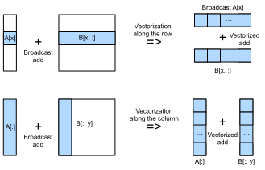

# Broadcast Add
:label:`ch_bcast_add_cpu`

This section talks about scheduling the broadcast add computation defined in :numref:`ch_bcast_add` on CPU. The optimization of it is similar to what we have done for vector add in :numref:`ch_vector_add_cpu`, as they are both essentially memory-bound element-wise calculation. Hence, instead of "what works", we will talk about "what doesn't work" in this section.

## Setup

```{.python .input  n=6}
%matplotlib inline
import d2ltvm
import inspect
from IPython import display
import numpy as np
from matplotlib import pyplot as plt
import timeit
import tvm
from tvm import te
```

Here we choose the broadcast add depicted in :numref:`fig_bcast_add`. The other broadcast patterns do not make essential difference.

First, we define the baseline in `numpy`. We use the real used data sizes in the x axis.

```{.python .input  n=7}
sizes = 2**np.arange(5, 15, 2)
np_bcast_add = lambda s1, s2: timeit.Timer(setup='import numpy as np\n'
                                'import d2ltvm\n'
                                'a, b, c = d2ltvm.get_bcast_data(%s, %s)' % (s1, s2),
                                stmt='np.add(a, b, out=c)')
exe_times = [d2ltvm.bench_workload(np_bcast_add((n, 1), (n, n)).timeit) for n in sizes]
np_gflops = sizes * sizes / 1e9 / np.array(exe_times)
# data size in MB
x_axis_sizes = (sizes * sizes * 2 + sizes * 1) * 4 / 1e6
d2ltvm.plot_gflops(x_axis_sizes, [np_gflops], ['numpy'], xlabel='Size (MB)')
```

Note that the x axis is denoted as the total data size consumed. The performance drops when the data size is larger than the L2 cache of a single core (1024 KB or 1 MB), which indirectly suggests that `numpy` may use single-thread to perform this operator.

## Good Schedule

The following code block defines a benchmarking method for broadcast add of a specific pattern in TVM. It follows the same format we discussed in :numref:`ch_vector_add_cpu`.

```{.python .input  n=8}
# Save to the d2ltvm package.
def bench_bcast_add_tvm(func, sizes, target):
    def workload(nrepeats):
        timer = mod.time_evaluator(mod.entry_name, ctx=ctx, number=nrepeats)
        return timer(a, b, c).mean * nrepeats
    times = []
    for n in sizes:
        n = int(n)
        s, (A, B, C) = func(n)
        mod = tvm.build(s, [A, B, C], target)
        ctx = tvm.context(target, 0)
        a, b, c = d2ltvm.get_bcast_data((n, 1), (n, n), lambda x: tvm.nd.array(x, ctx=ctx))
        times.append(d2ltvm.bench_workload(workload))
    return sizes * sizes / 1e9 / np.array(times)
```

The good schedule (i.e. what works) follows the similar scheme defined in :numref:`ch_vector_add_cpu`.

```{.python .input  n=9}
target = 'llvm -mcpu=skylake-avx512'
def default(n):
    A, B, C = d2ltvm.broadcast_add((n, 1), (n, n))
    s = te.create_schedule(C.op)
    return s, (A, B, C)

def good_schedule(n):
    s, (A, B, C) = default(n)
    x, y = C.op.axis
    s[C].parallel(x)
    s[C].vectorize(y)
    return s, (A, B, C)

s, args = good_schedule(64)
print(tvm.lower(s, args, simple_mode=True))
```

Now the C-like pseudo code should be familiar to you. One notable difference from :numref:`ch_vector_add_cpu` is that we broadcast `A[x]` to a vectorized register (i.e. `x64(A[x]`) for vectorized add.

Let's benchmark the good schedule.

```{.python .input  n=10}
good_gflops = bench_bcast_add_tvm(good_schedule, sizes, target)
d2ltvm.plot_gflops(x_axis_sizes, [np_gflops, good_gflops], ['numpy', 'good'], xlabel='Size (MB)')
```

Like the case in :numref:`ch_vector_add_cpu`, the performance is better and drops at a larger data size as multi-core comes into play, leading to a larger amount L2 cache in total.

## Bad Schedule

Now let's see how a bad schedule (i.e. what doesn't work) looks like. Note that our data are all stored in row-major and our schedules always make sure that the innermost loop manipulates the data in consecutive space.

However, if we think from the perspective vectorization, we may find that broadcasting `A[x]` to a vectorized register brings overhead. A better way is to have multiple values of `A` to add with multiple values of `B` in a vectorized instruction, which is illustrated in :numref:`fig_bcast_add_vectorize`.


:label:`fig_bcast_add_vectorize`

In order to make vectorization along the column, we need to reorder to data access pattern as follows.

```{.python .input  n=11}
def bad_schedule(n):
    s, (A, B, C) = default(n)
    x, y = C.op.axis
    s[C].reorder(y, x)
    s[C].parallel(y)
    s[C].vectorize(x)
    return s, (A, B, C)

s, args = bad_schedule(64)
print(tvm.lower(s, args, simple_mode=True))
```

Now we eliminate the broadcast of `A[x]` in vectorization. Let's run the benchmark and plot the chart for this schedule.

```{.python .input  n=12}
sizes = 2**np.arange(5, 11, 2)
bad_gflops = bench_bcast_add_tvm(bad_schedule, sizes, target)
diff = len(good_gflops)-len(bad_gflops)
bad_gflops = np.append(bad_gflops, [np.nan] * diff)
d2ltvm.plot_gflops(x_axis_sizes, [np_gflops, good_gflops, bad_gflops],
     ['numpy', 'good', 'bad'],  xlabel='Size (MB)')
```

Note that in order to make it finish in a short period of time, we reduce the number of tested sizes for this schedule.

We can see that the performance of the vectorization-favorable schedule is pretty bad. The reason is that we access `B` in a stride to get the data in the same column, which is much slower than accessing data in a consecutive space. And the thread-level parallelism would make it even worse as different threads compete in getting the data in the same cache line.

The result shows that a good schedule needs to consider multiple performance-related factors together. A scheduling scheme that favors one aspect may lead to bad overall performance as it harms other aspects.

## Summary

- Like vector add, broadcast add is a memory-bound operator.
- A good schedule needs to consider multiple performance-related factors together.

## Exercise

- Try to schedule other broadcast add patterns and observe the difference.
