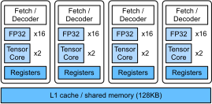

# GPU Architecture 

High-end GPUs often provide a significantly better performance over high-end CPUs. Despite the terminologies and programming paradigms are different between GPUs and CPUs. Their architectures are similar to each other, but GPU has a wider SIMD width and more cores. In this chapter, we will brief review the GPU architecture based on the CPU architecture presented in :numref:`ch_cpu_arch`. 

The system we are using has 4 [Tesla V100](https://images.nvidia.com/content/volta-architecture/pdf/volta-architecture-whitepaper.pdf) GPUs, therefore we will illustrate the architecture based on V100.

```{.python .input}
!nvidia-smi -q -i 0 | grep "Product Name"
```

## Streaming Multiprocessor

A streaming multiprocessor (SM) roughly equals to a CPU core, which is illustrated in :numref:`fig_gpu_sm`. 


:label:`fig_gpu_sm`

As can be seen that, a SM has four partitions. In each partition, there is 16 arithmetic units (AU) for float32, which is also called FP32 CUDA core. So a SM has in total 64 FP32 CUDA cores, which equals to a SIMD CPU core that executes 64 float32 operator (e.g. FMA) in each time.  Besides the register files and the instruction loader/decoders, a SM has 8 tensor cores. Each tensor core is able to execute a $4\times 4$ float16 matrix product in each time, which counts $2\times8\times 4^3=1024$ FLOP per clock. 

TBD.

:Compare the CPU and GPU used in this book. 

|Hardware | Intel E5-2686 v4 | Tesla V100 |
|------|------|------|
| Clock rate | 3 GHz | 1.53 GHz | 
| # cores | 16 | 80 |
| FP32 AU per core | 8 | 64 |
| FP16 AU per core | - | 512 |
| cache per core | 320KB | 128KB |
| shared cache | 45MB | 6MB |
| Memory | 240GB | 16GB |
| Max memory bandwidth | 72 GB/sec | 900 GB/sec |
| FP32 TFLOPS | 0.77 | 15.7 | 
| FP16 TFLOPS | - | 125.3 |
:label:`tab_cpu_gpu_compare`

:numref:`tab_cpu_gpu_compare` compare CPU and GPU.
