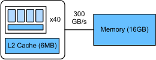

# GPU Architecture
:label:`ch_gpu_arch`


High-end GPUs often provide a significantly better performance over high-end CPUs. Although the terminologies and programming paradigms are different between GPUs and CPUs, their architectures are similar to each other, with GPU having a wider SIMD width and more cores. In this section, we will brief review the GPU architecture in comparison to the CPU architecture presented in :numref:`ch_cpu_arch`.

(FIXME, changed from V100 to T4 in CI..., also changed cpu...)

The system we are using has a [Tesla T4](https://www.nvidia.com/content/dam/en-zz/Solutions/design-visualization/technologies/turing-architecture/NVIDIA-Turing-Architecture-Whitepaper.pdf) GPU, which is based on Turing architecture. Tesla T4 is a GPU card based on the Turing architecture and targeted at deep learning model inference acceleration.

```{.python .input}
!nvidia-smi -q -i 0 | grep "Product Name"
```

## Streaming Multiprocessor

A streaming multiprocessor (SM) roughly equals a CPU core. The SM used by T4 is illustrated in :numref:`fig_gpu_sm`.


:label:`fig_gpu_sm`

As can be seen, an SM is partitioned into 4 processing blocks. In each block, there are 16 arithmetic units (AU) for processing float32 numbers, which are also called FP32 CUDA cores. 
In total, an SM has 64 FP32 AUs, which are able to execute 64 float32 operators (e.g. FMA) in each time. Besides the register files and the instruction loader/decoders, an SM has 8 tensor cores. Each tensor core is able to execute a $4\times 4$ float16 (or int8/int4) matrix product in each time. So each one, we can call it FP16 AU, counts for $2\times 4^3=128$ operators per clock. It is worth noting that in this chapter we won't use the tensor core. We will talk about utilizing it in the later chapter.

Another difference is that the SM only has an L1 cache, which is similar to CPU's L1 cache. However, we can use this storage as a shared memory for all threads running on the SM. We know that the cache is controlled by both hardware and operating system, while we can explicitly allocate and reclaim space on the shared memory, which gives us more flexibility to do performance optimization.

## GPU Architecture

Our Tesla T4 card contains 40 SMs with a 6MB L2 cache shared by all SMs. It also ships with 16GB high-bandwidth memory (GDDR6) that is connected to the processor. The overall architecture is illustrated in :numref:`fig_gpu_t4`.


:label:`fig_gpu_t4`

More broadly, we compare the specification difference between the CPU and GPUs used in this book in :numref:`tab_cpu_gpu_compare`, where GPUs includes 
(Tesla P100)[https://images.nvidia.com/content/pdf/tesla/whitepaper/pascal-architecture-whitepaper.pdf] (used in Colab), 
(Tesla V100)[https://images.nvidia.com/content/volta-architecture/pdf/volta-architecture-whitepaper.pdf] (equipped in Amazon EC2 P3 instance), 
and (Tesla T4)[https://www.nvidia.com/content/dam/en-zz/Solutions/design-visualization/technologies/turing-architecture/NVIDIA-Turing-Architecture-Whitepaper.pdf] (equipped in Amazon EC2 G4 instance).

:Compare the commonly used CPUs and GPUs, `x` means not supported. \ $^*$: Tesla P100 processes FP16 using FP32 CUDA cores.

|Hardware | Intel E5-2686 v4 | Tesla P100 | Tesla V100 | Tesla T4 |
|------|------|------|------|------|
| Clock rate (GHz) | **3** | 1.48 | 1.53 | 1.59 |
| # cores | 16 | 56 | **80** | 40 |
| # FP64 AUs per core | 4 | **32** | **32** | x |
| # FP32 AUs per core | 8 | **64** | **64** | **64** |
| # FP16 AUs per core | x | x$^*$ | **8** | **8** |
| cache per core (KB) | **320** | 64 | 128 | 64 |
| shared cache (MB)| **45** | 4 | 6 | 6 |
| Memory (GB) | **240** | 16 | 16 | 16 |
| Max memory bandwidth (GB/sec) | 72 | 732 | **900** | 300 |
| FP64 TFLOPS | 0.38 | 4.7 | **7.8** | x |
| FP32 TFLOPS | 0.77 | 9.3 | **15.7** | 8.1 |
| FP16 TFLOPS | x | 18.7 | **125.3** | 65 |
:label:`tab_cpu_gpu_compare`

## Summary
- GPUs have conceptually similar architecture as CPUs, but are much faster.
