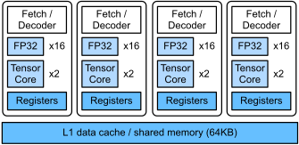

# GPU Architecture
:label:`ch_gpu_arch`


High-end GPUs often provide a significantly better performance over high-end CPUs. Despite the terminologies and programming paradigms are different between GPUs and CPUs. Their architectures are similar to each other, but GPU has a wider SIMD width and more cores. In this chapter, we will brief review the GPU architecture based on the CPU architecture presented in :numref:`ch_cpu_arch`.

(FIXME, changed from V100 to T4 in CI..., also changed cpu...)

The system we are using has a [Tesla T4](https://images.nvidia.com/content/volta-architecture/pdf/volta-architecture-whitepaper.pdf) GPUs, therefore we will illustrate the architecture based on V100.

```{.python .input}
!nvidia-smi -q -i 0 | grep "Product Name"
```

## Streaming Multiprocessor

A streaming multiprocessor (SM) roughly equals to a CPU core. The SM used by V100 is illustrated in :numref:`fig_gpu_sm`.


:label:`fig_gpu_sm`

As can be seen that, a SM has four partitions. In each partition, there is 16 arithmetic units (AU) for float32, which is also called FP32 CUDA core. So a SM has 64 FP32 AUs in total, which is able to execute 64 float32 operators (e.g. FMA) in each time.  Besides the register files and the instruction loader/decoders, a SM has 8 tensor cores. Each tensor core is able to execute a $4\times 4$ float16 matrix product in each time. So each one, we can call it FP16 AU, counts for $2\times 4^3=128$ operators per clock.

Another difference is that SM only has a L1 cache, which similar to CPU's L1 cache. However, we can use the storage as a shared memory for all threads running on the SM. We know that the cache is controlled by both hardware and operation system, while we can explicitly create and delete memory on the shared memory, which gives us more flexibility to optimize the performance.

## V100 Architecture

The Tesla V100 card has a GV100 processor, which contains 80 SMs with a 6MB L2 cache shared by all SMs. It also ships with 16GB high-speed memory that is connected to the processor. The overall architecture is illustrated in :numref:`fig_gpu_v100`.


:label:`fig_gpu_v100`

We compare the specification difference between the CPU and GPU used by this book in :numref:`tab_cpu_gpu_compare`. TODO(mli)

:Compare the CPU and GPU used by this book.

|Hardware | Intel E5-2686 v4 | Tesla V100 |
|------|------|------|
| Clock rate (GHz) | **3** | 1.53 |
| # cores | 16 | **80** |
| # FP64 AUs per core | 4 | **32** |
| # FP32 AUs per core | 8 | **64** |
| # FP16 AUs per core | ? | **8** |
| cache per core (KB) | **320** | 128 |
| shared cache (MB)| **45** | 6 |
| Memory (GB) | **240** | 16 |
| Max memory bandwidth (GB/sec) | 72 | **900** |
| FP64 TFLOPS | 0.38 | **7.8** |
| FP32 TFLOPS | 0.77 | **15.7** |
| FP16 TFLOPS | ? | **125.3** |
:label:`tab_cpu_gpu_compare`

## Summary
