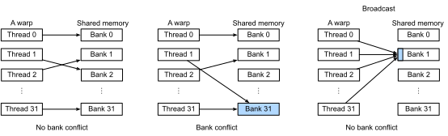

### Bank Conflict

All threads will read `A_shared` and `B_shared` simultaneously, which may cause performance issues. To understand it, we need to dive a little bit into the shared memory architecture and how threads are executed. 

Remember that we created 256 threads for a thread block. Due to resource limits, we cannot execute all of them at the same time. Instead, each time we select a group of threads and run time simultaneously, and then switch to another group quickly. Such a group is called a wrap, which contains 32 threads, and each having a consecutive thread index. 

Each thread in a wrap can access data on the shared memory simultaneously. So the shared memory is designed to support parallel load and store. The basic unit of the shared memory is word. Each word has 4 bytes, which can hold a single 32-bit floating number. Words are grouped into 32 banks. The $j$-th word is in the $i$-th bank if `j % 32 == i`. 

Each bank can only handle a single request at a time, while these 32 banks are process in parallel. So the shared memory performs fastest when each bank gets one request from a single thread in a wrap, therefore we can access 32 words in the same time. However, if there are two threads request data from the same bank, then we need to serialize these two requests. It is a called a bank conflict. An unique case is that if all (or some) threads of a wrap request the same word in a bank, then the word will only read once and broadcast (multicast) to each thread, so there is no bank conflict. :numref:`fig_bank_conflict` illustrated these three cases.


:label:`fig_bank_conflict`

Now let's analysis the read pattern of `A_shared` and `B_shared`. Note from :numref:`fig_matmul_block_gpu2` that a thread reads a column segment of `A_shared` with a length of 4. Due `A_shared` has a width of 32, so each element of the segment will in the same bank, so there is no bank conflict. While a thread reads a row segment with a length of 8 from `B_shared`, it spans over 8 banks and therefore will conflict with other 7 threads. 

### Virtual Threads 

One way to improve it is increasing the stride of this segment. For example, with a stride of 8, the $i$-th segment will contains $(i, i+8, i+16, \ldots, i+120)$-th elements of the row. Therefore the $i$-th thread only conflicts with the $i+8$-th thread. To fully eliminate the bank conflict, we need to increase `blockDim.x` to 32. An increased number of threads, however, requires more hardware resources. 

:numref:`fig_strided_block` illustrates the original first output block versus the strided version. We can use virtual threads to obtain strided blocks. The idea is first split the column axis into 8 parts, and bind it to 8 virtual threads. next bind the split inner axis, whose length is 16, to CUDA threads, each of them will process 1 element. Then the $i$-th CUDA thread in all virtual threads will be merged into a single one, so we will only get 16 CUDA threads instead of $16\times 8$ threads. And the $i$-th thread will process the $i$-th element in each outer axis. 


:label:`fig_strided_block`


Since the generated pseudo codes could be long, we define a function to only return the lines matched a particular pattern.

```{.python .input}
# Save into the d2ltvm package.
def lower(s, args, pattern, nstrip=0):
    """Run tvm.lower and print selected lines
    """
    import re
    lines = tvm.lower(s, args, simple_mode=True).__str__().split('\n')
    ret = [l[nstrip:] for l in lines if re.match('.*'+pattern, l)]
    return '\n'.join(ret)
```

## Setup

```{.python .input  n=1}
import d2ltvm
import numpy as np
import timeit
import tvm

```

```{.python .input  n=4}
channels = 2**np.arange(6, 11)
# a list of (c, n, k)
sizes = [(int(c), 64, 3) for c in channels]
mxnet_gflops = d2ltvm.bench_conv_mxnet(sizes, 'gpu')
```

```{.python .input  n=5}
mxnet_gflops
```

```{.json .output n=5}
[
 {
  "data": {
   "text/plain": "[1759.3970663105365,\n 4480.83677831982,\n 6028.607280330208,\n 6284.193868653794,\n 5653.279421170381]"
  },
  "execution_count": 5,
  "metadata": {},
  "output_type": "execute_result"
 }
]
```

```{.python .input}

```
